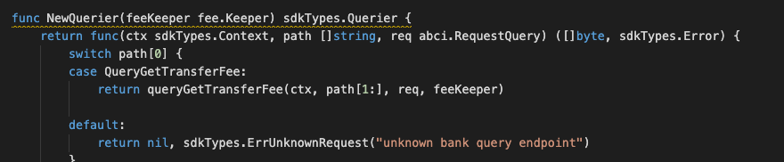

### Application Goals

This specifies the bank module of the Maxonrow SDK that relies on Cosmos SDK.

The bank module is responsible for handling multi-asset coin transfers between accounts. It exposes several interfaces with varying capabilities for secure interaction with other modules which must alter user balances.

In this section, you will learn how these simple requirements translate to application design.

### Type of Message

In this module which consists of ONE types of messages that users 
can send to interact with the application state: 

* [MsgMxwSend](msgtype/MxwSend.md "MsgMxwSend") -- This is the message type used to create coin transfers transaction. 

** They will each have an associated Handler.

### Querier

Now you can navigate to the ./x/bank/querrier.go file. 
This is the place to define which queries against application state users will be able to make. 
 
Here, you will see NewQuerier been defined, and it acts as a sub-router for queries to this module (similar the NewHandler function). Note that because there isn't an interface similar to Msg for queries, we need to manually define switch statement cases (they can't be pulled off of the query .Route() function):

This module will expose few queries:

* [GetTransferFee](querier/GetTransferFee.md "GetTransferFee") -- This takes fee-setting and returns the Transfer Fee.

