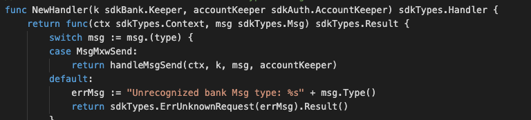
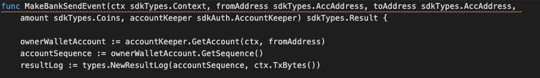
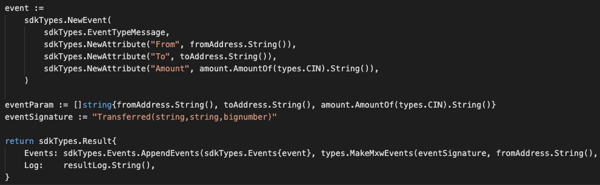

This is the message type used to create coin transfers transaction. 

## Parameters

The message type contains the following parameters:


| Name | Type | Required | Description                 |
| ---- | ---- | -------- | --------------------------- |
| from_address | string | true   | Account address of Sender| | 
| to_address| string | true   | Account address of Receiver| | 
| amount| []Coin | true   | Set of coin | | 


#### Example
```
{
    "type": "mxw/msgSend",
    "value": {
        "from_address": "mxw16aqacvvcgqph6czaxkrlqt9g38ky5y4sh5ukp8",
        "to_address": "mxw1w0m8xqy0fpgkf6luwu666f5hhl3tm0sq53snw5",
        "amount": [
            {
                "denom": "cin",
                "amount": "999999999999000000000"
            }
        ]
    }
}

```

## Handler

The role of the handler is to define what action(s) needs to be taken when this MsgTypeBurnNonFungibleItem message is received.

In the file (./x/bank/handler.go) start with the following code:




NewHandler is essentially a sub-router that directs messages coming into this module to the proper handler.
Now, you need to define the actual logic for handling the MsgTypeBurnNonFungibleItem message in handleMsgBurnNonFungibleItem:




In this function, requirements need to be met before emitted by the network.  

* Sender must be authorised KYC user.
* Balance amount must be enough to be sent.
* Receiver allowed to be non-authorised KYC user.

## Events
This tutorial describes how to create maxonrow events for scanner on this after emitted by a network.

  


#### Usage
This MakeMxwEvents create maxonrow events, by accepting :

* Custom Event Signature : using Transferred(string,string,bignumber)
* Account address of Sender
* Event Parameters as below: 

| Name | Type | Description                 |
| ---- | ---- | --------------------------- |
| fromAddress | string | Account address of Sender| | 
| toAddress | string | IteAccount address of Receiver| | 
| amount | bignumber | Amount value to be transfered| | 

