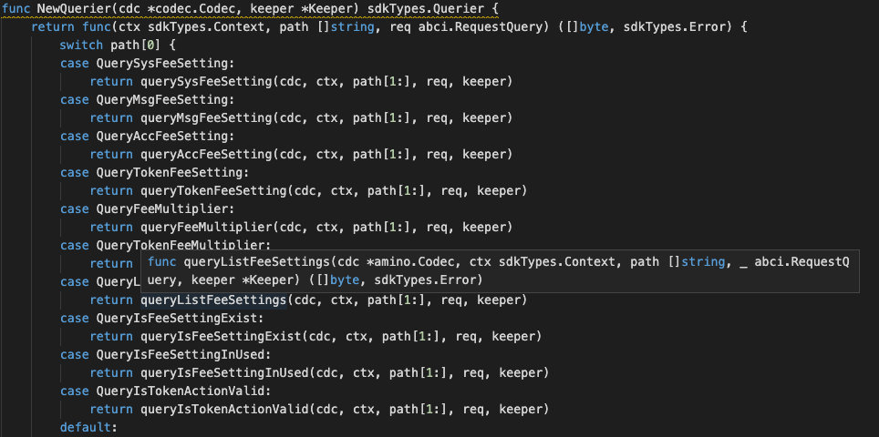

### Application Goals

The goal of the module is to let users create and maintain account of a fee setting. 

In this section, you will learn how these simple requirements translate to application design.

### Type of Message

In this module which consists of FOUR types of messages that users 
can send to interact with the application state: 

* [MsgSysFeeSetting](msgtype/SysFeeSetting.md "MsgSysFeeSetting") -- This is the msg type used to create or update the system fee setting. Eg. “default”, “zero”, “transfer” and etc.  
* [MsgDeleteSysFeeSetting](msgtype/DeleteSysFeeSetting.md "MsgDeleteSysFeeSetting") -- This is the msg type used to delete the fee setting. 
* [MsgAssignFeeToMsg](msgtype/AssignFeeToMsg.md "MsgAssignFeeToMsg") -- This is the msg type used to assign fee setting to message.
* [MsgAssignFeeToAcc](msgtype/AssignFeeToAcc.md "MsgAssignFeeToAcc") -- This is the msg type used to assign fee setting to account.  
* [MsgDeleteAccFeeSetting](msgtype/DeleteAccFeeSetting.md "MsgDeleteAccFeeSetting") -- This is the msg type used to delete an account of the fee setting. 
* [MsgMultiplier](msgtype/Multiplier.md "MsgMultiplier") -- This is the msg type used to create, update the system fee multiplier. 
* [MsgTokenMultiplier](msgtype/TokenMultiplier.md "MsgTokenMultiplier") -- This is the msg type used to create, update the token fee multiplier.
* [MsgAssignFeeToToken](msgtype/AssignFeeToToken.md "MsgAssignFeeToToken") -- This is the msg type used to assign fee setting to token by token action and token symbol.

** They will each have an associated Handler.

### Querier

Now you can navigate to the ./x/fee/querier.go file. 
This is the place to define which queries against application state users will be able to make. 
 
Here, you will see NewQuerier been defined, and it acts as a sub-router for queries to this module (similar the NewHandler function). Note that because there isn't an interface similar to Msg for queries, we need to manually define switch statement cases (they can't be pulled off of the query .Route() function):

This module will expose few queries:

* [AccFeeSetting](querier/AccFeeSetting.md "AccFeeSetting") -- This takes a account address and returns the fee setting info of the account.
* [FeeMultiplier](querier/FeeMultiplier.md "FeeMultiplier") -- This returns the fee multiplier info.
* [IsFeeSettingExist](querier/IsFeeSettingExist.md "IsFeeSettingExist") -- This takes a fee setting and returns appearance of this fee setting.
* [IsFeeSettingInUsed](querier/IsFeeSettingInUsed.md "IsFeeSettingInUsed") -- This takes a fee setting and 
check whether been used currently.
* [IsTokenActionValid](querier/IsTokenActionValid.md "IsTokenActionValid") -- This takes token action and returns whether it is valid or not.
* [ListFeeSettings](querier/ListFeeSettings.md "ListFeeSettings") -- This returns all fee setting info.
* [MsgFeeSetting](querier/MsgFeeSetting.md "MsgFeeSetting") -- This takes a fee setting and returns the fee setting message info.
* [SysFeeSetting](querier/SysFeeSetting.md "SysFeeSetting") -- This takes a fee setting and returns fee setting info.
* [TokenFeeMultiplier](querier/TokenFeeMultiplier.md "TokenFeeMultiplier") -- This returns token-fee-multiplier info.
* [TokenFeeSetting](querier/TokenFeeSetting.md "TokenFeeSetting") -- This takes a fee setting and token-action then returns the relevant info.
