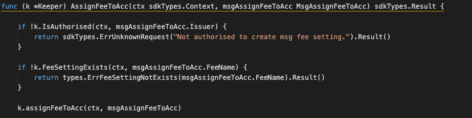

This is the message type used to assign fee setting to account.

## Parameters

The message type contains the following parameters:

| Name | Type | Required | Description                 |
| ---- | ---- | -------- | --------------------------- |
| fee_name | string | true   | Fee setting| | 
| account| string | true   | Fee account address | | 
| issuer| string | true   | Issuer account address | | 


#### Example
```
{
	"type": "fee/assignFeeToAcc",
	"value": {
		"fee_name": "zero",
		"account": "mxw1g6cjz0pgtchedjyacjcsldhmxcvu2z4nrud9qt",
		"issuer": "mxw1k9tr2cukhfvlhj356e5eur28kuw3p6a4l93h59"
	}
}
```

## Handler

The role of the handler is to define what action(s) needs to be taken when this MsgAssignFeeToAcc message is received.

In the file (./x/fee/handler.go) start with the following code:


NewHandler is essentially a sub-router that directs messages coming into this module to the proper handler.
Now, you need to define the actual logic for handling the MsgAssignFeeToAcc message in handleMsgAssignFeeToAcc:




In this function, requirements need to be met before emitted by the network.  

* Issuer must be authorised user.
* Fee setting account must be existed.


## Events
This tutorial describes how to create maxonrow events for scanner on this after emitted by a network.

  


#### Usage
This MakeMxwEvents create maxonrow events, by accepting :

* Custom Event Signature : using CreatedAccountFeeSetting(string,string)
* Signer
* Event Parameters as below: 

| Name | Type | Description                 |
| ---- | ---- | --------------------------- |
| account | string | Fee account address| | 
| signer | string | Account address| | 


