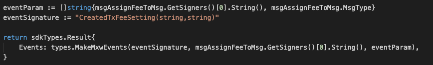

This is the message type used to assign fee setting to message.


## Parameters

The message type contains the following parameters:

| Name | Type | Required | Description                 |
| ---- | ---- | -------- | --------------------------- |
| fee_name | string | true   | Fee setting| | 
| msg_type | string | true   | Message type| | 
| issuer | string | true   | Issuer account address| | 


#### Example

```
{
	"type": "fee/assignFeeToMsg",
	"value": {
		"fee_name": "double",
		"msg_type": "bank-send",
		"issuer": "mxw1k9tr2cukhfvlhj356e5eur28kuw3p6a4l93h59"
	}
}
```

## Handler

The role of the handler is to define what action(s) needs to be taken when this MsgAssignFeeToMsg message is received.

In the file (./x/fee/handler.go) start with the following code:


NewHandler is essentially a sub-router that directs messages coming into this module to the proper handler.
Now, you need to define the actual logic for handling the MsgAssignFeeToMsg message in handleMsgAssignFeeToMsg:


In this function, requirements need to be met before emitted by the network.  

* Issuer must be authorised user.
* Duplicated Fee setting is not allowed.


## Events
This tutorial describes how to create maxonrow events for scanner on this after emitted by a network.

  


#### Usage
This MakeMxwEvents create maxonrow events, by accepting :

* Custom Event Signature : using CreatedTxFeeSetting(string,string)
* Signer
* Event Parameters as below: 


| Name | Type | Description                 |
| ---- | ---- | --------------------------- |
| signer | string | Account address| | 
| msgtype | string | Message type| | 


