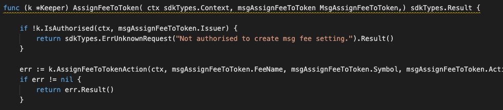
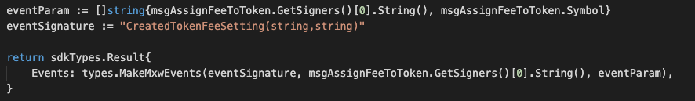

This is the message type used to assign fee setting to token by token action and token symbol.

<!-- type MsgAssignFeeToToken struct {
	FeeName string              `json:"fee_name"`
	Symbol  string              `json:"symbol"`
	Action  string              `json:"action"`
	Issuer  sdkTypes.AccAddress `json:"issuer"`
} -->


## Parameters

The message type contains the following parameters:

| Name | Type | Required | Description                 |
| ---- | ---- | -------- | --------------------------- |
| fee_name | string | true   | Fee setting| | 
| symbol | string | true   | Token| | 
| action | string | true   | Action types| | 
| issuer | string | true   | Issuer account address| | 


-dx
#### Example

```

```

## Handler

The role of the handler is to define what action(s) needs to be taken when this MsgAssignFeeToToken message is received.

In the file (./x/fee/handler.go) start with the following code:


NewHandler is essentially a sub-router that directs messages coming into this module to the proper handler.
Now, you need to define the actual logic for handling the MsgAssignFeeToToken message in handleMsgAssignFeeToToken:




In this function, requirements need to be met before emitted by the network.  

* Issuer must be authorised user.
* Fee setting must be existed.
* Fee been issued base on different actions : eg. Transfer-token, Mint-token, Burn-token   Transfer-token-ownership, Accept-token-ownership 


## Events
This tutorial describes how to create maxonrow events for scanner on this after emitted by a network.

  


#### Usage
This MakeMxwEvents create maxonrow events, by accepting :

* Custom Event Signature : using CreatedTokenFeeSetting(string,string)
* Signer
* Event Parameters as below: 

| Name | Type | Description                 |
| ---- | ---- | --------------------------- |
| signer | string | Account address| | 
| symbol | string | Token| | 


