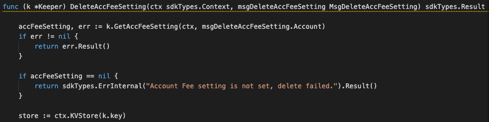
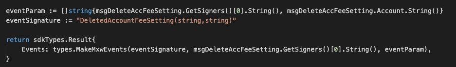

This is the message type used to delete the fee setting.


<!-- type MsgDeleteAccFeeSetting struct {
	Account sdkTypes.AccAddress `json:"account"`
	Issuer  sdkTypes.AccAddress `json:"issuer"`
} -->


## Parameters

The message type contains the following parameters:

| Name | Type | Required | Description                 |
| ---- | ---- | -------- | --------------------------- |
| account | string | true   | Account address| | 
| issuer | string | true   | Issuer account address| | 


-dx
#### Example

```

```

## Handler

The role of the handler is to define what action(s) needs to be taken when this MsgDeleteAccFeeSetting message is received.

In the file (./x/fee/handler.go) start with the following code:


NewHandler is essentially a sub-router that directs messages coming into this module to the proper handler.
Now, you need to define the actual logic for handling the MsgDeleteAccFeeSetting message in handleMsgDeleteAccFeeSetting:




In this function, requirements need to be met before emitted by the network.  

* Issuer must be authorised user.
* Fee setting account must be existed.

## Events
This tutorial describes how to create maxonrow events for scanner on this after emitted by a network.

  


#### Usage
This MakeMxwEvents create maxonrow events, by accepting :

* Custom Event Signature : using DeletedAccountFeeSetting(string,string)
* Signer
* Event Parameters as below: 

| Name | Type | Description                 |
| ---- | ---- | --------------------------- |
| signer | string | Account address| | 
| account | string | Account fee setting| | 


