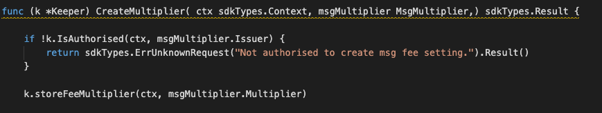
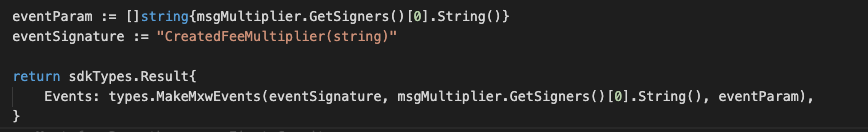

This is the message type used to create, update the system fee multiplier.


## Parameters

The message type contains the following parameters:

| Name | Type | Required | Description                 |
| ---- | ---- | -------- | --------------------------- |
| multiplier | string | true   | Multiplier| | 
| issuer | string | true   | Issuer Account address| | 


#### Example

```
{
	"type": "fee/msgMultiplier",
	"value": {
		"multiplier": "2",
		"issuer": "mxw1k9tr2cukhfvlhj356e5eur28kuw3p6a4l93h59"
	}
}

```

## Handler

The role of the handler is to define what action(s) needs to be taken when this MsgMultiplier message is received.

In the file (./x/fee/handler.go) start with the following code:


NewHandler is essentially a sub-router that directs messages coming into this module to the proper handler.
Now, you need to define the actual logic for handling the MsgMultiplier message in handleMsgMultiplier:




In this function, requirements need to be met before emitted by the network.  

* Issuer must be authorised user.


## Events
This tutorial describes how to create maxonrow events for scanner on this after emitted by a network.

  


#### Usage
This MakeMxwEvents create maxonrow events, by accepting :

* Custom Event Signature : using CreatedFeeMultiplier(string)
* Signer
* Event Parameters as below: 

| Name | Type | Description                 |
| ---- | ---- | --------------------------- |
| signer | string | Account address| | 

