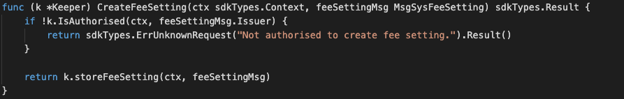
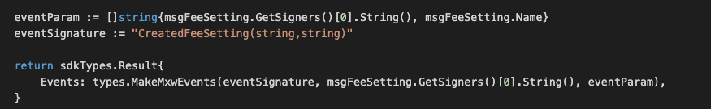

This is the message type used to create or update the system fee setting. Eg. “default”, “zero”, “transfer” and etc.


## Parameters

The message type contains the following parameters:

| Name | Type | Required | Description                 |
| ---- | ---- | -------- | --------------------------- |
| name | string | true   | Fee setting| | 
| min | sdkTypes.Coins | true   | Minimum amount| | 
| max | sdkTypes.Coins | true   | Maximum amount| | 
| percentage | string | true   | Percentage| | 
| issuer | string | true   | Account address| | 


#### Example

```
 {
	"type": "fee/sysFeeSetting",
	"value": {
		"name": "default",
		"min": [
			{
				"denom": "cin",
				"amount": "400000000"
			}
		],
		"max": [
			{
				"denom": "cin",
				"amount": "2000000000"
			}
		],
		"percentage": "0.001",
		"issuer": "mxw1k9tr2cukhfvlhj356e5eur28kuw3p6a4l93h59"
	}
}
```

## Handler

The role of the handler is to define what action(s) needs to be taken when this MsgSysFeeSetting message is received.

In the file (./x/fee/handler.go) start with the following code:


NewHandler is essentially a sub-router that directs messages coming into this module to the proper handler.
Now, you need to define the actual logic for handling the MsgSysFeeSetting message in handleMsgSysFeeSetting:




In this function, requirements need to be met before emitted by the network.  

* Issuer must be authorised user.


## Events
This tutorial describes how to create maxonrow events for scanner on this after emitted by a network.

  


#### Usage
This MakeMxwEvents create maxonrow events, by accepting :

* Custom Event Signature : using CreatedFeeSetting(string,string)
* Signer
* Event Parameters as below: 

| Name | Type | Description                 |
| ---- | ---- | --------------------------- |
| signer | string | Account address| | 
| name | string | Fee setting| | 

