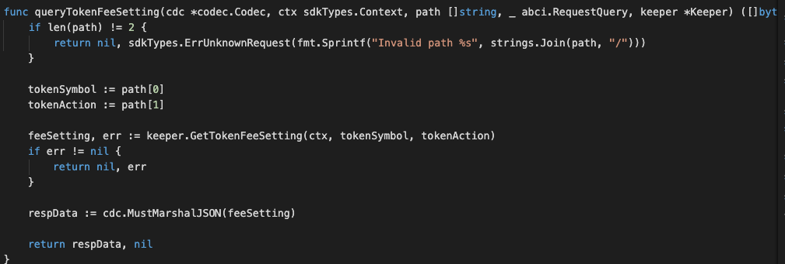

This takes a fee setting and token-action then returns the relevant info.

After the router is defined, define the inputs and responses for this queryTokenFeeSetting:




Notes on the above code:

This query request TWO path-parameter which refer to symbol and actions. 
The output type should be something that is both JSON marshalable and stringable (implements the Golang fmt.Stringer interface). The returned bytes should be the JSON encoding of the output result.

For the output of TokenFeeSetting, the normal TokenFeeSetting struct is already JSON marshalable, but we need to add a .String() method on it.

#### Parameters
| Name | Type | Default | Required | Description                 |
| ---- | ---- | ------- | -------- | --------------------------- |
| path | string | false | false    | Path to the data (eg. "/a/b/c") |
| data | []byte | false | true     | Data |
| height | int64 | 0 | false    | Height (0 means latest) |
| prove | bool | false | false    | Include proofs of the transactions inclusion in the block, if true |


#### Example
In this example, we will explain how to query TokenFeeSetting with abci_query. 

Run the command with the JSON request body:
```
curl 'http://localhost:26657/'
```

```
{
    "method": "abci_query",
    "params": [
    	"/custom/fee/get_token_fee_setting/zero/assign-msg",
    	"",
    	"0",
    	false
    	],
    "id": 0,
    "jsonrpc": "2.0"
}

```

The above command returns JSON structured like this: 
```
{
    "jsonrpc": "2.0",
    "id": 0,
    "result": {
        "response": {
            "code": 3002,
            "log": "{\"codespace\":\"mxw\",\"code\":3002,\"message\":\"Token fee setting not found, token symbol: zero\"}",
            "info": "",
            "index": "0",
            "key": null,
            "value": null,
            "proof": null,
            "height": "345",
            "codespace": "mxw"
        }
    }
}
```

