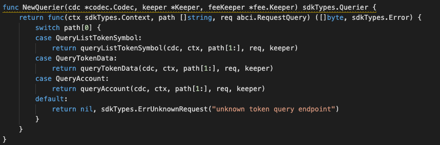

### Application Goals

The goal of the module is to let users create and maintain fungible tokens being something (such as money or a commodity) of such a nature that one part or quantity may be replaced by another equal part or quantity in paying a debt or settling an account.

In this section, you will learn how these simple requirements translate to application design.

### Type of Message

In this module which consists of EIGHT types of messages that users 
can send to interact with the application state: 

* [MsgTypeCreateFungibleToken](msgtype/CreateFungibleToken.md "MsgCreateFungibleToken") -- This is the msg type used to create the fungible token. 
* [MsgTypeSetFungibleTokenStatus](msgtype/SetFungibleTokenStatus.md "MsgSetFungibleTokenStatus") -- This is the msg type used to set the status of a fungible token. 
* [MsgTypeTransferFungibleToken](msgtype/TransferFungibleToken.md "MsgTransferFungibleToken") -- This is the msg type used to transfer the item of fungible token.
* [MsgTypeMintFungibleToken](msgtype/MintFungibleToken.md "MsgMintFungibleToken") -- This is the msg type used to mint a new item of fungible token. 
* [MsgTypeBurnFungibleToken](msgtype/BurnFungibleToken.md "MsgBurnFungibleToken") -- This is the msg type used to burn the item of fungible token.
* [MsgTypeTransferFungibleTokenOwnership](msgtype/TransferFungibleTokenOwnership.md "MsgTransferFungibleTokenOwnership") -- This is the msg type used to transfer the ownership of a fungible token.
* [MsgTypeAcceptFungibleTokenOwnership](msgtype/AcceptFungibleTokenOwnership.md "MsgAcceptFungibleTokenOwnership") -- This is the msg type used to accept the ownership of a fungible token. 
* [MsgTypeSetFungibleTokenAccountStatus](msgtype/SetFungibleTokenAccountStatus.md "MsgSetFungibleTokenAccountStatus") -- This is the msg type used to set the account status of a fungible token.

** They will each have an associated Handler.

### Querier

Now you can navigate to the ./x/token/fungible/querier.go file. 
This is the place to define which queries against application state users will be able to make. 
 
Here, you will see NewQuerier been defined, and it acts as a sub-router for queries to this module (similar the NewHandler function). Note that because there isn't an interface similar to Msg for queries, we need to manually define switch statement cases (they can't be pulled off of the query .Route() function):

This module will expose few queries:

* [ListTokenSymbol](querier/ListTokenSymbol.md "ListTokenSymbol") -- This query the available tokens list.
* [TokenData](querier/TokenData.md "TokenData") -- This takes a symbol and returns token data base on it.
* [Account](querier/Account.md "Account") -- This takes a account and symbol then returns account data.

