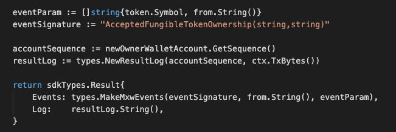

This is the message type used to accept the ownership of a fungible token.

## Parameters

The message type contains the following parameters:

| Name | Type | Required | Description                 |
| ---- | ---- | -------- | --------------------------- |
| symbol | string | true   | Token symbol, which must be unique| |
| from | string | true   | Token owner| |


#### Example

```
{
    "type": "token/acceptFungibleTokenOwnership",
    "value": {
        "symbol": "TT-6",
        "from": "mxw14vl7sua9jkhu0vd66eur35kzgesj5tj8pmhdjw"
    }
}
```

## Handler

The role of the handler is to define what action(s) needs to be taken when this `MsgTypeAcceptFungibleTokenOwnership` message is received.

In the file (./x/token/fungible/handler.go) start with the following code:


NewHandler is essentially a sub-router that directs messages coming into this module to the proper handler.
Now, you need to define the actual logic for handling the MsgTypeAcceptFungibleTokenOwnership message in `handleMsgTypeAcceptFungibleTokenOwnership`:


In this function, requirements need to be met before emitted by the network.

* A valid Token.
* A valid Token owner.
* A valid New token owner.
* Token must be approved and not be freeze.
* Action of Re-accept-ownership is not allowed.


## Events
This tutorial describes how to create maxonrow events for scanner on this after emitted by a network.




#### Usage
This MakeMxwEvents create maxonrow events, by accepting :

* Custom Event Signature : using AcceptedFungibleTokenOwnership(string,string)
* Token owner
* Event Parameters as below:

| Name | Type | Description                 |
| ---- | ---- | --------------------------- |
| symbol | string | Token symbol, which must be unique| |
| from | string | New token owner| |
