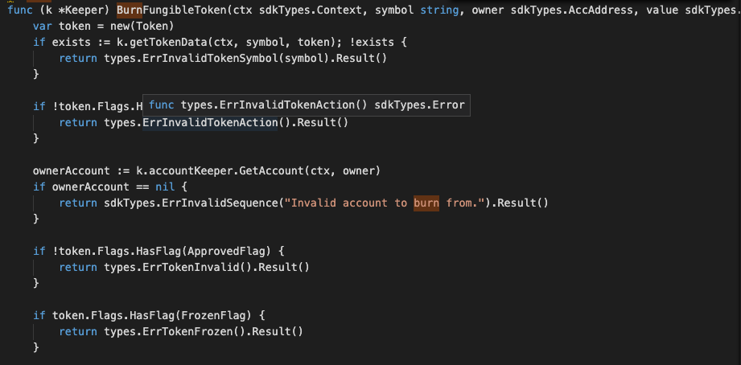
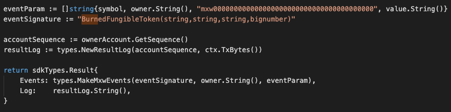

This is the message type used to burn the amount of fungible token of an account owner.

<!-- type MsgBurnFungibleToken struct {
	Symbol string              `json:"symbol"`
	Value  sdkTypes.Uint       `json:"value"`
	From   sdkTypes.AccAddress `json:"from"`
} -->

## Parameters

The message type contains the following parameters:

| Name | Type | Required | Description                 |
| ---- | ---- | -------- | --------------------------- |
| symbol | string | true   | Token symbol, which must be unique| | 
| value | string | true   | Burn value| | 
| from | string | true   | Token account owner| | 


#### Example

```
{
    "type": "token/burnFungibleToken",
    "value": {
        "symbol": "TT-2",
        "value": "200",
        "from": "mxw1x5cf8y99ntjc8cjm00z603yfqwzxw2mawemf73"
    }
}

```

## Handler

The role of the handler is to define what action(s) needs to be taken when this MsgTypeBurnFungibleToken message is received.

In the file (./x/token/fungible/handler.go) start with the following code:


NewHandler is essentially a sub-router that directs messages coming into this module to the proper handler.
Now, you need to define the actual logic for handling the MsgTypeBurnFungibleToken message in handleMsgBurnNonFungibleItem:




In this function, requirements need to be met before emitted by the network.  

* A valid Token.
* A valid Token account.
* Token must be approved before this, and not be freeze. Also burnable flag must equals to true.
* Signer who is the Token owner need to be authorised to do this process.
* Action of Re-burn is allowed if the balance amount is enough to do burning.


## Events
This tutorial describes how to create maxonrow events for scanner on this after emitted by a network.

  


#### Usage
This MakeMxwEvents create maxonrow events, by accepting :

* Custom Event Signature : using BurnedFungibleToken(string,string,string,bignumber)
* Token owner
* Event Parameters as below: 

| Name | Type | Description                 |
| ---- | ---- | --------------------------- |
| symbol | string | Token symbol, which must be unique| | 
| owner | string | Token account owner| | 
| account | string | Token account owner| | 
| value | string | Burn value| | 


