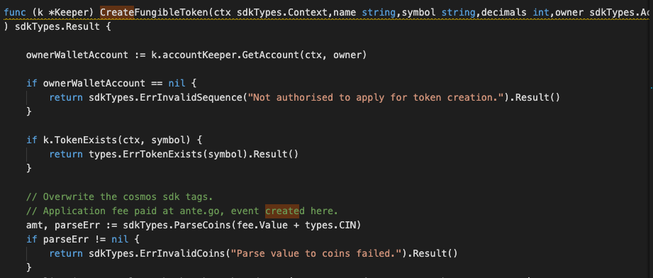
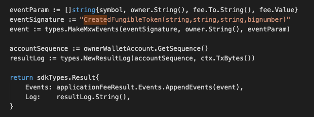

This is the message type used to create the fungible token.

## Parameters

The message type contains the following parameters:

| Name | Type | Required | Description                 |
| ---- | ---- | -------- | --------------------------- |
| name | string | true   | Token name| | 
| symbol | string | true   | Token symbol, which must be unique| | 
| decimals | int | true   | Decimals value| | 
| metadata | string | true   | Metadata of token| | 
| fixedSupply | bool | true   | Fixed Supply value| | 
| owner | string | true   | Token owner| | 
| maxSupply | int | true   | Maximum Supply value| | 
| fee | Fee | true   | Fee information| | 


#### Fee Information
| Name | Type | Required | Description                 |
| ---- | ---- | -------- | --------------------------- |
| to | string | true   | Fee-collector| | 
| value | string | true   | Fee amount to be paid| | 


#### Example
```
{
    "type": "token/createFungibleToken",
    "value": {
        "name": "TestToken-6",
        "symbol": "TT-6",
        "decimals": "8",
        "metadata": "",
        "fixedSupply": false,
        "owner": "mxw1x5cf8y99ntjc8cjm00z603yfqwzxw2mawemf73",
        "maxSupply": "100000",
        "fee": {
            "to": "mxw1g6cjz0pgtchedjyacjcsldhmxcvu2z4nrud9qt",
            "value": "100000"
        }
    }
}

```

## Handler

The role of the handler is to define what action(s) needs to be taken when this MsgTypeCreateFungibleToken
 message is received.

In the file (./x/token/fungible/handler.go) start with the following code:


NewHandler is essentially a sub-router that directs messages coming into this module to the proper handler.
Now, you need to define the actual logic for handling the MsgTypeCreateFungibleToken message in handleMsgCreateNonFungibleToken:




In this function, requirements need to be met before emitted by the network.  

* Token must be unique.
* Token owner must be authorised.
* A valid Fee will be charged base on this.
* Action of Re-create is not allowed.

## Events
This tutorial describes how to create maxonrow events for scanner on this after emitted by a network.

  


#### Usage
This MakeMxwEvents create maxonrow events, by accepting :

* Custom Event Signature : using CreatedFungibleToken(string,string,string,bignumber)
* Token owner
* Event Parameters as below: 

| Name | Type | Description                 |
| ---- | ---- | --------------------------- |
| symbol | string | Token symbol, which must be unique| | 
| owner | string | Token owner| | 
| to | string | Fee-collector| | 
| value | bignumber | Fee amount to be paid| | 

