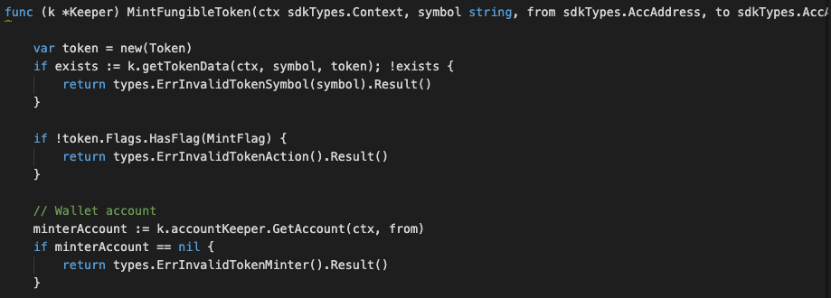
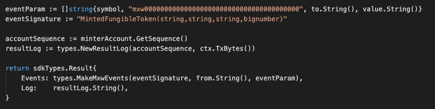

This is the message type used to mint the amount of fungible token to an account owner.

## Parameters

The message type contains the following parameters:

| Name | Type | Required | Description                 |
| ---- | ---- | -------- | --------------------------- |
| symbol | string | true   | Token symbol, which must be unique| | 
| owner | string | true   | Token owner| | 
| to | string | true   | Token account owner| | 
| value | int | true   | Mint value| | 


#### Example
```
{
    "type": "token/mintFungibleToken",
    "value": {
        "symbol": "TT-2b",
        "value": "100000",
        "owner": "mxw1x5cf8y99ntjc8cjm00z603yfqwzxw2mawemf73",
        "to": "mxw14vl7sua9jkhu0vd66eur35kzgesj5tj8pmhdjw"
    }
}

```

## Handler

The role of the handler is to define what action(s) needs to be taken when this MsgTypeMintFungibleToken message is received.

In the file (./x/token/fungible/handler.go) start with the following code:


NewHandler is essentially a sub-router that directs messages coming into this module to the proper handler.
Now, you need to define the actual logic for handling the MsgTypeMintFungibleToken message in handleMsgMintFungibleToken:




In this function, requirements need to be met before emitted by the network.  

* A valid Token.
* Token which Mint Flag equals to true and must be approved, and not yet be freeze.
* Token can only be minted by token-creator.
* Token with Max-Supply bigger than ZERO is known as Fixed-Supply, which need do validate between Total-Supply and Max-Supply. Else is known as Dynamic-Supply.
* Action of Re-mint is allowed if not yet reached the total-supply-limit (as Fixed-Supply).


## Events
This tutorial describes how to create maxonrow events for scanner on this after emitted by a network.

  


#### Usage
This MakeMxwEvents create maxonrow events, by accepting :

* Custom Event Signature : using MintedFungibleToken(string,string,string,bignumber)
* Token owner
* Event Parameters as below: 

| Name | Type | Description                 |
| ---- | ---- | --------------------------- |
| symbol | string | Token symbol, which must be unique| | 
| owner | string | Token account owner| | 
| to | string | Token account owner| | 
| value | string | Mint value| | 
