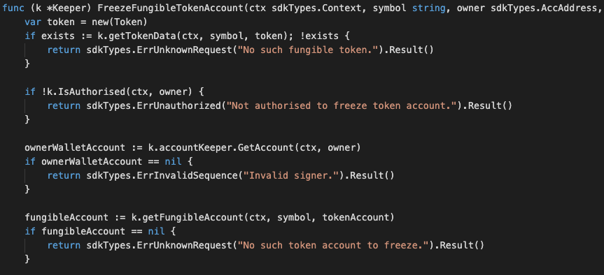
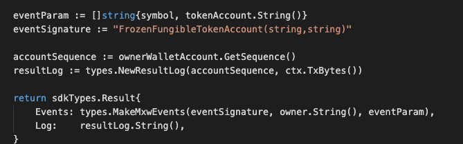
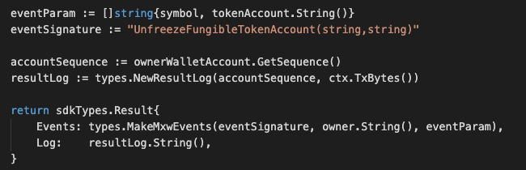

This is the message type used to set the account status of a fungible token.

## Parameters

The message type contains the following parameters:

| Name | Type | Required | Description                 |
| ---- | ---- | -------- | --------------------------- |
| owner | string | true   | Item owner| | 
| payload | TokenAccountPayload | true   | Account Payload information| | 
| signatures | []Signature | true   | Array of Signature| | 


#### Account Payload Information
| Name | Type | Required | Description                 |
| ---- | ---- | -------- | --------------------------- |
| tokenAccount | TokenAccount | true   | Token account| | 
| pub_key | nil | true   | crypto.PubKey| | 
| signature | []byte | true   | Signature| | 


#### Token Account Information
| Name | Type | Required | Description                 |
| ---- | ---- | -------- | --------------------------- |
| from | string | true   | Token owner| | 
| nonce | string | true   | Nonce| | 
| status | string | true   | Status, eg. freeze or unfreeze | | 
| symbol | string | true   | Token symbol| | 
| to | string | true   | Token account address| | 


#### Example
```
{
    "type": "token/setFungibleTokenAccountStatus",
    "value": {
        "owner": "mxw1j4duwuaqdj2na054rmlg3pdzncpmwzdjwtfqht",
        "payload": {
            "tokenAccount": {
                "from": "mxw1lmym5599yja76d2s463390he22pcpng3zzpx4p",
                "nonce": "0",
                "status": "FREEZE_ACCOUNT",
                "symbol": "TFT-Acc1",
                "to": "mxw1x5cf8y99ntjc8cjm00z603yfqwzxw2mawemf73"
            },
            "pub_key": {
                "type": "tendermint/PubKeySecp256k1",
                "value": "A8I4AHjOPpkQhEFy24L8SZkwd9UxQyEyudZYcYl9f4jK"
            },
            "signature": "XgDB/IWOX2M2gwi+1Voi4YaNhCJzAZdG00hbUTtTAFhEtnl+7i1BHi70XX5pwH9s+74y5gZunT2BFZoJXm/xzA=="
        },
        "signatures": [
            {
                "pub_key": {
                    "type": "tendermint/PubKeySecp256k1",
                    "value": "A4PwoBS8fl/2W+V1HXrWQBn5jXci5gnYUTQzDZFqD0vl"
                },
                "signature": "STAuPiC0512i3HHYm6pK+k0LXwCMLr1DgAjO+bV3UAct068WnvoWNh1Jd7xcWrnaghLfdWZT8yknhEkKd9XFRA=="
            }
        ]
    }
}
```

## Handler

The role of the handler is to define what action(s) needs to be taken when this MsgTypeSetFungibleTokenAccountStatus message is received.

In the file (./x/token/fungible/handler.go) start with the following code:


NewHandler is essentially a sub-router that directs messages coming into this module to the proper handler.

First, you define the actual logic for handling the MsgTypeSetFungibleTokenAccountStatus-FreezeTokenAccount message in handleMsgSetFungibleTokenAccountStatus:




In this function, requirements need to be met before emitted by the network.  

* A valid Token.
* A valid Token account which must not be freeze.
* Signer must be authorised.
* Action of Re-freeze-item is not allowed.


Last, you define the actual logic for handling the MsgTypeSetFungibleTokenAccountStatus-UnfreezeTokenAccount message in handleMsgSetFungibleTokenAccountStatus:


In this function, requirements need to be met before emitted by the network.  

* A valid Token.
* A valid Token account which must be freeze.
* Signer must be authorised.
* Action of Re-unfreeze-item is not allowed.


## Events
#### 1.
This tutorial describes how to create maxonrow events for scanner base on freeze token account
after emitted by a network.

  


#### Usage
This MakeMxwEvents create maxonrow events, by accepting :

* Custom Event Signature : using FrozenFungibleTokenAccount(string,string) 
* Token owner
* Event Parameters as below: 

| Name | Type | Description                 |
| ---- | ---- | --------------------------- |
| symbol | string | Token symbol, which must be unique| | 
| owner | string | Token owner| | 


#### 2.
This tutorial describes how to create maxonrow events for scanner base on unfreeze token account after emitted by a network.

  


#### Usage
This MakeMxwEvents create maxonrow events, by accepting :

* Custom Event Signature : using UnfreezeFungibleTokenAccount(string,string) 
* Token owner
* Event Parameters as below: 

| Name | Type | Description                 |
| ---- | ---- | --------------------------- |
| symbol | string | Token symbol, which must be unique| | 
| owner | string | Token owner| | 
