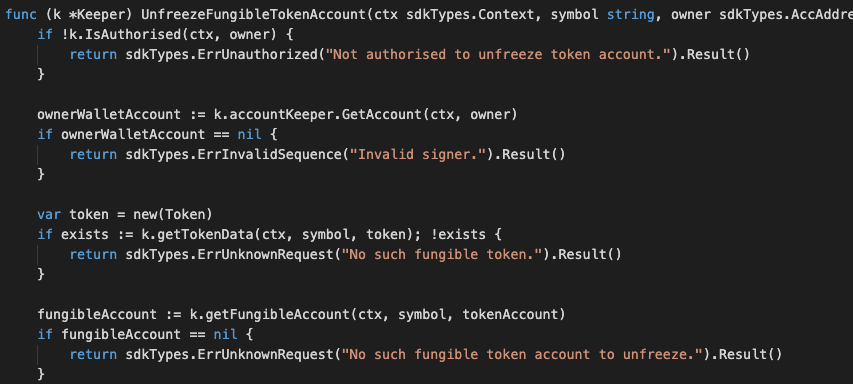

MsgTypeSetFungibleTokenAccountStatus

This is the msg type used to set the account status of a fungible token.


## Parameters

The message type contains the following parameters:

| Name | Type | Required | Description                 |
| ---- | ---- | -------- | --------------------------- |
| owner | string | true   | Item owner| | 
| payload | TokenAccountPayload | true   | Account Payload information| | 
| signatures | []Signature | true   | Array of Signature| | 


#### Account Payload Information
| Name | Type | Required | Description                 |
| ---- | ---- | -------- | --------------------------- |
| tokenAccount | TokenAccount | true   | Token account| | 
| pub_key | nil | true   | crypto.PubKey| | 
| signature | []byte | true   | signature| | 


#### Token Account Information
| Name | Type | Required | Description                 |
| ---- | ---- | -------- | --------------------------- |
| from | string | true   | Token owner| | 
| nonce | string | true   | nonce signature| | 
| status | string | true   | status, eg. freeze or unfreeze | | 
| symbol | string | true   | Token-symbol| | 
| to | string | true   | account address| | 


#### Example
```

```

## Handler

The role of the handler is to define what action(s) needs to be taken when this MsgTypeSetFungibleTokenAccountStatus message is received.

In the file (./x/token/fungible/handler.go) start with the following code:


NewHandler is essentially a sub-router that directs messages coming into this module to the proper handler.

First, you define the actual logic for handling the MsgTypeSetFungibleTokenAccountStatus-FreezeToken message in handleMsgSetFungibleTokenAccountStatus:


In this function, requirements need to be met before emitted by the network.  

* xxA valid Token.
* xxToken must not be freeze
* xxSigner must be authorised.
* xxAction of Re-freeze is not allowed.


Last, you define the actual logic for handling the MsgTypeSetFungibleTokenAccountStatus-UnfreezeToken message in handleMsgSetFungibleTokenAccountStatus:




In this function, requirements need to be met before emitted by the network.  

* xxA valid Token.
* xxToken must be freeze.
* xxSigner must be authorised.
* xxAction of Re-unfreeze is not allowed.


## Events
#### 1.
This tutorial describes how to create maxonrow events for scanner base on freeze token
after emitted by a network.

  


#### Usage
This MakeMxwEvents create maxonrow events, by accepting :

* Custom Event Signature : using FrozenFungibleToken(string,string) 
* Token owner
* Event Parameters as below: 

| Name | Type | Description                 |
| ---- | ---- | --------------------------- |
| symbol | string | Token symbol, which must be unique| | 
| owner | string | Token owner| | 


#### 2.
This tutorial describes how to create maxonrow events for scanner base on unfreeze token after emitted by a network.

  


#### Usage
This MakeMxwEvents create maxonrow events, by accepting :

* Custom Event Signature : using UnfreezeFungibleToken(string,string) 
* Token owner
* Event Parameters as below: 

| Name | Type | Description                 |
| ---- | ---- | --------------------------- |
| symbol | string | Token symbol, which must be unique| | 
| owner | string | Token owner| | 


