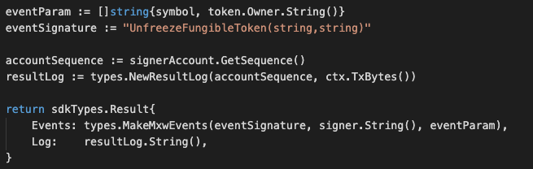

MsgTypeSetFungibleTokenStatus
This is the msg type used to set the status of a fungible token.


## Parameters

The message type contains the following parameters:

| Name | Type | Required | Description                 |
| ---- | ---- | -------- | --------------------------- |
| owner | string | true   | Token owner| | 
| payload | Payload | true   | Payload information| | 
| signatures | []Signature | true   | Array of Signature| | 


#### Payload Information
| Name | Type | Required | Description                 |
| ---- | ---- | -------- | --------------------------- |
| token | TokenData | true   | Token data| | 
| pub_key | nil | true   | crypto.PubKey| | 
| signature | []byte | true   | signature| | 


#### Token Data Information
| Name | Type | Required | Description                 |
| ---- | ---- | -------- | --------------------------- |
| from | string | true   | Token owner| | 
| nonce | string | true   | nonce signature| | 
| status | string | true   | status, eg. freeze or unfreeze | | 
| symbol | string | true   | Token-symbol| | 
| burnable | bool | true   | flag of burnable| | 
| tokenFees,omitempty | []TokenFee | true   | Fee Setting information| | 


#### Token Fee Information
| Name | Type | Required | Description                 |
| ---- | ---- | -------- | --------------------------- |
| action | string | true   | action | | 
| feeName | string | true   | fee setting| | 


#### Example
```
 {
    "type": "token/setFungibleTokenStatus",
    "value": {
        "owner": "mxw1j4duwuaqdj2na054rmlg3pdzncpmwzdjwtfqht",
        "payload": {
            "token": {
                "from": "mxw1lmym5599yja76d2s463390he22pcpng3zzpx4p",
                "nonce": "0",
                "status": "FREEZE",
                "symbol": "TT-4",
                "burnable": true
            },
            "pub_key": {
                "type": "tendermint/PubKeySecp256k1",
                "value": "A8I4AHjOPpkQhEFy24L8SZkwd9UxQyEyudZYcYl9f4jK"
            },
            "signature": "2rX+NvGxvB5vmEa7aeOk3nICZuUcOpv3jgRn64PtGVoT3e9Nq1mBDSUtggr5XyWJFNA6ntBzt/yvL4K+MgW+ng=="
        },
        "signatures": [
            {
                "pub_key": {
                    "type": "tendermint/PubKeySecp256k1",
                    "value": "A4PwoBS8fl/2W+V1HXrWQBn5jXci5gnYUTQzDZFqD0vl"
                },
                "signature": "y92hR1sSHk53B1tSbybOE0q2VQ9yzHnxW0heTk64Q9wHuk5lnQhqoztfM+IqaGOMbUYc3MGVhntkAVUVoXKw8A=="
            }
        ]
    }
}
```

## Handler

The role of the handler is to define what action(s) needs to be taken when this MsgTypeSetFungibleTokenStatus message is received.

In the file (./x/token/fungible/handler.go) start with the following code:


NewHandler is essentially a sub-router that directs messages coming into this module to the proper handler.

First, you define the actual logic for handling the MsgTypeSetFungibleTokenStatus-FreezeToken message in handleMsgSetFungibleTokenStatus:


In this function, requirements need to be met before emitted by the network.  

* xxA valid Token.
* xxToken must not be freeze
* xxSigner must be authorised.
* xxAction of Re-freeze is not allowed.


Last, you define the actual logic for handling the MsgTypeSetFungibleTokenStatus-UnfreezeToken message in handleMsgSetFungibleTokenStatus:


In this function, requirements need to be met before emitted by the network.  

* xxA valid Token.
* xxToken must be freeze.
* xxSigner must be authorised.
* xxAction of Re-unfreeze is not allowed.


## Events
#### 1.
This tutorial describes how to create maxonrow events for scanner base on freeze token
after emitted by a network.

  


#### Usage
This MakeMxwEvents create maxonrow events, by accepting :

* Custom Event Signature : using FrozenFungibleToken(string,string) 
* Token owner
* Event Parameters as below: 

| Name | Type | Description                 |
| ---- | ---- | --------------------------- |
| symbol | string | Token symbol, which must be unique| | 
| owner | string | Token owner| | 


#### 2.
This tutorial describes how to create maxonrow events for scanner base on unfreeze token after emitted by a network.

  


#### Usage
This MakeMxwEvents create maxonrow events, by accepting :

* Custom Event Signature : using UnfreezeFungibleToken(string,string) 
* Token owner
* Event Parameters as below: 

| Name | Type | Description                 |
| ---- | ---- | --------------------------- |
| symbol | string | Token symbol, which must be unique| | 
| owner | string | Token owner| | 


