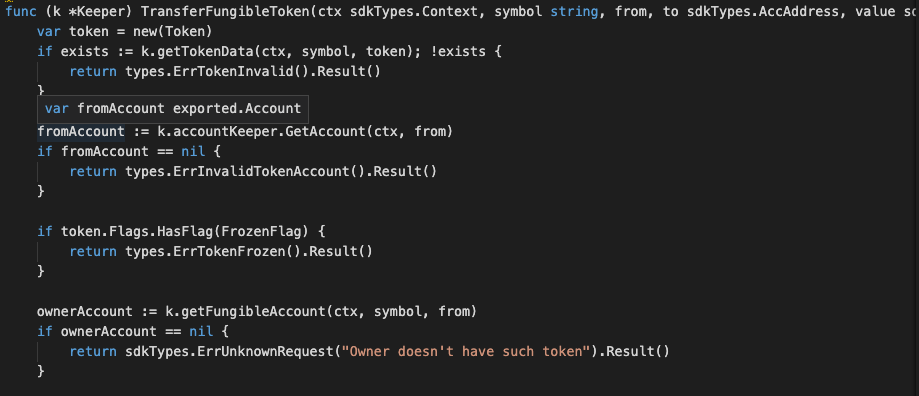
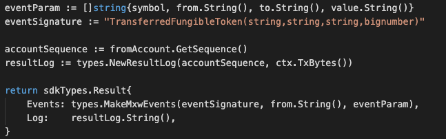

This is the msg type used to transfer the item of fungible token.


## Parameters

The message type contains the following parameters:

| Name | Type | Required | Description                 |
| ---- | ---- | -------- | --------------------------- |
| symbol | string | true   | Token symbol, which must be unique| | 
| from | string | true   | Item owner| | 
| to | string | true   | New Item owner| | 
| value | int | true   | value| | 


#### Example
```
{
    "type": "token/transferFungibleToken",
    "value": {
        "symbol": "TT-6",
        "value": "0",
        "from": "mxw1x5cf8y99ntjc8cjm00z603yfqwzxw2mawemf73",
        "to": "mxw1w0m8xqy0fpgkf6luwu666f5hhl3tm0sq53snw5"
    }
}
```

## Handler

The role of the handler is to define what action(s) needs to be taken when this MsgTypeTransferFungibleToken message is received.

In the file (./x/token/fungible/handler.go) start with the following code:


NewHandler is essentially a sub-router that directs messages coming into this module to the proper handler.
Now, you need to define the actual logic for handling the MsgTypeTransferFungibleToken message in handleMsgTransferFungibleToken:




In this function, requirements need to be met before emitted by the network.  

* A valid Token.
* Signer must be a valid token owner.
* Current token owner's account is not in freeze condition.
* New token owner's account is not in freeze condition.
* Current token owner must have enough balance in order to do transfer amount to New token owner
* Action of Re-transfer is allowed if have enough balance.


## Events
This tutorial describes how to create maxonrow events for scanner on this after emitted by a network.

  


#### Usage
This MakeMxwEvents create maxonrow events, by accepting :

* Custom Event Signature : using TransferredFungibleToken(string,string,string,bignumber)
* Item owner
* Event Parameters as below: 

| Name | Type | Description                 |
| ---- | ---- | --------------------------- |
| symbol | string | Token symbol, which must be unique| | 
| from | string | Item owner| | 
| to | string | New item owner| | 
| value | string | Value| | 

