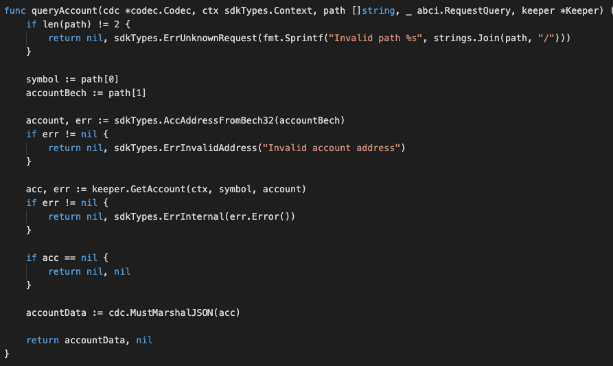

This takes a account and symbol then returns account data.

After the router is defined, define the inputs and responses for this queryAccount:




Notes on the above code:

This query request TWO path-parameters which refer to token-symbol and account. 
The output type should be something that is both JSON marshalable and stringable (implements the Golang fmt.Stringer interface). The returned bytes should be the JSON encoding of the output result.

For the output of Account, the normal Account struct is already JSON marshalable, but we need to add a .String() method on it.

#### Parameters
| Name | Type | Default | Required | Description                 |
| ---- | ---- | ------- | -------- | --------------------------- |
| path | string | false | false    | Path to the data (eg. "/a/b/c") |
| data | []byte | false | true     | Data |
| height | int64 | 0 | false    | Height (0 means latest) |
| prove | bool | false | false    | Include proofs of the transactions inclusion in the block, if true |


#### Example
In this example, we will explain how to query account data with abci_query. 

Run the command with the JSON request body:
```
curl 'http://localhost:26657/'
```

```
{
    "method": "abci_query",
    "params": [
    	"/custom/token/account/TT-2b/mxw1x5cf8y99ntjc8cjm00z603yfqwzxw2mawemf73",
    	"",
    	"0",
    	false
    	],
    "id": 0,
    "jsonrpc": "2.0"
}

```

The above command returns JSON structured like this: 
```
{
  "jsonrpc": "2.0",
  "id": 0,
  "result": {
    "response": {
      "code": 0,
      "log": "",
      "info": "",
      "index": "0",
      "key": null,
      "value": "eyJPd25lciI6Im14dzF4NWNmOHk5OW50amM4Y2ptMDB6NjAzeWZxd3p4dzJtYXdlbWY3MyIsIkZyb3plbiI6ZmFsc2UsIk1ldGFkYXRhIjoiIiwiQmFsYW5jZSI6IjAifQ==",
      "proof": null,
      "height": "844",
      "codespace": ""
    }
  }
}
```


