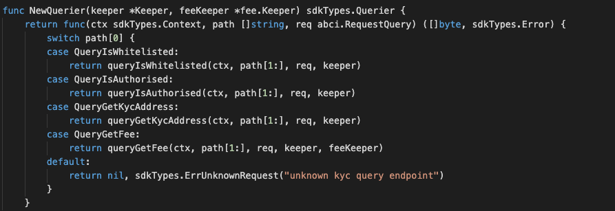

### Application Goals

The goal of the module is to let users do KYC whitelisting or revoke base on the existing whitelist. 

In this section, you will learn how these simple requirements translate to application design.

### Type of Message

In this module which consists of FOUR types of messages that users 
can send to interact with the application state: 

* [MsgWhitelist](msgtype/Whitelist.md "MsgWhitelist") -- This is the message type used to do KYC whitelisting. 
* [MsgRevokeWhitelist](msgtype/RevokeWhitelist.md "MsgRevokeWhitelist") -- This is the message type used to revoke base on the existing whitelist. 
* [MsgKycBind](msgtype/KycBind.md "MsgKycBind") -- This is the message type used to do KYC whitelisting (by Bussiness users).
* [MsgKycUnbind](msgtype/KycUnbind.md "MsgMintFungibleToken") -- This is the message type used to revoke base on the existing whitelist (by Bussiness users). 

** They will each have an associated Handler.

### Querier

Now you can navigate to the ./x/kyc/querier.go file. 
This is the place to define which queries against application state users will be able to make. 
 
Here, you will see NewQuerier been defined, and it acts as a sub-router for queries to this module (similar the NewHandler function). Note that because there isn't an interface similar to Msg for queries, we need to manually define switch statement cases (they can't be pulled off of the query .Route() function):

This module will expose few queries:

* [IsWhitelisted](querier/IsWhitelisted.md "IsWhitelisted") -- This takes an account address and returns whether been whitelisted.
* [IsAuthorised](querier/IsAuthorised.md "IsAuthorised") -- This takes an account address and returns whether been authorised.
* [GetKycAddress](querier/GetKycAddress.md "GetKycAddress") -- This takes an account address and returns the KYC address.
* [GetFee](querier/GetFee.md "GetFee") -- This takes a fee setting and returns the fee setting info.

