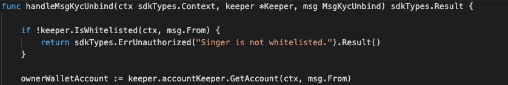
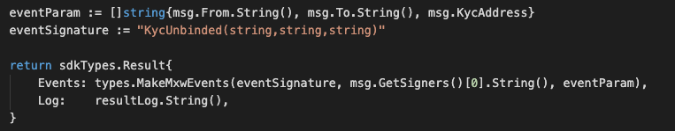

This is the message type used to revoke base on the existing whitelist (by Bussiness users).

<!-- type MsgKycUnbind struct {
	From       sdkTypes.AccAddress `json:"from"`
	To         sdkTypes.AccAddress `json:"to"`
	KycAddress string              `json:"kycAddress"`
} -->

## Parameters

The message type contains the following parameters:

| Name | Type | Required | Description                 |
| ---- | ---- | -------- | --------------------------- |
| from | string | true   | Account address| | 
| to | string | true   | Account address| | 
| kycAddress | string | true   | KYC address| | 


-dx
#### Example

```

```

## Handler

The role of the handler is to define what action(s) needs to be taken when this MsgTypeBurnNonFungibleItem message is received.

In the file (./x/kyc/handler.go) start with the following code:


NewHandler is essentially a sub-router that directs messages coming into this module to the proper handler.
Now, you need to define the actual logic for handling the MsgTypeBurnNonFungibleItem message in handleMsgBurnNonFungibleItem:




In this function, requirements need to be met before emitted by the network.  

* Authoriser, Issuer, provider must be authorised users.
* Business Entity with valid account and Corporate-KYC completed only can proceed this.


## Events
This tutorial describes how to create maxonrow events for scanner on this after emitted by a network.

  


#### Usage
This MakeMxwEvents create maxonrow events, by accepting :

* Custom Event Signature : using KycUnbinded(string,string,string)
* Signer
* Event Parameters as below: 

| Name | Type | Description                 |
| ---- | ---- | --------------------------- |
| from | string | Account address| | 
| to | string | Account address| | 
| value | string | KYC address| | 

