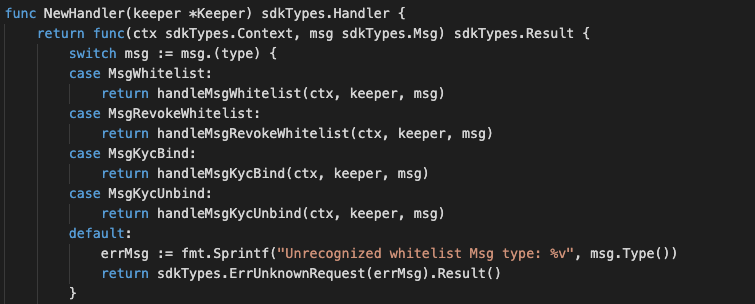
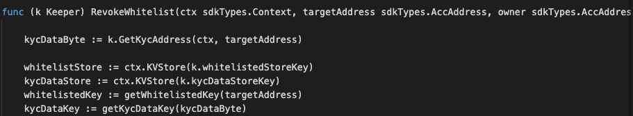
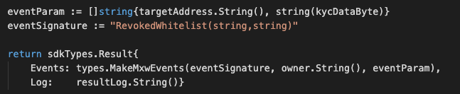

This is the message type used to revoke base on the existing whitelist.

## Parameters

<!-- type MsgRevokeWhitelist struct {
	Owner         sdkTypes.AccAddress `json:"owner"`
	RevokePayload RevokePayload       `json:"payload"`
	Signatures    []Signature         `json:"signatures"`
}

type RevokePayload struct {
	RevokeKycData RevokeKycData `json:"kyc"`
	crypto.PubKey `json:"pub_key"`
	Signature     []byte `json:"signature"`
}

type RevokeKycData struct {
	From  sdkTypes.AccAddress `json:"from"`
	Nonce string              `json:"nonce"`
	To    sdkTypes.AccAddress `json:"to"`
} -->


The message type contains the following parameters:

| Name | Type | Required | Description                 |
| ---- | ---- | -------- | --------------------------- |
| owner | string | true   | Owner account address| | 
| payload | RevokePayload | true   | RevokePayload data| | 
| signatures | []Signature | true   | Signatures| | 


#### RevokePayload Information
| Name | Type | Required | Description                 |
| ---- | ---- | -------- | --------------------------- |
| kyc | RevokeKycData | true   | KYC data| | 
| pub_key | crypto.PubKey | true   | PubKey | |
| signature | []byte | true   | signatures | |


#### Payload Information
| Name | Type | Required | Description                 |
| ---- | ---- | -------- | --------------------------- |
| from | string | true   | account address| | 
| nonce | string | true   | nonce| | 
| to | string | true   | account address| | 


#### Example

```
{
    "type": "kyc/revokeWhitelist",
    "value": {
        "owner": "mxw1y0j6xqc8dsafx2tfv4m8765mw7wrvlespzfyfq",
        "payload": {
            "kyc": {
                "from": "mxw126l5vx5s478khryv5l597lhdsfvnq9tmvmzfsl",
                "nonce": "0",
                "to": "mxw1nyk9r6347l3a6l2t0yk0mczqgumsnfuqjqwda4"
            },
            "pub_key": {
                "type": "tendermint/PubKeySecp256k1",
                "value": "AxPt3o4lK81VNI5XZZ9ik0HZ0saiEwFXDVbmU/NUhV7V"
            },
            "signature": "vA7SVyE2Nap8Ni8UbW/J/CJztU4wM4RVjAXluHt+8jhonzFZEpC2lQHYO0RAcGR/lou7k1HwZ9jGkouUULeIUw=="
        },
        "signatures": [
            {
                "pub_key": {
                    "type": "tendermint/PubKeySecp256k1",
                    "value": "Aw96JCN8YXpQqxolKEeMDgpSdYMdgVgOWEdfi96+zo+p"
                },
                "signature": "ZwGjv5XPrHVMv9RhcretrKz7PGsCMzgdKJQWQQqZc9htEVeHWfzi9k+263YCSSSYpiumymdULudzRRFicJYlqQ=="
            }
        ]
    }
}

```

## Handler

The role of the handler is to define what action(s) needs to be taken when this MsgRevokeWhitelist message is received.

In the file (./x/token/fungible/handler.go) start with the following code:




NewHandler is essentially a sub-router that directs messages coming into this module to the proper handler.
Now, you need to define the actual logic for handling the MsgRevokeWhitelist message in handleMsgBurnNonFungibleItem:




In this function, requirements need to be met before emitted by the network.  

* Authoriser, Issuer, provider must be authorised users.
* User with valid account and KYC completed only can proceed this.

## Events
This tutorial describes how to create maxonrow events for scanner on this after emitted by a network.

  


#### Usage
This MakeMxwEvents create maxonrow events, by accepting :

* Custom Event Signature : using RevokedWhitelist(string,string)
* Owner address
* Event Parameters as below: 


| Name | Type | Description                 |
| ---- | ---- | --------------------------- |
| address | string | Targeted address| | 
| value | string | value| | 

