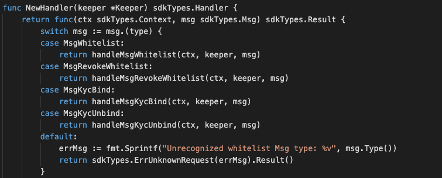

This is the message type used to do KYC whitelisting.

## Parameters

The message type contains the following parameters:

<!-- type MsgWhitelist struct {
	Owner   sdkTypes.AccAddress `json:"owner"`
	KycData KycData             `json:"kycData"`
}

type KycData struct {
	Payload    Payload     `json:"payload"`
	Signatures []Signature `json:"signatures"`
}

type Payload struct {
	Kyc           Kyc `json:"kyc"`
	crypto.PubKey `json:"pub_key"`
	Signature     []byte `json:"signature"`
} -->

| Name | Type | Required | Description                 |
| ---- | ---- | -------- | --------------------------- |
| owner | string | true   | Token owner| | 
| kycData| KycData | true   | Data of KYC | | 


#### KycData Information
| Name | Type | Required | Description                 |
| ---- | ---- | -------- | --------------------------- |
| payload | Payload | true   | Payload| | 
| signatures | []Signature | true   | signatures | |


#### Payload Information
| Name | Type | Required | Description                 |
| ---- | ---- | -------- | --------------------------- |
| kyc | Kyc | true   | kyc data| | 
| pub_key | crypto.PubKey | true   | pub_key| | 
| signature | []byte | true   | signatures| | 


#### Example
```
{
    "type": "kyc/whitelist",
    "value": {
        "owner": "mxw1y0j6xqc8dsafx2tfv4m8765mw7wrvlespzfyfq",
        "kycData": {
            "payload": {
                "kyc": {
                    "from": "mxw1nyk9r6347l3a6l2t0yk0mczqgumsnfuqjqwda4",
                    "nonce": "0",
                    "kycAddress": "testKyc1234"
                },
                "pub_key": {
                    "type": "tendermint/PubKeySecp256k1",
                    "value": "AhFwNoY/JtmaQnkwPSGGXTqmZnw5izkGEzDBbZ11PCD0"
                },
                "signature": "XhyQbVGeS5KmVUIGWuUkA3Mz7nFhpSFeT5nO5XskC15kdRRBDi6Z3pqRm2c9bRCa3j9QWhG+MurOHnI6/QS9GA=="
            },
            "signatures": [
                {
                    "pub_key": {
                        "type": "tendermint/PubKeySecp256k1",
                        "value": "Aw96JCN8YXpQqxolKEeMDgpSdYMdgVgOWEdfi96+zo+p"
                    },
                    "signature": "xh4OzyV6B7ES0b3jcuIPqpn3lVw7HD3IUgts6E19wPdr6sdS/sb9wvWp2afN1nXzBHwaRwDmsU1oujhrqRErzg=="
                },
                {
                    "pub_key": {
                        "type": "tendermint/PubKeySecp256k1",
                        "value": "AxPt3o4lK81VNI5XZZ9ik0HZ0saiEwFXDVbmU/NUhV7V"
                    },
                    "signature": "HPB4aC1XuL/zYsQiPa+Stq5b1FPsXJ9LlBeA8iALl191w/kM5lvFAT5J6UUHmKivpzDknoXuxtyjDkallZYY/w=="
                }
            ]
        }
    }
}

```

## Handler

The role of the handler is to define what action(s) needs to be taken when this MsgTypeBurnNonFungibleItem message is received.

In the file (./x/token/fungible/handler.go) start with the following code:




NewHandler is essentially a sub-router that directs messages coming into this module to the proper handler.
Now, you need to define the actual logic for handling the MsgTypeBurnNonFungibleItem message in handleMsgBurnNonFungibleItem:


In this function, requirements need to be met before emitted by the network.  

* Authoriser, Issuer, provider must be authorised users.
* User with valid account only can proceed for KYC process.  


## Events
This tutorial describes how to create maxonrow events for scanner on this after emitted by a network.

  


#### Usage
This MakeMxwEvents create maxonrow events, by accepting :

* Custom Event Signature : using KycWhitelisted(string,string)
* Signer
* Event Parameters as below: 

| Name | Type | Description                 |
| ---- | ---- | --------------------------- |
| signer | string | Account address| | 
| account | string | Account address| |


