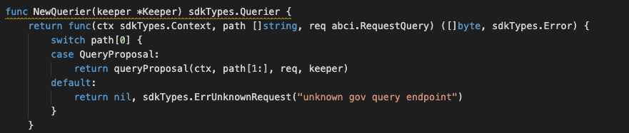

### Application Goals

The goal of the module is to let users create and maintain status of a particular proposal. 

In this section, you will learn how these simple requirements translate to application design.

### Type of Message

In this module which consists of TWO types of messages that users 
can send to interact with the application state: 

* [MsgSubmitProposal](msgtype/SubmitProposal.md "MsgSubmitProposal") -- This is the msg type used to create a proposal from maintainers. 
* [MsgCastAction](msgtype/CastAction.md "MsgCastAction") -- This is the msg type used for maintainers to cast “approve” or “reject” on certain proposal. 

** They will each have an associated Handler.

### Querier

Now you can navigate to the ./x/maintenance/querier.go file. 
This is the place to define which queries against application state users will be able to make. 
 
Here, you will see NewQuerier been defined, and it acts as a sub-router for queries to this module (similar the NewHandler function). Note that because there isn't an interface similar to Msg for queries, we need to manually define switch statement cases (they can't be pulled off of the query .Route() function):

This module will expose few queries:

* [Proposal](querier/Proposal.md "Proposal") -- This takes a proposal ID and returns the proposal info.
