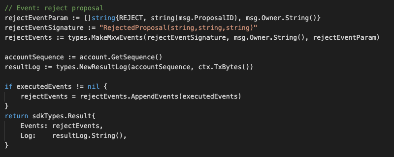

This is the message type used to set the alias status, eg. Approval, Reject, Revoke.

<!-- type MsgCastAction struct {
	Action     string              `json:"action"`
	ProposalID uint64              `json:"proposalId"` // ID of the proposal
	Owner      sdkTypes.AccAddress `json:"owner"`      //  address of the voter
} -->


## Parameters

The message type contains the following parameters:

| Name | Type | Required | Description                 |
| ---- | ---- | -------- | --------------------------- |
| action | string | true   | Action : Approve or Reject| | 
| proposalId | uint64 | true   | Proposal Id| | 
| owner | string | true   | Account address| | 


#### Example
```
{
    "type": "maintenance/msgCastAction",
    "value": {
        "action": "approve",
        "proposalId": "1",
        "owner": "mxw1643vtl03p3xgyxjgf7wmfuqeg04rkx9txjw6w6"
    }
}
```

## Handler

The role of the handler is to define what action(s) needs to be taken when this MsgTypeSetNonFungibleTokenStatus message is received.

In the file (./x/maintenance/handler.go) start with the following code:


NewHandler is essentially a sub-router that directs messages coming into this module to the proper handler.

First, you define the actual logic for handling the MsgCastAction-Approve Proposal message in handleMsgCastAction:


In this function, requirements need to be met before emitted by the network.  

* Caster must be valid account user. 
* Caster must be authorised as valid maintainer.
* Proposal ID must be valid in order to proceed for Approve or Reject.

Lastly, you define the actual logic for handling the MsgCastAction-Reject Proposal message in handleMsgCastAction:


In this function, requirements need to be met before emitted by the network.  

* xxA valid Token.
* xxToken must not be approved.
* xxToken must not be approved.
* xxSigner must be authorised.
* xxAction of Re-approved is not allowed.


## Events
#### 1.
This tutorial describes how to create maxonrow events for scanner base on Approve Proposal after emitted by a network.

  


#### Usage
This MakeMxwEvents create maxonrow events, by accepting :

* Custom Event Signature : using ApprovedProposal(string,string,string)
* Signer
* Event Parameters as below: 

| Name | Type | Description                 |
| ---- | ---- | --------------------------- |
| proposalType | string | APPROVE| | 
| proposalID | uint64 | Proposal ID| | 
| proposer | string | Proposal Account address| | 


#### 2.
This tutorial describes how to create maxonrow events for scanner base on Reject Proposal after emitted by a network.

  


#### Usage
This MakeMxwEvents create maxonrow events, by accepting :

* Custom Event Signature : using RejectedProposal(string,string,string)
* Signer
* Event Parameters as below: 

| Name | Type | Description                 |
| ---- | ---- | --------------------------- |
| proposalType | string | REJECT| | 
| proposalID | uint64 | Proposal ID| | 
| proposer | string | Proposal Account address| | 

