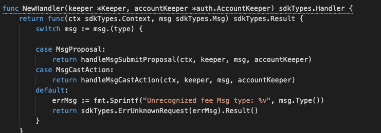

This is the message type used to create the alias.


<!-- type MsgProposal struct {
	Title        string              `json:"title"`
	Description  string              `json:"description"`
	ProposalType ProposalKind        `json:"proposalType"`
	ProposalData MsgProposalData     `json:"proposalData"`
	Proposer     sdkTypes.AccAddress `json:"proposer"`
}

type MsgProposalData interface {
	GetType() ProposalKind
} -->


## Parameters

The message type contains the following parameters:

| Name | Type | Required | Description                 |
| ---- | ---- | -------- | --------------------------- |
| title | string | true   | Title| | 
| description | string | true   | Description of proposal| | 
| proposalType | byte | true   | Proposal Type| | 
| proposalData | MsgProposalData | true   | Proposal Data| | 
| proposer | string | true   | Proposer| | 


#### MsgProposalData Information
| Name | Type | Required | Description                 |
| ---- | ---- | -------- | --------------------------- |
| proposalData | byte | true   | Proposal Data| | 


#### Example

```
{
    "type": "maintenance/msgProposal",
    "value": {
        "title": "Add authorised address",
        "description": "Add cmo as fee authorised address",
        "proposalType": "ModifyFeeMaintainer",
        "proposalData": {
            "type": "maintenance/data/feeMaintainer",
            "value": {
                "action": "add",
                "feeCollectors": [
                    {
                        "module": "",
                        "address": ""
                    }
                ],
                "authorisedAddresses": [
                    "mxw173qf9y2ae0cx8y07ez6qsl9k2gs2l5955hfc7x"
                ]
            }
        },
        "proposer": "mxw173qf9y2ae0cx8y07ez6qsl9k2gs2l5955hfc7x"
    }
}

```

## Handler

The role of the handler is to define what action(s) needs to be taken when this MsgProposal message is received.

In the file (./x/maintenance/handler.go) start with the following code:




NewHandler is essentially a sub-router that directs messages coming into this module to the proper handler.
Now, you need to define the actual logic for handling the MsgProposal message in handleMsgSubmitProposal:


  


In this function, requirements need to be met before emitted by the network.  

* Proposer must be valid account user.
* Proposer must be authorised as valid maintainer.
* ProposalData must be valid.


## Events
This tutorial describes how to create maxonrow events for scanner on this after emitted by a network.

  


#### Usage
This MakeMxwEvents create maxonrow events, by accepting :

* Custom Event Signature : using SubmittedProposal(string,string,string)
* Proposer
* Event Parameters as below: 

| Name | Type | Description                 |
| ---- | ---- | --------------------------- |
| proposalID | uint64 | Proposal ID| | 
| proposer | string | Proposal Account address| | 
| proposalType | string | Proposal Type| | 


#### Usage
This MakeMxwEvents create maxonrow events, by accepting :

* Custom Event Signature : using ApprovedProposal(string,string,string)
* Signer
* Event Parameters as below: 

| Name | Type | Description                 |
| ---- | ---- | --------------------------- |
| proposalType | string | APPROVE| | 
| proposalID | uint64 | Proposal ID| | 
| proposer | string | Proposal Account address| | 

