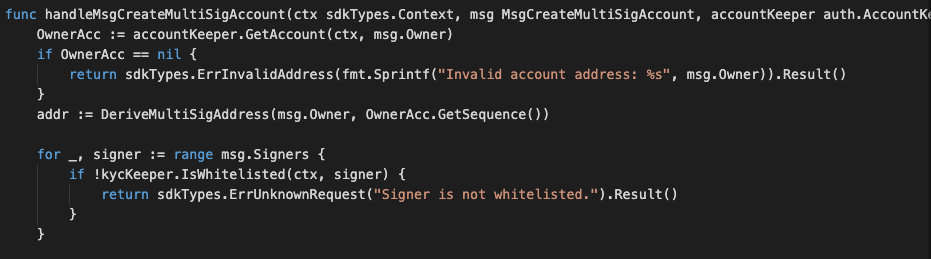
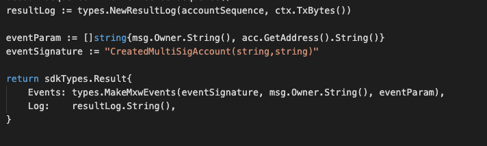

This is the message type used to create multiSig account.

<!-- type MsgCreateMultiSigAccount struct {
	Owner     sdkTypes.AccAddress   `json:"owner"`
	Threshold int                   `json:"threshold"`
	Signers   []sdkTypes.AccAddress `json:"signers"`
} -->


## Parameters

The message type contains the following parameters:

| Name | Type | Required | Description                 |
| ---- | ---- | -------- | --------------------------- |
| owner | string | true   | Owner Account address| | 
| threshold | int | true   | Threshold number| | 
| signers | []string | true   | List of Signers Account address| | 


-dx
#### Example

```

```


## Handler

The role of the handler is to define what action(s) needs to be taken when this MsgCreateMultiSigAccount message is received.

In the file (./x/auth/handler.go) start with the following code:


NewHandler is essentially a sub-router that directs messages coming into this module to the proper handler.
Now, you need to define the actual logic for handling the MsgCreateMultiSigAccount message in handleMsgCreateMultiSigAccount:




In this function, requirements need to be met before emitted by the network.  

* xxAuthoriser, Issuer, provider must be authorised users.
* xxBusiness Entity with valid account only can proceed for Corporate-KYC process.  


## Events
This tutorial describes how to create maxonrow events for scanner on this after emitted by a network.

  


#### Usage
This MakeMxwEvents create maxonrow events, by accepting :

* Custom Event Signature : using CreatedMultiSigAccount(string,string)
* Signer
* Event Parameters as below: 

| Name | Type | Description                 |
| ---- | ---- | --------------------------- |
| signer | string | Account address| | 
| to | string | Account address| | 


