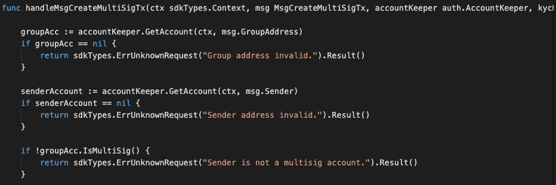
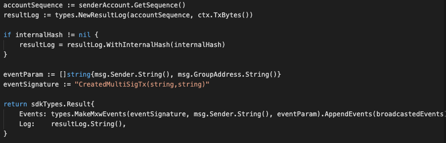

This is the message type used to create relevant multiSig transactions, eg. Fund Transfer, Transfer ownership, Mint token, Burn token, Recover wallet, Add or Remove wallet of signer.


<!-- 
type MsgCreateMultiSigTx struct {
	GroupAddress sdkTypes.AccAddress `json:groupAddress`
	StdTx        auth.StdTx          `json:stdTx`
	Sender       sdkTypes.AccAddress `json:sender`
} 


type StdTx struct {
	Msgs       []sdk.Msg      `json:"msg" yaml:"msg"`
	Fee        StdFee         `json:"fee" yaml:"fee"`
	Signatures []StdSignature `json:"signatures" yaml:"signatures"`
	Memo       string         `json:"memo" yaml:"memo"`
}


type StdSignature struct {
	crypto.PubKey `json:"pub_key" yaml:"pub_key"` // optional
	Signature     []byte                          `json:"signature" yaml:"signature"`
}

-->

## Parameters

The message type contains the following parameters:

| Name | Type | Required | Description                 |
| ---- | ---- | -------- | --------------------------- |
| groupAddress | string | true   | Group Account address| | 
| stdTx | StdTx | true   | stdTx| | 
| sender| string | true   | Sender Account address | | 


#### StdTx Information
| Name | Type | Required | Description                 |
| ---- | ---- | -------- | --------------------------- |
| msg | []sdk.Msg | true   | Payload| | 
| fee | StdFee | true   | signatures | |
| signatures | []StdSignature | true   | signatures | |
| memo | string | true   | signatures | |


#### StdSignature Information
| Name | Type | Required | Description                 |
| ---- | ---- | -------- | --------------------------- |
| pub_key | crypto.PubKey | true   | pub_key| | 
| signature | []byte | true   | signatures| | 


#### Example
```


```

-dx
## Handler

The role of the handler is to define what action(s) needs to be taken when this MsgCreateMultiSigTx message is received.

In the file (./x/auth/handler.go) start with the following code:


NewHandler is essentially a sub-router that directs messages coming into this module to the proper handler.
Now, you need to define the actual logic for handling the MsgCreateMultiSigTx message in handleMsgCreateMultiSigTx:




In this function, requirements need to be met before emitted by the network.  

* xxAuthoriser, Issuer, provider must be authorised users.
* xxUser with valid account only can proceed for KYC process.  


## Events
This tutorial describes how to create maxonrow events for scanner on this after emitted by a network.

  


#### Usage
This MakeMxwEvents create maxonrow events, by accepting :

* Custom Event Signature : using CreatedMultiSigTx(string,string)
* Signer
* Event Parameters as below: 

| Name | Type | Description                 |
| ---- | ---- | --------------------------- |
| signer | string | Account address| | 
| groupAddress | string | Account address| | 

