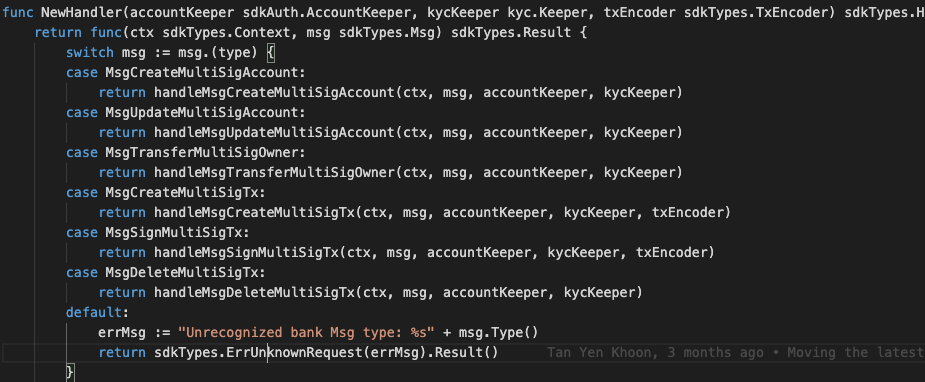

This is the message type used to endorse relevant multiSig transactions.


<!-- type MsgSignMultiSigTx struct {
	GroupAddress sdkTypes.AccAddress `json:groupAddress`
	TxID         uint64              `json:txId`
	Signature    auth.StdSignature   `json:signature`
	Sender       sdkTypes.AccAddress `json:sender`
} 

type StdSignature struct {
	crypto.PubKey `json:"pub_key" yaml:"pub_key"` // optional
	Signature     []byte                          `json:"signature" yaml:"signature"`
}

-->

## Parameters

The message type contains the following parameters:


| Name | Type | Required | Description                 |
| ---- | ---- | -------- | --------------------------- |
| groupAddress | string | true   | Group account | | 
| txId| uint64 | true   | Transaction ID | | 
| signature | auth.StdSignature | true   | signature | | 
| sender| string | true   | Sender account | | 


#### StdSignature Information
| Name | Type | Required | Description                 |
| ---- | ---- | -------- | --------------------------- |
| pub_key | crypto.PubKey | true   | pub_key| | 
| signature | []byte | true   | signatures| | 


#### Example
```


```

-dx
## Handler

The role of the handler is to define what action(s) needs to be taken when this MsgSignMultiSigTx message is received.

In the file (./x/auth/handler.go) start with the following code:




NewHandler is essentially a sub-router that directs messages coming into this module to the proper handler.
Now, you need to define the actual logic for handling the MsgSignMultiSigTx message in handleMsgSignMultiSigTx:


In this function, requirements need to be met before emitted by the network.  

* xxAuthoriser, Issuer, provider must be authorised users.
* xxUser with valid account only can proceed for KYC process.  


## Events
This tutorial describes how to create maxonrow events for scanner on this after emitted by a network.

  


#### Usage
This MakeMxwEvents create maxonrow events, by accepting :

* Custom Event Signature : using SignedMultiSigTx(string,string,string)
* Signer
* Event Parameters as below: 

| Name | Type | Description                 |
| ---- | ---- | --------------------------- |
| signer | string | Account address| | 
| groupAddress | string | Account address| | 
| transactionId | string | Transaction ID| | 

