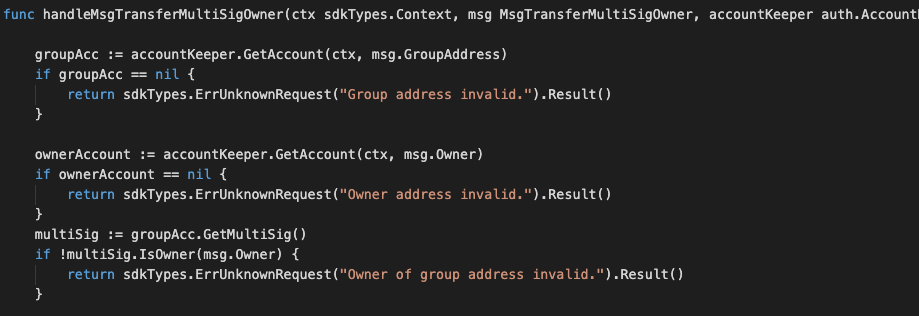
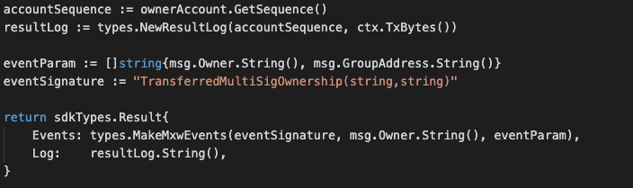

This is the message type used to transfer account from current owner to a new owmer.


## Parameters
<!-- 
type MsgTransferMultiSigOwner struct {
	GroupAddress sdkTypes.AccAddress `json:groupAddress`
	Owner        sdkTypes.AccAddress `json:owner`
	NewOwner     sdkTypes.AccAddress `json:newOwner`
} -->


The message type contains the following parameters:

| Name | Type | Required | Description                 |
| ---- | ---- | -------- | --------------------------- |
| groupAddress | string | true   | Group account address| | 
| owner | string | true   | Old Owner account address| | 
| newOwner | string | true   | New Owner account address| | 


#### Example

```


```

## Handler

The role of the handler is to define what action(s) needs to be taken when this MsgTransferMultiSigOwner message is received.

In the file (./x/auth/handler.go) start with the following code:


NewHandler is essentially a sub-router that directs messages coming into this module to the proper handler.
Now, you need to define the actual logic for handling the MsgTransferMultiSigOwner message in handleMsgTransferMultiSigOwner:




In this function, requirements need to be met before emitted by the network.  

* xxAuthoriser, Issuer, provider must be authorised users.
* xxUser with valid account and KYC completed only can proceed this.

## Events
This tutorial describes how to create maxonrow events for scanner on this after emitted by a network.

  


#### Usage
This MakeMxwEvents create maxonrow events, by accepting :

* Custom Event Signature : using TransferredMultiSigOwnership(string,string)
* Signer
* Event Parameters as below: 


| Name | Type | Description                 |
| ---- | ---- | --------------------------- |
| signer | string | Account address| | 
| groupAddress | string | Account address| | 
