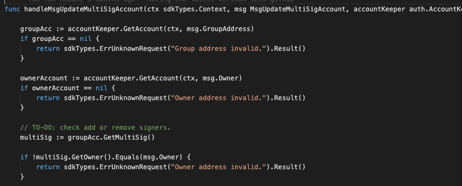
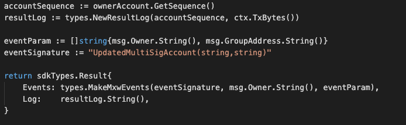

This is the message type used to update existing multiSig account.

<!-- type MsgUpdateMultiSigAccount struct {
	Owner        sdkTypes.AccAddress   `json:owner`
	GroupAddress sdkTypes.AccAddress   `json:groupAddress`
	NewThreshold int                   `json:threshold`
	NewSigners   []sdkTypes.AccAddress `json:signers`
} -->


## Parameters

The message type contains the following parameters:

| Name | Type | Required | Description                 |
| ---- | ---- | -------- | --------------------------- |
| owner | string | true   | Owner account address| | 
| groupAddress | string | true   | Group account address| | 
| threshold | string | true   | threshold number| | 
| signers | []string | true   | List of Signers account address| | 


-dx
#### Example

```

```

## Handler

The role of the handler is to define what action(s) needs to be taken when this MsgUpdateMultiSigAccount message is received.

In the file (./x/auth/handler.go) start with the following code:


NewHandler is essentially a sub-router that directs messages coming into this module to the proper handler.
Now, you need to define the actual logic for handling the MsgUpdateMultiSigAccount message in handleMsgUpdateMultiSigAccount:




In this function, requirements need to be met before emitted by the network.  

* xxAuthoriser, Issuer, provider must be authorised users.
* xxBusiness Entity with valid account and Corporate-KYC completed only can proceed this.


## Events
This tutorial describes how to create maxonrow events for scanner on this after emitted by a network.

  


#### Usage
This MakeMxwEvents create maxonrow events, by accepting :

* Custom Event Signature : using UpdatedMultiSigAccount(string,string)
* Signer
* Event Parameters as below: 

| Name | Type | Description                 |
| ---- | ---- | --------------------------- |
| signer | string | Account address| | 
| groupAddress | string | Account address| | 


