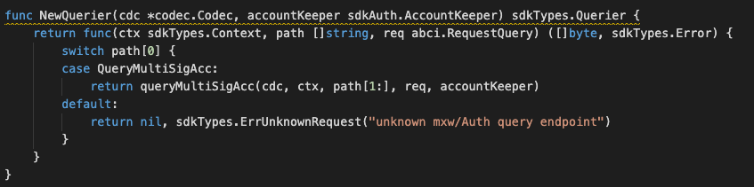

### Application Goals

A Multi-signature wallet which supports more complicated transactions that require the confirmation of multiple users who called copayers before any relevant transaction types proceed, may even be along with daily limits. 
The wallet account consist of owner, signer and threshold information, where only account owner are allowed to update the signer list from time-to-time basis. There is a transfer-ownership function which can change from the current account owner to a new owner after the approval of signers. 

In this section, you will learn how these simple requirements translate to application design.

### Type of Message

In this module which consists of FOUR types of messages that users 
can send to interact with the application state: 

* [MsgCreateMultiSigAccount](msgtype/CreateMultiSigAccount.md "MsgCreateMultiSigAccount") -- This is the message type used to create multiSig account. 
* [MsgUpdateMultiSigAccount](msgtype/UpdateMultiSigAccount.md "MsgUpdateMultiSigAccount") -- This is the message type used to update existing multiSig account.
* [MsgTransferMultiSigOwner](msgtype/TransferMultiSigOwner.md "MsgTransferMultiSigOwner") -- This is the message type used to transfer account from current owner to a new owmer.
* [MsgCreateMultiSigTx](msgtype/CreateMultiSigTx.md "MsgCreateMultiSigTx") -- This is the message type used to create relevant multiSig transactions, eg. Fund Transfer, Transfer ownership, Mint token, Burn token, Recover wallet, 
Add or Remove wallet of signer. 
* [MsgSignMultiSigTx](msgtype/SignMultiSigTx.md "MsgSignMultiSigTx") -- This is the message type used to endorse relevant multiSig transactions. 
* [MsgDeleteMultiSigTx](msgtype/DeleteMultiSigTx.md "MsgDeleteMultiSigTx") -- This is the message type used to remove relevant multiSig transactions.  

** They will each have an associated Handler.

### Querier

Now you can navigate to the ./x/auth/querrier.go file. 
This is the place to define which queries against application state users will be able to make. 
 
Here, you will see NewQuerier been defined, and it acts as a sub-router for queries to this module (similar the NewHandler function). Note that because there isn't an interface similar to Msg for queries, we need to manually define switch statement cases (they can't be pulled off of the query .Route() function):

This module will expose few queries:

* [MultiSigAcc](querier/MultiSigAcc.md "MultiSigAcc") -- This takes a group-account address and returns its information.

