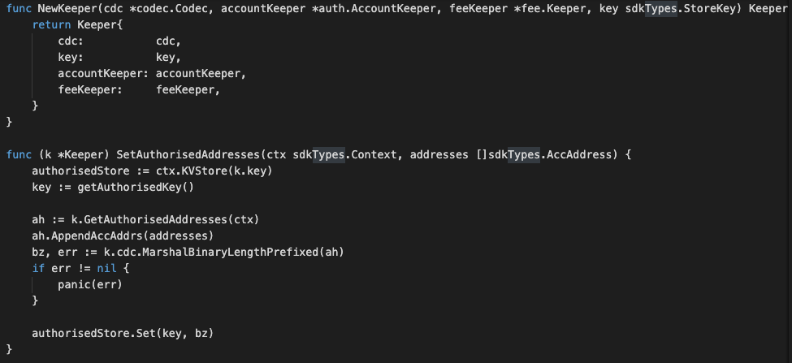

# Maxonrow Modules

In this section, you will learn how these simple requirements translate to application design.

### Type

We will use this for all type of operations that send to our fullnode. 
Start by creating the file msgs.go in ./x/what_module/ folder which 
will hold customs message types for that particular module.
To start the SDK module, define those relevant structs in 
the ./x/what_module/msgs.go file.

### Msgs

Msgs define your application's state transitions. 
They are encoded and passed around the network wrapped in Txs. 
Messages are "owned" by a single module, meaning they are routed to only one of your applications modules. 
Each module has its own set of messages that it uses to update its subset of the chain state. 
Maxonrow SDK relies on Cosmos SDK wraps and unwraps Msgs from Txs, which means developer only have to define the relevant Msgs.   
Msgs must satisfy the following interface:

  

### Handlers

Next we need to write a handler function to process the Messages contained 
in the transactions delivered in each block. 
Handlers determine what actions should be taken (eg. which stores need to get updated, how, and under what conditions) 
when a given Msg is received. In MVC terms this would be the 'controller'.

Each module will have its owned types of Msgs that users can send to interact with the application state.

### Keeper

The main core of a Maxonrow SDK module is a piece called the Keeper. 
Each module's Keeper is responsible for CRUD operations to the main datastore of the application. 
With more sophisticated applications, modules may have access to each other's Keepers 
for cross-module interactions.  In MVC terms this would be the "model". 

  

### Querier

This is the place to define which queries against application state users will be able to make. 
Now that we have a running distributed state machine, 
it's time to enable querying our blockchain state. This is done through Queriers. 
These define the queries that clients can send via websocket/rpc to which our application will respond. 
Each module will expose its queries accordingly.

### List of Modules
Here are those modules that can be used in Maxonrow SDK applications, along with their respective documentation and tutorials:

* Bank
* KYC
* Maintenance
* Fee Settings
* Nameservice
* [Fungible Token](fungible/fungible.md "What is Fungible Token?")
* [Non-fungible Token](nonfungible/nonfungible.md "What is Non-fungible Token?")

