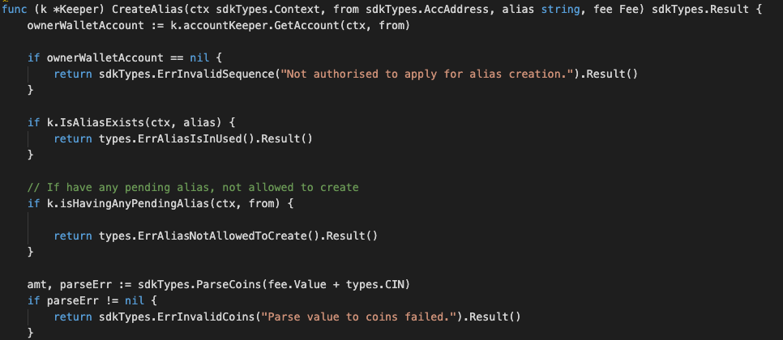
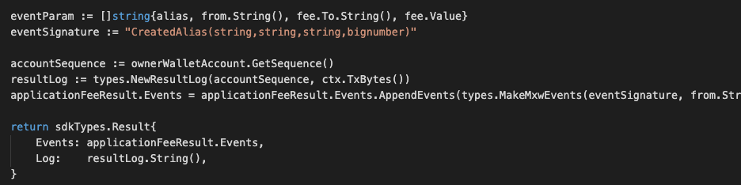

This is the message type used to create the alias.


<!-- type MsgCreateAlias struct {
	Name  string         `json:"name"`
	Owner sdk.AccAddress `json:"owner"`
	Fee   Fee            `json:"fee"`
}

type Fee struct {
	To    sdkTypes.AccAddress `json:"to"`
	Value string              `json:"value"`
} -->


## Parameters

The message type contains the following parameters:

| Name | Type | Required | Description                 |
| ---- | ---- | -------- | --------------------------- |
| name | string | true   | name of alias| | 
| owner | string | true   | Account address| | 
| fee | Fee | true   | Fee Data| | 


#### Fee Information
| Name | Type | Required | Description                 |
| ---- | ---- | -------- | --------------------------- |
| to | string | true   | Fee-collector| | 
| value | string | true   | Fee amount to be paid| | 


#### Example

```
{
    "type": "nameservice/createAlias",
    "value": {
        "name": "mxw-alias",
        "owner": "mxw1ytw2ydf7nnwt3mlyt6f00vk4tj8gwn3s4txnye",
        "fee": {
            "to": "mxw123xwuat5h9x92w6vdtn4fl2l03t7d793qugxvc",
            "value": "10000"
        }
    }
}

```

## Handler

The role of the handler is to define what action(s) needs to be taken when this MsgKycBind message is received.

In the file (./x/nameservice/handler.go) start with the following code:


NewHandler is essentially a sub-router that directs messages coming into this module to the proper handler.
Now, you need to define the actual logic for handling the MsgKycBind message in handleMsgBurnNonFungibleItem:




In this function, requirements need to be met before emitted by the network.  

* Alias must be unique.
* Owner of Alias must have valid account.
* The account owner only can have one valid Alias during a particular period. 
* Application-fee may be applied/charged during the alias creation.  
  If yes, a valid balance amount have to be applied on this. 


## Events
This tutorial describes how to create maxonrow events for scanner on this after emitted by a network.

  


#### Usage
This MakeMxwEvents create maxonrow events, by accepting :

* Custom Event Signature : using CreatedAlias(string,string,string,bignumber)
* Signer
* Event Parameters as below: 

| Name | Type | Description                 |
| ---- | ---- | --------------------------- |
| alias | string | Alias value| | 
| from | string | Account address| | 
| to | string | Fee Collector Account address| | 
| value | string | Fee amount| | 


