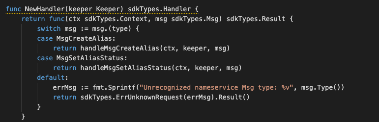
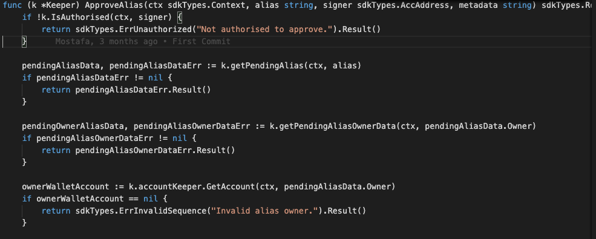
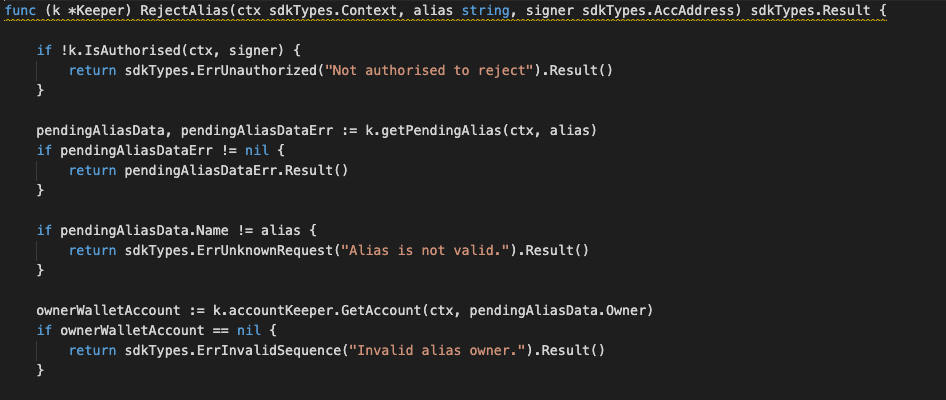
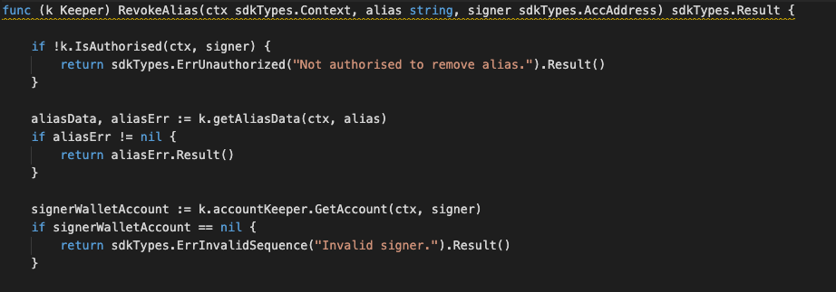
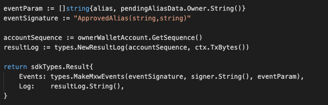
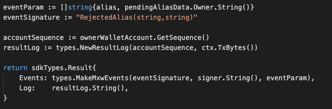
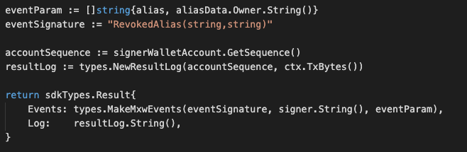

This is the message type used to set the alias status, eg. Approval, Reject, Revoke.

<!-- type MsgSetAliasStatus struct {
	Owner      sdkTypes.AccAddress `json:"owner"`
	Payload    Payload             `json:"payload"`
	Signatures []Signature         `json:"signatures"`
}

type Payload struct {
	Alias         AliasData `json:"alias"`
	crypto.PubKey `json:"pub_key"`
	Signature     []byte `json:"signature"`
}

type AliasData struct {
	From   sdkTypes.AccAddress `json:"from"`
	Nonce  string              `json:"nonce"`
	Status string              `json:"status"`
	Name   string              `json:"name"`
} -->


## Parameters

The message type contains the following parameters:

| Name | Type | Required | Description                 |
| ---- | ---- | -------- | --------------------------- |
| owner | string | true   | Account address| | 
| payload | Payload | true   | Payload data| | 
| signatures | []Signature | true   | Signature| | 


#### Payload Information
| Name | Type | Required | Description                 |
| ---- | ---- | -------- | --------------------------- |
| alias | AliasData | true   | Fee-collector| | 
| pub_key | string | true   | Fee amount to be paid| | 
| signature | []byte | true   | Fee amount to be paid| | 


#### AliasData Information
| Name | Type | Required | Description                 |
| ---- | ---- | -------- | --------------------------- |
| from | string | true   | Fee-collector| | 
| nonce | string | true   | nonce| | 
| status | string | true   | status| | 
| name | string | true   | name| | 


#### Example

```
{
    "type": "nameservice/setAliasStatus",
    "value": {
        "owner": "mxw136v3635vfextt20lxzux2yuzkx2h74te834a3j",
        "payload": {
            "alias": {
                "from": "mxw10za0fxan50gdkke34yrhwv9svv3a3pujycg3c6",
                "nonce": "0",
                "status": "APPROVE",
                "name": "mxw-alias"
            },
            "pub_key": {
                "type": "tendermint/PubKeySecp256k1",
                "value": "A0ANQy6Oju8+qlCDZvOikiv08+oDwMnLm+MMOuz9rvmT"
            },
            "signature": "fjRvVS0B9KV/pOYGUZxZCn+3Sx3caeaJwJtQgLlwj3hFH6FGJgwJzh1tX0BIZ/lpX2P8wfMPr/a4uMJ0FnKCaA=="
        },
        "signatures": [
            {
                "pub_key": {
                    "type": "tendermint/PubKeySecp256k1",
                    "value": "AtAmflMmeRnFAZtTE9MoKnWjPMGnIQJar6ZhR5WZ8mUJ"
                },
                "signature": "0CgqlFodCEjGbybsJd2YhCtq5ts+he5s8I+VOoG42+cyoPyxwTyfp+sasRIqCyXZPgXLTo5M5OszIsFBXvu8kg=="
            }
        ]
    }
}
```

## Handler

The role of the handler is to define what action(s) needs to be taken when this MsgTypeSetNonFungibleTokenStatus message is received.

In the file (./x/nameservice/handler.go) start with the following code:




NewHandler is essentially a sub-router that directs messages coming into this module to the proper handler.

First, you define the actual logic for handling the MsgSetAliasStatus-ApproveAlias message in handleMsgSetAliasStatus:




In this function, requirements need to be met before emitted by the network.  

* Alias must be valid.
* Owner of Alias must have valid account.
* Signer must be authorised in order to approve the alias proposal.


Second, you define the actual logic for handling the MsgSetAliasStatus-RejectAlias message in handleMsgSetAliasStatus:




In this function, requirements need to be met before emitted by the network.  

* Alias must be valid.
* Owner of Alias must have valid account.
* Signer must be authorised in order to reject the alias proposal.


Lastly, you define the actual logic for handling the MsgSetAliasStatus-RevokeAlias message in handleMsgSetAliasStatus:




In this function, requirements need to be met before emitted by the network.  

* Alias must be valid.
* Owner of Alias must have valid account.
* Signer must be authorised in order to revoke the alias proposal.

## Events
#### 1.
This tutorial describes how to create maxonrow events for scanner base on Approve Alias after emitted by a network.

  


#### Usage
This MakeMxwEvents create maxonrow events, by accepting :

* Custom Event Signature : using ApprovedAlias(string,string)
* Signer
* Event Parameters as below: 

| Name | Type | Description                 |
| ---- | ---- | --------------------------- |
| alias | string | Alias value| | 
| from | string | Account address| | 


#### 2.
This tutorial describes how to create maxonrow events for scanner base on Rejected Alias after emitted by a network.

  


#### Usage
This MakeMxwEvents create maxonrow events, by accepting :

* Custom Event Signature : using RejectedAlias(string,string) 
* Signer
* Event Parameters as below: 

| Name | Type | Description                 |
| ---- | ---- | --------------------------- |
| alias | string | Alias value| | 
| from | string | Account address| | 


#### 3.
This tutorial describes how to create maxonrow events for scanner base on Revoke Alias after emitted by a network.

  


#### Usage
This MakeMxwEvents create maxonrow events, by accepting :

* Custom Event Signature : using RevokedAlias(string,string) 
* Signer
* Event Parameters as below: 

| Name | Type | Description                 |
| ---- | ---- | --------------------------- |
| alias | string | Alias value| | 
| from | string | Account address| | 


