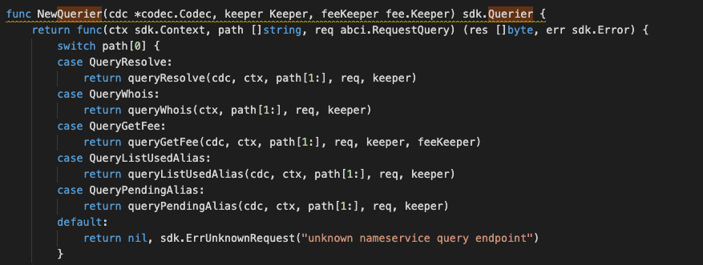

### Application Goals

The goal of the module you are building is to let users create names and to set a value these names resolve to. 

In this section, you will learn how these simple requirements translate to application design.

### Type of Message

In this module which consists of TWO types of messages that users 
can send to interact with the application state: 

* [MsgCreateAlias](msgtype/CreateAlias.md "MsgCreateAlias") -- This is the message type used to create the alias. 
* [MsgSetAliasStatus](msgtype/SetAliasStatus.md "MsgSetAliasStatus") -- This is the message type used to set the alias status, eg. Approval, Reject, Revoke. 

** They will each have an associated Handler.

### Querier

Now you can navigate to the ./x/nameservice/querier.go file. 
This is the place to define which queries against application state users will be able to make. 
 
Here, you will see NewQuerier been defined, and it acts as a sub-router for queries to this module (similar the NewHandler function). Note that because there isn't an interface similar to Msg for queries, we need to manually define switch statement cases (they can't be pulled off of the query .Route() function):

This module will expose few queries:

* [Resolve](querier/Resolve.md "Resolve") -- This takes a name and returns the value that is stored by the nameservice. This is similar to a DNS query.
* [Whois](querier/Whois.md "Whois") -- This takes a name and returns the value of the name.
* [GetFee](querier/GetFee.md "GetFee") -- This returns the fee while doing this nameservice stored.
* [ListUsedAlias](querier/ListUsedAlias.md "ListUsedAlias") -- This returns all the names stored in the nameservice store.
* [PendingAlias](querier/PendingAlias.md "PendingAlias") -- This returns all the names stored in the nameservice store which yet to processed.
