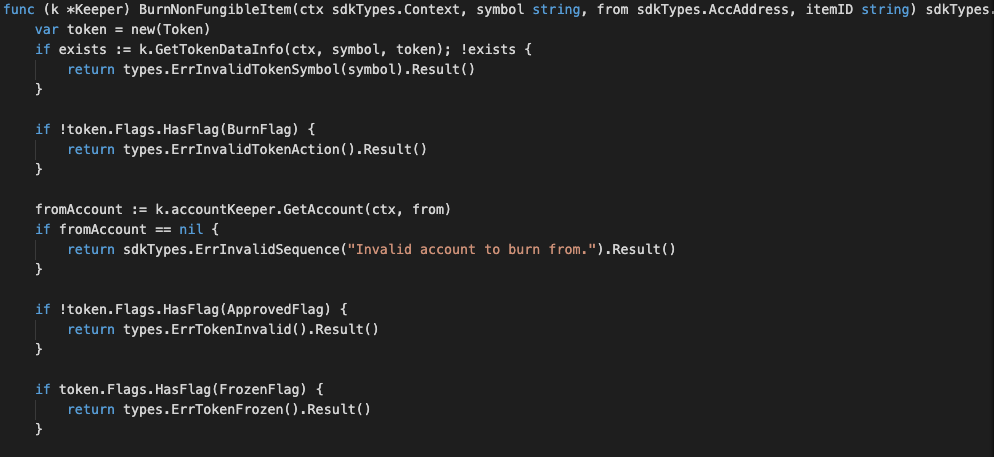
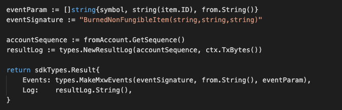

This is the message type used to burn an item of a non-fungible token.


## Parameters

The message type contains the following parameters:

| Name | Type | Required | Description                 |
| ---- | ---- | -------- | --------------------------- |
| symbol | string | true   | Token symbol, which must be unique| | 
| from | string | true   | Item owner| | 
| itemID | string | true   | Properties of token| | 


#### Example

```
{
    "type": "nonFungible/burnNonFungibleItem",
    "value": {
        "symbol": "TNFT",
        "from": "mxw1zrguzs0gyqqscjhk6y8zht9xknfz8e4pnvugy6",
        "itemID": "ITEM-123"
    }
}

```

## Handler

The role of the handler is to define what action(s) needs to be taken when this MsgTypeBurnNonFungibleItem message is received.

In the file (./x/token/nonfungible/handler.go) start with the following code:


NewHandler is essentially a sub-router that directs messages coming into this module to the proper handler.
Now, you need to define the actual logic for handling the MsgTypeBurnNonFungibleItem message in handleMsgBurnNonFungibleItem:




In this function, requirements need to be met before emitted by the network.  

* A valid Token.
* Token must be approved before this, and not be freeze. Also burnable flag must equals to true.
* A valid Item ID.
* Signer who is the Item owner need to be authorised to do this process.
* Action of Re-burn is not allowed.


## Events
This tutorial describes how to create maxonrow events for scanner on this after emitted by a network.

  


#### Usage
This MakeMxwEvents create maxonrow events, by accepting :

* eventSignature : Custom Event Signature that using BurnedNonFungibleItem(string,string,string)
* from : Item owner
* eventParam : Event Parameters as below 

| Name | Type | Description                 |
| ---- | ---- | --------------------------- |
| symbol | string | Token symbol, which must be unique| | 
| itemID | string | Item ID| | 
| from | string | Item owner| | 

