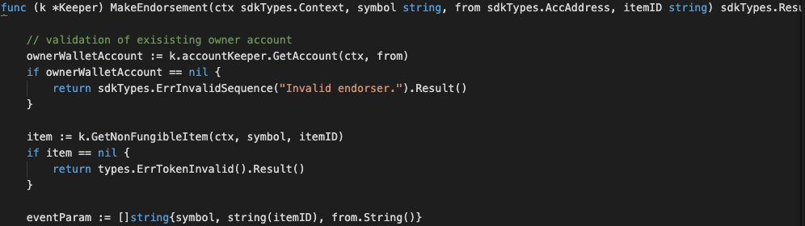
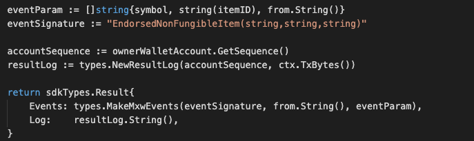

This is the message type used to endorse an item of a non-fungible token.
The user can write into the MEMO field that indicate what kind of remarks/comments wish to be input, while come to item endorsement process. However, the limitation of this MEMO can only be 128 bytes.

## Parameters

The message type contains the following parameters:

| Name | Type | Required | Description                 |
| ---- | ---- | -------- | --------------------------- |
| symbol | string | true   | Token symbol, which must be unique| |
| from | string | true   | Endorser| |
| itemID | string | true   | Item ID, which must be unique| |


#### Example
```
{
    "type": "nonFungible/endorsement",
    "value": {
        "symbol": "TNFT",
        "from": "mxw1k9sxz0h3yeh0uzmxet2rmsj7xe5zg54eq7vhla",
        "itemID": "ITEM-123"
    }
}


```

## Handler

The role of the handler is to define what action(s) needs to be taken when this `MsgTypeEndorsement` message is received.

In the file (./x/token/nonfungible/handler.go) start with the following code:


NewHandler is essentially a sub-router that directs messages coming into this module to the proper handler.
Now, you need to define the actual logic for handling the MsgTypeEndorsement message in `handleMsgEndorsement`:




In this function, requirements need to be met before emitted by the network.

* A valid Item ID.
* Signer must be a valid endorser.
* Action of Re-endorse process is allowed.


## Events
This tutorial describes how to create maxonrow events for scanner on this after emitted by a network.




#### Usage
This MakeMxwEvents create maxonrow events, by accepting :

* eventSignature : Custom Event Signature that using EndorsedNonFungibleItem(string,string,string)
* from : Endorser
* eventParam : Event Parameters as below

| Name | Type | Description                 |
| ---- | ---- | --------------------------- |
| symbol | string | Token symbol, which must be unique| |
| itemID | string | Item ID| |
| from | string | Endorser| |
