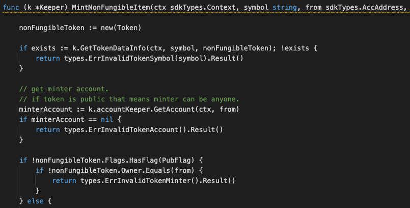

This is the message type used to mint an item of a non-fungible token.

## Parameters

The message type contains the following parameters:

| Name | Type | Required | Description                 |
| ---- | ---- | -------- | --------------------------- |
| itemID | string | true   | Item ID, which must be unique| |
| symbol | string | true   | Token symbol, which must be unique| |
| owner | string | true   | Token owner| |
| to | string | true   | Item owner| |
| properties | string | true   | Properties of item| |
| metadata | string | true   | Metadata of item| |


#### Example
```
{
    "type": "nonFungible/mintNonFungibleItem",
    "value": {
        "itemID": "ITEM-123",
        "symbol": "TNFT",
        "owner": "mxw1x5cf8y99ntjc8cjm00z603yfqwzxw2mawemf73",
        "to": "mxw1md4u2zxz2ne5vsf9t4uun7q2k0nc3ly5g22dne",
        "properties": "item-properties",
        "metadata": "item-metadata"
    }
}

```

## Handler

The role of the handler is to define what action(s) needs to be taken when this `MsgTypeMintNonFungibleItem` message is received.

In the file (./x/token/nonfungible/handler.go) start with the following code:


NewHandler is essentially a sub-router that directs messages coming into this module to the proper handler.
Now, you need to define the actual logic for handling the MsgTypeMintNonFungibleItem message in `handleMsgMintNonFungibleItem`:




In this function, requirements need to be met before emitted by the network.

* A valid Token.
* Token must be approved, and not yet be freeze.
* Token which Public Flag equals to true can only be minted to same user.
* Token which Mint-limit Flag set to ZERO, any items can be minted without the limitation. Otherwise, will base on the threshold of this setting.
* A valid Item ID which must be unique.
* Action of Re-mint is not allowed.


## Events
This tutorial describes how to create maxonrow events for scanner on this after emitted by a network.


#### Usage
This MakeMxwEvents create maxonrow events, by accepting :

* eventSignature : Custom Event Signature that using MintedNonFungibleItem(string,string,string,string)
* from : Token owner
* eventParam : Event Parameters as below

| Name | Type | Description                 |
| ---- | ---- | --------------------------- |
| symbol | string | Token symbol, which must be unique| |
| itemID | string | Item ID| |
| from | string | Token owner| |
| to | string | Item owner| |
