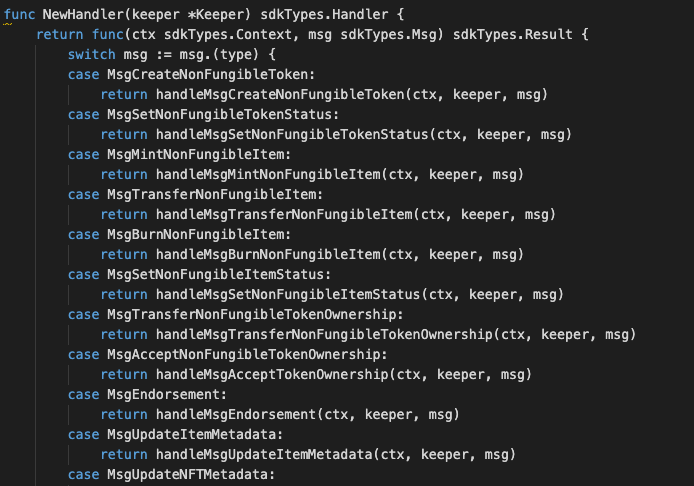
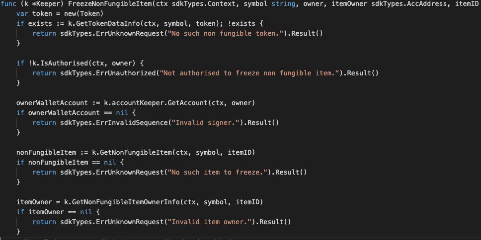
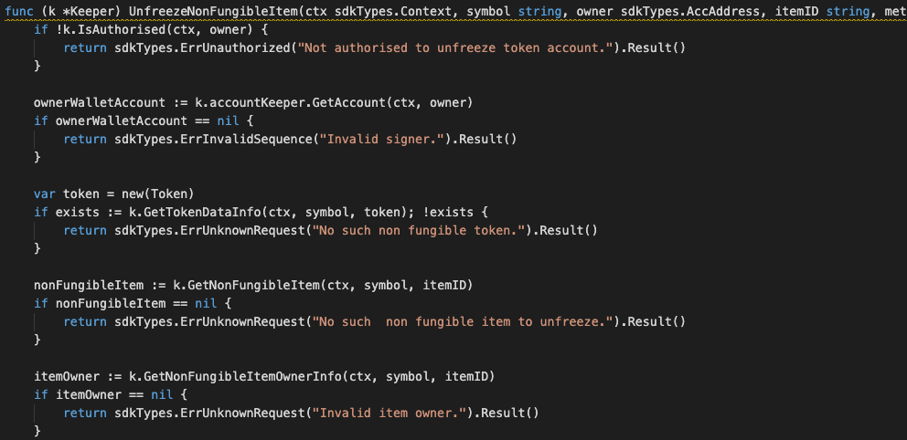
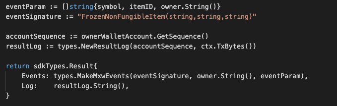
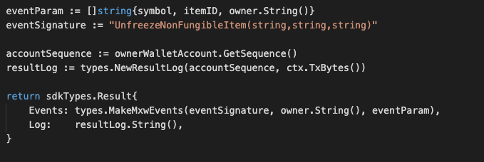

This is the message type used to update the status of an item of a non-fungible token,
  eg. Freeze or unfreeze

## Parameters

The message type contains the following parameters:

| Name | Type | Required | Description                 |
| ---- | ---- | -------- | --------------------------- |
| owner | string | true   | Item owner| |
| payload | ItemPayload | true   | Item Payload information| |
| signatures | []Signature | true   | Array of Signature| |


#### Item Payload Information
| Name | Type | Required | Description                 |
| ---- | ---- | -------- | --------------------------- |
| item | ItemDetails | true   | Item details information| |
| pub_key | type/value | true   | crypto.PubKey| |
| signature | []byte | true   | signature| |


#### Item Details Information
| Name | Type | Required | Description                 |
| ---- | ---- | -------- | --------------------------- |
| from | string | true   | Item owner| |
| nonce | string | true   | nonce signature| |
| status | string | true   | There are two type of status, which include FREEZE_ITEM, UNFREEZE_ITEM. All this keywords must be matched while come to this message type | |
| symbol | string | true   | Token-symbol| |
| itemID | string | true   | Item ID| |

#### status details
* While come to process of set FREEZE_ITEM, a valid token with a valid Item ID which already been approved
and yet to be frozen must be signed by authorised Signer with valid signature will be proceed.
Item ID which already been frozen is not allowed to do re-submit.
* While come to process of set UNFREEZE_ITEM, a valid token with a valid Item ID which already been
approved and frozen must be signed by authorised Signer with valid signature will be proceed.
Item ID which already been unfreeze is not allowed to do re-submit.


#### Example
```
{
  "type": "nonFungible/setNonFungibleItemStatus",
  "value": {
    "owner": "mxw1md4u2zxz2ne5vsf9t4uun7q2k0nc3ly5g22dne",
    "payload": {
      "item": {
        "from": "mxw1f8r0k5p7s85kv7jatwvmpartyy2j0s20y0p0yk",
        "nonce": "0",
        "status": "FREEZE_ITEM",
        "symbol": "TNFT",
        "itemID": "Item-123"
      },
      "pub_key": {
        "type": "tendermint/PubKeySecp256k1",
        "value": "A0VBHXKgUEU2fttqh8Lhqp1G6+GzOxTXvCExzDLEdfD7"
      },
      "signature": "hEnOeX536dduNFgWMOdK0cFKq2xwWW9aAHalW9l5kAgxg94P55MIEQJ8vFkEq9eAcYo1sjQ4TfXW5EynIk/kuQ=="
    },
    "signatures": [
      {
        "pub_key": {
          "type": "tendermint/PubKeySecp256k1",
          "value": "Ausyj7Gas2WkCjUpM8UasCcezXrzTMTRbPHqYx44GzLm"
        },
        "signature": "uDh1fll2eN/3lpKgMydW9mEdgfI3Mint30pkFrrQ+phkIY5X8nMbCoS6WNmw5bqCiVunMhkey75U3Qm99csG4g=="
      }
    ]
  }
}

```

## Handler

The role of the handler is to define what action(s) needs to be taken when this `MsgTypeSetNonFungibleItemStatus` message is received.

In the file (./x/token/nonfungible/handler.go) start with the following code:




NewHandler is essentially a sub-router that directs messages coming into this module to the proper handler.
Now, you define the actual logic for handling the MsgTypeSetNonFungibleItemStatus-FreezeNonFungibleItem message in `handleMsgSetNonFungibleItemStatus`:




In this function, requirements need to be met before emitted by the network.

* A valid Token.
* A valid Item ID which must not be freeze.
* Signer must be authorised.
* Action of Re-freeze-item is not allowed.

Next, you define the actual logic for handling the MsgTypeSetNonFungibleItemStatus-UnfreezeNonFungibleItem message in `handleMsgSetNonFungibleItemStatus`:




In this function, requirements need to be met before emitted by the network.

* A valid Token.
* A valid Item ID which must be freeze.
* Signer must be authorised.
* Action of Re-unfreeze-item is not allowed.


## Events

#### 1.
This tutorial describes how to create maxonrow events for scanner base on freeze-item after emitted by a network.




#### Usage
This MakeMxwEvents create maxonrow events, by accepting :

* eventSignature : Custom Event Signature that using FrozenNonFungibleItem(string,string,string)
* owner : Signer
* eventParam : Event Parameters as below

| Name | Type | Description                 |
| ---- | ---- | --------------------------- |
| symbol | string | Token symbol, which must be unique| |
| itemID | string | Item ID| |
| owner | string | Signer| |


#### 2.
This tutorial describes how to create maxonrow events for scanner base on unfreeze-item after emitted by a network.




#### Usage
This MakeMxwEvents create maxonrow events, by accepting :

* eventSignature : Custom Event Signature that using UnfreezeNonFungibleItem(string,string,string)
* owner : Signer
* eventParam : Event Parameters as below

| Name | Type | Description                 |
| ---- | ---- | --------------------------- |
| symbol | string | Token symbol, which must be unique| |
| itemID | string | Item ID| |
| owner | string | Signer| |
