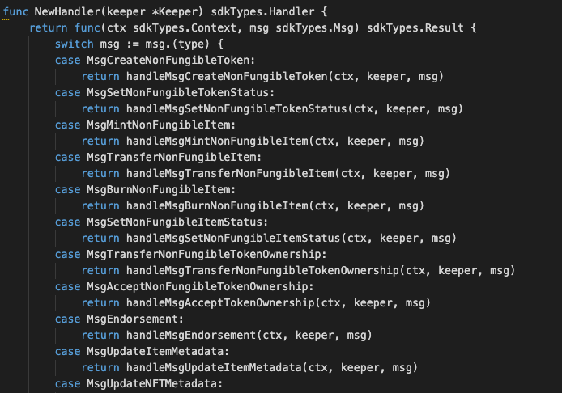
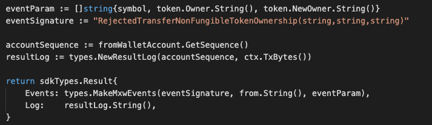

This is the message type used to update the status of a non-fungible token,
  eg. Approve, Reject, Freeze or unfreeze, Approve-transfer-ownership, Reject-transfer-ownership


## Parameters

The message type contains the following parameters:

| Name | Type | Required | Description                 |
| ---- | ---- | -------- | --------------------------- |
| owner | string | true   | Item owner| |
| payload | ItemPayload | true   | Item Payload information| |
| signatures | []Signature | true   | Array of Signature| |


#### Item Payload Information
| Name | Type | Required | Description                 |
| ---- | ---- | -------- | --------------------------- |
| token | TokenData | true   | Token data| |
| pub_key | nil | true   | crypto.PubKey| |
| signature | []byte | true   | signature| |


#### Token Data Information
| Name | Type | Required | Description                 |
| ---- | ---- | -------- | --------------------------- |
| from | string | true   | Token owner| |
| nonce | string | true   | nonce signature| |
| status | string | true   | There are different type of status, which include APPROVE, REJECT, FREEZE, UNFREEZE, APPROVE_TRANFER_TOKEN_OWNERSHIP, REJECT_TRANFER_TOKEN_OWNERSHIP. All this keywords must be matched while come to this message type | |
| symbol | string | true   | Token-symbol| |
| transferLimit | string | true   | Item transfer Limit setting| |
| mintLimit | string | true   | Item mint Limit setting| |
| burnable | bool | true   | flag of Item burnable setting, either TRUE or FALSE| |
| transferable | bool | true   | flag of Item transferable setting, either TRUE or FALSE| |
| modifiable | bool | true   | flag of Item modifiable setting, either TRUE or FALSE| |
| pub | bool | true   | flag of public setting, either TRUE or FALSE| |
| tokenFees | []TokenFee | true   | Fee Setting information| |
| endorserList | []string | true   | Endorser list| |


#### status details
* While come to process of set APPROVE, a valid new token which yet to be approved must be signed by authorised Signer
with valid signature will be proceed along with a valid Fee setting scheme that been provided.
Token which already been approved is not allowed to do re-submit.
* While come to process of set REJECT, a valid new token which yet to be approved must be signed by authorised Signer
with valid signature will be proceed. Token which already been rejected is not allowed to do re-submit.
* While come to process of set FREEZE, a valid token which already been approved must be signed by authorised Signer
with valid signature will be proceed. Token which already been frozen is not allowed to do re-submit.
* While come to process of set UNFREEZE, a valid token which already been approved and frozen must be signed by authorised Signer with valid signature will be proceed. Token which already been unfreeze is not allowed to do re-submit.
* While come to process of set APPROVE_TRANFER_TOKEN_OWNERSHIP, a valid token which TransferTokenOwnership flag equals to true must be signed by authorised Signer with valid signature will be proceed. Token which already been approved for transfer token-ownership is not allowed to do re-submit.
* While come to process of set REJECT_TRANFER_TOKEN_OWNERSHIP, a valid token which TransferTokenOwnership flag equals to true must be signed by authorised Signer with valid signature will be proceed.
Token which already been rejected for transfer token-ownership is not allowed to do re-submit.

#### transferLimit details
For the Item transfer-limit setting, only applicable while come to process of set APPROVE base on this particular token-symbol. Once exceeded this limits, will received an alert said that 'TRANSFER limit existed' and
is not allowed to proceed the relevant request. However, if transfer-limit is set to ZERO, that means not allowed to transfer for this particular item. Need to be aware while come to this setting.

#### mintLimit details
For the Item mint-limit setting, only applicable while come to process of set APPROVE base on this particular token-symbol. Once exceeded this limits, will received an alert said that 'TRANSFER limit existed' and
is not allowed to proceed the relevant request. However, if mint-limit is set to ZERO, that means is NO LIMITATION on the minting for this particular item. Need to be aware while come to this setting.

#### burnable details
* For the burnable equals TRUE, system allowed to proceed during burn-item process.
Prior to this, this flag will be set inside the tokenPayload of the current token during the message type setting
and also will be set as one of the token flag components during approve-token or freeze-token or unfreeze-token process.
* For the burnable equals FALSE, system NOT allowed to proceed during burn-item process with an alert of 'Invalid token action'. Prior to this, this flag will be set inside the tokenPayload of the current token during the message type setting and also will not be set as one of the token flag components during approve-token or freeze-token or unfreeze-token process.

#### transferable details
* For the transferable equals TRUE, system allowed to proceed during transfer-item process.
Prior to this, this flag will be set inside the tokenPayload of the current token during the message type setting
and also will be set as one of the token flag components during approve-token.
* For the transferable equals FALSE, system NOT allowed to proceed during transfer-item process with an alert of 'Invalid token action'.
Prior to this, this flag will be set inside the tokenPayload of the current token during the message type setting
and also will not be set as one of the token flag components during approve-token.


#### modifiable details
* For the modifiable equals TRUE, system will also validate Item Owner must equals to relevant signer during Update Item Metadata process. If not, with an alert of 'Token item not modifiable'.
Prior to this, this flag will be set inside the tokenPayload of the current token during the message type setting
and also will be set as one of the token flag components during approve-token or freeze-token or unfreeze-token.

* For the modifiable equals FALSE, system will also validate signer must equals to token-Owner during Update Item Metadata process. If not, with an alert of 'Token item not modifiable'.
Prior to this, this flag will be set inside the tokenPayload of the current token during the message type setting
and also will not be set as one of the token flag components during approve-token or freeze-token or unfreeze-token.


#### pub details
* For the public equals TRUE, system will validate signer must equals to new item-owner during Mint Item process.
If not, with an alert of 'Public token can only be minted to oneself'.
Prior to this, this flag will be set inside the tokenPayload of the current token during the message type setting
and also will be set as one of the token flag components during approve-token or freeze-token or unfreeze-token.
* For the public equals FALSE, system will validate signer must equals to token-owner during Mint Item process.
If not, with an alert of 'Invalid token minter'.
Prior to this, this flag will be set inside the tokenPayload of the current token during the message type setting
and also will not be set as one of the token flag components during approve-token or freeze-token or unfreeze-token.

#### tokenFees details
While come to process of approve-token, the feeName value will be set for different action
types which inside the tokenPayload of the current token :
eg. transfer-item, mint-item, burn-item, transfer-token-Ownership, accept-token-Ownership.


#### endorserList details
For the public equals TRUE, system will do verification on the current signer whether come from the endorser list during Item Endorsement process.
If not, with an alert of 'Invalid endorser'.
Howevere if endorser list is set to empty, system will not do this validation during endorsement-item process.
Prior to this, this endorser list will be set as one of the token flag components during approve-token.


#### Token Fee Information
| Name | Type | Required | Description                 |
| ---- | ---- | -------- | --------------------------- |
| action | string | true   | action | |
| feeName | string | true   | fee setting| |


#### Example
```
{
    "type": "nonFungible/setNonFungibleTokenStatus",
    "value": {
        "owner": "mxw1md4u2zxz2ne5vsf9t4uun7q2k0nc3ly5g22dne",
        "payload": {
            "token": {
                "from": "mxw1f8r0k5p7s85kv7jatwvmpartyy2j0s20y0p0yk",
                "nonce": "0",
                "status": "APPROVE",
                "symbol": "TNFT",
                "transferLimit": "2",
                "mintLimit": "2",
                "burnable": true,
                "transferable": true,
                "modifiable": true,
                "pub": true,
                "tokenFees": [
                    {
                        "action": "transfer",
                        "feeName": "default"
                    },
                    {
                        "action": "mint",
                        "feeName": "default"
                    },
                    {
                        "action": "burn",
                        "feeName": "default"
                    },
                    {
                        "action": "transferOwnership",
                        "feeName": "default"
                    },
                    {
                        "action": "acceptOwnership",
                        "feeName": "default"
                    }
                ],
                "endorserList": [
                    "mxw1f8r0k5p7s85kv7jatwvmpartyy2j0s20y0p0yk",
                    "mxw1k9sxz0h3yeh0uzmxet2rmsj7xe5zg54eq7vhla"
                ]
            },
            "pub_key": {
                "type": "tendermint/PubKeySecp256k1",
                "value": "A0VBHXKgUEU2fttqh8Lhqp1G6+GzOxTXvCExzDLEdfD7"
            },
            "signature": "Hiaih1n5Y1/gJQQDKbXmskPPEXzP2MOu+mxRDnJEBXxFtCQeRe3tK5cN7QTl326YpUMvsejG9Go+u4rzNaqILg=="
        },
        "signatures": [
            {
                "pub_key": {
                    "type": "tendermint/PubKeySecp256k1",
                    "value": "Ausyj7Gas2WkCjUpM8UasCcezXrzTMTRbPHqYx44GzLm"
                },
                "signature": "tIRCsR4cy+Kp1IOCOmoBqM8xr/nnnsNGF2V/6QX+UORtx/HNaQ9+HtYkaYGVJ5I4T5yMHXKwtgDU8IpyHD6l/w=="
            }
        ]
    }
}

```

## Handler

The role of the handler is to define what action(s) needs to be taken when the `MsgTypeSetNonFungibleTokenStatus` message is received.

In the file (./x/token/nonfungible/handler.go) start with the following code:




NewHandler is essentially a sub-router that directs messages coming into this module to the proper handler.

First, you define the actual logic for handling the MsgTypeSetNonFungibleTokenStatus-ApproveToken message in `handleMsgSetNonFungibleTokenStatus`:


In this function, requirements need to be met before emitted by the network.

* A valid Token.
* Token must not be approved.
* Signer must be authorised.
* Action of Re-approved is not allowed.


Second, you define the actual logic for handling the MsgTypeSetNonFungibleTokenStatus-RejectToken message in `handleMsgSetNonFungibleTokenStatus`:


In this function, requirements need to be met before emitted by the network.

* A valid Token.
* Token must not be approved.
* Signer must be authorised.
* Action of Re-reject is not allowed.


Thirth, you define the actual logic for handling the MsgTypeSetNonFungibleTokenStatus-FreezeToken message in `handleMsgSetNonFungibleTokenStatus`:


In this function, requirements need to be met before emitted by the network.

* A valid Token.
* Token must not be freeze
* Signer must be authorised.
* Action of Re-freeze is not allowed.


Next, you define the actual logic for handling the MsgTypeSetNonFungibleTokenStatus-UnfreezeToken message in `handleMsgSetNonFungibleTokenStatus`:


In this function, requirements need to be met before emitted by the network.

* A valid Token.
* Token must be freeze.
* Signer must be authorised.
* Action of Re-unfreeze is not allowed.

Next, you define the actual logic for handling the MsgTypeSetNonFungibleTokenStatus-ApproveTransferTokenOwnership message in `handleMsgSetNonFungibleTokenStatus`:


In this function, requirements need to be met before emitted by the network.

* A valid Token.
* Token with TransferTokenOwnership flag equals to true.
* Signer must be authorised.
* Action of Re-approve transfer token-ownership is not allowed.

Last, you define the actual logic for handling the MsgTypeSetNonFungibleTokenStatus-RejectTransferTokenOwnership message in `handleMsgSetNonFungibleTokenStatus`:


In this function, requirements need to be met before emitted by the network.

* A valid Token.
* Token TransferTokenOwnership flag equals to true.
* Signer must be authorised.
* Action of Re-reject transfer token-ownership is not allowed.


## Events
#### 1.
This tutorial describes how to create maxonrow events for scanner base on approve token after emitted by a network.


#### Usage
This MakeMxwEvents create maxonrow events, by accepting :

* eventSignature : Custom Event Signature that using ApprovedNonFungibleToken(string,string)
* signer : Signer
* eventParam : Event Parameters as below

| Name | Type | Description                 |
| ---- | ---- | --------------------------- |
| symbol | string | Token symbol, which must be unique| |
| owner | string | Token owner| |


#### 2.
This tutorial describes how to create maxonrow events for scanner base on reject token after emitted by a network.


#### Usage
This MakeMxwEvents create maxonrow events, by accepting :

* eventSignature : Custom Event Signature that using RejectedNonFungibleToken(string,string)
* signer : Signer
* eventParam : Event Parameters as below

| Name | Type | Description                 |
| ---- | ---- | --------------------------- |
| symbol | string | Token symbol, which must be unique| |
| owner | string | Token owner| |


#### 3.
This tutorial describes how to create maxonrow events for scanner base on freeze token after emitted by a network.


#### Usage
This MakeMxwEvents create maxonrow events, by accepting :

* eventSignature : Custom Event Signature that using FrozenNonFungibleToken(string,string)
* signer : Signer
* eventParam : Event Parameters as below

| Name | Type | Description                 |
| ---- | ---- | --------------------------- |
| symbol | string | Token symbol, which must be unique| |
| owner | string | Token owner| |


#### 4.
This tutorial describes how to create maxonrow events for scanner base on unfreeze token after emitted by a network.


#### Usage
This MakeMxwEvents create maxonrow events, by accepting :

* eventSignature : Custom Event Signature that using UnfreezeNonFungibleToken(string,string)
* signer : Signer
* eventParam : Event Parameters as below

| Name | Type | Description                 |
| ---- | ---- | --------------------------- |
| symbol | string | Token symbol, which must be unique| |
| owner | string | Token owner| |


#### 5.
This tutorial describes how to create maxonrow events for scanner base on approve transfer token-ownership after emitted by a network.


#### Usage
This MakeMxwEvents create maxonrow events, by accepting :

* eventSignature : Custom Event Signature that using ApprovedTransferNonFungibleTokenOwnership(string,string,string)
* from : Signer
* eventParam : Event Parameters as below

| Name | Type | Description                 |
| ---- | ---- | --------------------------- |
| symbol | string | Token symbol, which must be unique| |
| owner | string | Token owner| |
| newOwner | string | New token owner| |


#### 6.
This tutorial describes how to create maxonrow events for scanner base on reject transfer token-ownership after emitted by a network.




#### Usage
This MakeMxwEvents create maxonrow events, by accepting :

* eventSignature : Custom Event Signature that using RejectedTransferNonFungibleTokenOwnership(string,string,string)
* from : Signer
* eventParam : Event Parameters as below

| Name | Type | Description                 |
| ---- | ---- | --------------------------- |
| symbol | string | Token symbol, which must be unique| |
| owner | string | Token owner| |
| newOwner | string | New token owner| |
