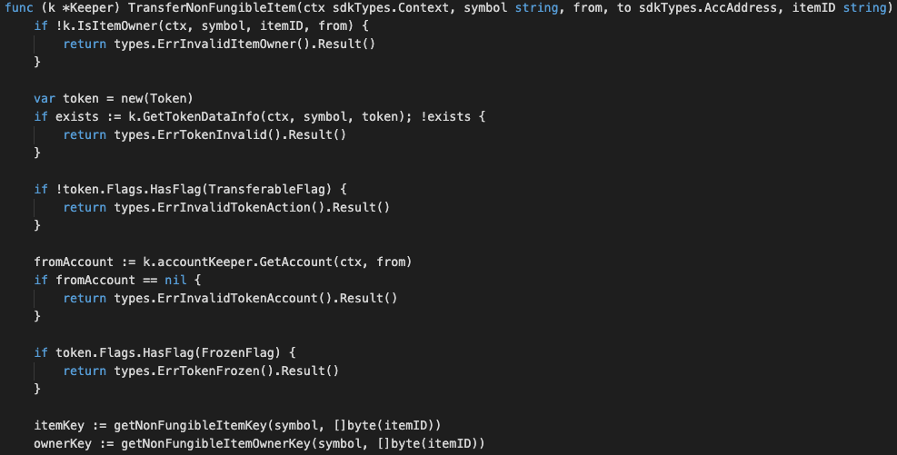
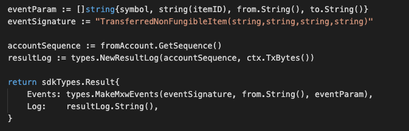

This is the message type used to transfer the item of a non-fungible token.


## Parameters

The message type contains the following parameters:

| Name | Type | Required | Description                 |
| ---- | ---- | -------- | --------------------------- |
| symbol | string | true   | Token symbol, which must be unique| | 
| from | string | true   | Item owner| | 
| to | string | true   | New Item owner| | 
| itemID | string | true   | Properties of token| | 


#### Example
```
{
    "type": "nonFungible/transferNonFungibleItem",
    "value": {
        "symbol": "TNFT",
        "from": "mxw1zrguzs0gyqqscjhk6y8zht9xknfz8e4pnvugy6",
        "to": "mxw1md4u2zxz2ne5vsf9t4uun7q2k0nc3ly5g22dne",
        "itemID": "item-123"
    }
}
```

## Handler

The role of the handler is to define what action(s) needs to be taken when this MsgTypeTransferNonFungibleItem message is received.

In the file (./x/token/nonfungible/handler.go) start with the following code:


NewHandler is essentially a sub-router that directs messages coming into this module to the proper handler.
Now, you need to define the actual logic for handling the MsgTypeTransferNonFungibleItem message in handleMsgTransferNonFungibleItem:




In this function, requirements need to be met before emitted by the network.  

* A valid Token.
* Token transferable flag equals to true and not in freeze condition.
* Token which Transfer-limit Flag set to a certain threshold, number of items that can be transferrable need to follow this constraint.
* Signer must be a valid item owner.
* Action of Re-transfer is not allowed.


## Events
This tutorial describes how to create maxonrow events for scanner on this after emitted by a network.

  


#### Usage
This MakeMxwEvents create maxonrow events, by accepting :

* eventSignature : Custom Event Signature that using TransferredNonFungibleItem(string,string,string,string)
* from : Item owner
* eventParam : Event Parameters as below 

| Name | Type | Description                 |
| ---- | ---- | --------------------------- |
| symbol | string | Token symbol, which must be unique| | 
| itemID | string | Item ID| | 
| from | string | Item owner| | 
| to | string | New item owner| | 

