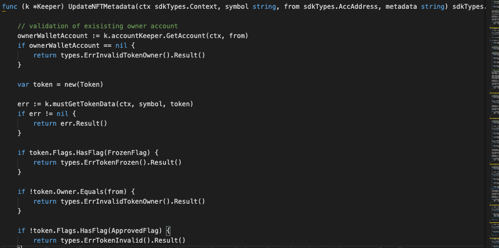
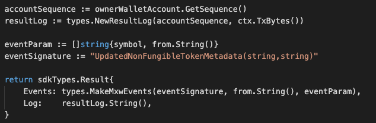

This is the message type used to update metadata of a non-fungible token.

## Parameters

The message type contains the following parameters:

| Name | Type | Required | Description                 |
| ---- | ---- | -------- | --------------------------- |
| symbol | string | true   | Token symbol, which must be unique| | 
| from | string | true   | Token owner| | 
| metadata | string | true   | Metadata of token| | 

#### Example
```
{
    "type": "nonFungible/updateNFTMetadata",
    "value": {
        "symbol": "TNFT",
        "from": "mxw1x5cf8y99ntjc8cjm00z603yfqwzxw2mawemf73",
        "metadata": "token metadata updated here"
    }
}
```

## Handler

The role of the handler is to define what action(s) needs to be taken when this MsgTypeUpdateNFTMetadata message is received.

In the file (./x/token/nonfungible/handler.go) start with the following code:


NewHandler is essentially a sub-router that directs messages coming into this module to the proper handler.
Now, you need to define the actual logic for handling the MsgTypeUpdateNFTMetadata message in handleMsgUpdateNFTMetadata:




In this function, requirements need to be met before emitted by the network.  

* A valid Token.
* Token must be approved and not in freeze condition.
* Signer must be valid token owner
* Action of Re-update is allowed.


## Events
This tutorial describes how to create maxonrow events for scanner on this after emitted by a network.

  


#### Usage
This MakeMxwEvents create maxonrow events, by accepting :

* eventSignature : Custom Event Signature that using UpdatedNonFungibleTokenMetadata(string,string)
* from : Token owner
* eventParam : Event Parameters as below 

| Name | Type | Description                 |
| ---- | ---- | --------------------------- |
| symbol | string | Token symbol, which must be unique| | 
| from | string | Token owner| | 

