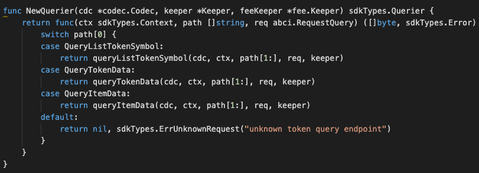

### Application Goals

Non-fungible Tokens are essentially inventory lists, where was CryptoKitties which 
established the first standard called ERC-721. This allowed for an extreme variety of use cases because 
the standard was as un-opinionated as possible as to exactly how the standard was used. 
That’s why we’ve been able to see such a wide range of uses that come from different industries, 
eg. been used in invoices and domain names. That’s why at it’s core a Non-fungible Token only cares about the unique identification number and the token’s place of origin (which makes them essentially inventory lists).

In this section, you will learn how these simple requirements translate to application design.

### Type of Message

In this module which consists of ELEVEN types of messages that users 
can send to interact with the application state: 

* [MsgTypeCreateNonFungibleToken](msgtype/CreateNonFungibleToken.md "MsgTypeCreateNonFungibleToken") -- This is the message type used to create a non-fungible token. 
* [MsgTypeSetNonFungibleTokenStatus](msgtype/SetNonFungibleTokenStatus.md "MsgTypeSetNonFungibleTokenStatus") --  This is the message type used to update the status of a non-fungible token, 
  eg. Approve, Reject, Freeze or unfreeze, Approve-transfer-ownership, Reject-transfer-ownership
* [MsgTypeTransferNonFungibleItem](msgtype/TransferNonFungibleItem.md "MsgTypeTransferNonFungibleItem") -- This is the message type used to transfer the item of a non-fungible token. 
* [MsgTypeMintNonFungibleItem](msgtype/MintNonFungibleItem.md "MsgTypeMintNonFungibleItem") -- This is the message type used to mint an item of a non-fungible token. 
* [MsgTypeBurnNonFungibleItem](msgtype/BurnNonFungibleItem.md "MsgTypeBurnNonFungibleItem") -- This is the message type used to burn an item of a non-fungible token. 
* [MsgTypeTransferNonFungibleTokenOwnership](msgtype/TransferNonFungibleTokenOwnership.md "MsgTypeTransferNonFungibleTokenOwnership") -- This is the message type used to transfer-ownership of a non-fungible token. 
* [MsgTypeAcceptNonFungibleTokenOwnership](msgtype/AcceptNonFungibleTokenOwnership.md "MsgTypeAcceptNonFungibleTokenOwnership") -- This is the message type used to accept-ownership of a non-fungible token. 
* [MsgTypeSetNonFungibleItemStatus](msgtype/SetNonFungibleItemStatus.md "MsgTypeSetNonFungibleItemStatus") -- This is the message type used to update the status of an item of a non-fungible token, 
  eg. Freeze or unfreeze     
* [MsgTypeEndorsement](msgtype/Endorsement.md "MsgTypeEndorsement") -- This is the message type used to endorse an item of a non-fungible token. 
* [MsgTypeUpdateItemMetadata](msgtype/UpdateItemMetadata.md "MsgTypeUpdateItemMetadata") -- This is the message type used to update metadata of a non-fungible token.
* [MsgTypeUpdateNFTMetadata](msgtype/UpdateNFTMetadata.md "MsgTypeUpdateNFTMetadata") -- This is the message type used to update item metadata of a non-fungible token.

** They will each have an associated Handler.

### Querier

Now you can navigate to the ./x/token/nonfungible/querier.go file. 
This is the place to define which queries against application state users will be able to make. 
 
Here, you will see NewQuerier been defined, and it acts as a sub-router for queries to this module (similar the NewHandler function). Note that because there isn't an interface similar to Msg for queries, we need to manually define switch statement cases (they can't be pulled off of the query .Route() function):

This module will expose few queries:

* [ListTokenSymbol](querier/ListTokenSymbol.md "ListTokenSymbol") -- This query the available tokens list.
* [TokenData](querier/TokenData.md "TokenData") -- This query the token data by a given symbol.
* [ItemData](querier/ItemData.md "ItemData") -- This query the item data by given of symbol and item ID.

