### Application Goals

Non-fungible Tokens are essentially inventory lists, where was CryptoKitties which 
established the first standard called ERC-721. This allowed for an extreme variety of use cases because 
the standard was as un-opinionated as possible as to exactly how the standard was used. 
That’s why we’ve been able to see such a wide range of uses that come from different industries, 
eg. been used in invoices and domain names. That’s why at it’s core a Non-fungible Token only cares about the unique identification number and the token’s place of origin (which makes them essentially inventory lists).

In this section, you will learn how these simple requirements translate to application design.

### Type of Message

In this module which consists of ELEVEN types of messages that users 
can send to interact with the application state: 


### MsgCreateNonFungibleToken
This is the message type used to create a non-fungible token.

`Parameters`

The message type contains the following parameters:

| Name | Type | Required | Description                 |
| ---- | ---- | -------- | --------------------------- |
| name | string | true   | Token name| | 
| symbol | string | true   | Token symbol, which must be unique| | 
| properties | string | true   | Properties of token| | 
| metadata | string | true   | Metadata of token| | 
| owner | string | true   | Token owner| | 
| fee | Fee | true   | Fee information| | 


Fee Information

| Name | Type | Required | Description                 |
| ---- | ---- | -------- | --------------------------- |
| to | string | true   | Fee-collector| | 
| value | string | true   | Fee amount to be paid| | 


Example
```
{
    "type": "nonFungible/createNonFungibleToken",
    "value": {
        "name": "TestNonFungibleToken",
        "symbol": "TNFT",
        "properties": "token properties",
        "metadata": "token metadata",
        "owner": "mxw1x5cf8y99ntjc8cjm00z603yfqwzxw2mawemf73",
        "fee": {
            "to": "mxw1md4u2zxz2ne5vsf9t4uun7q2k0nc3ly5g22dne",
            "value": "10000000"
        }
    }
}

```

`Handler`

The role of the handler is to define what action(s) needs to be taken when this `MsgCreateNonFungibleToken` message is received.

In the file (./x/token/nonfungible/handler.go) start with the following code:


NewHandler is essentially a sub-router that directs messages coming into this module to the proper handler.
Now, you need to define the actual logic for handling the `MsgCreateNonFungibleToken` message in `handleMsgCreateNonFungibleToken`:


In this function, requirements need to be met before emitted by the network.  

* Token must be unique and not existed.
* Token owner must be authorised.
* A valid Fee will be charged base on this.
* Action of Re-create is not allowed.

`Events`

This tutorial describes how to create maxonrow events for scanner on this after emitted by a network.

  


Usage

This MakeMxwEvents create maxonrow events, by accepting :

* eventSignature : Custom Event Signature that using CreatedNonFungibleToken(string,string,string,bignumber)
* from : Token owner
* eventParam : Event Parameters as below 

| Name | Type | Description                 |
| ---- | ---- | --------------------------- |
| symbol | string | Token symbol, which must be unique| | 
| owner | string | Token owner| | 
| to | string | Fee-collector| | 
| value | bignumber | Fee amount to be paid| | 


### MsgSetNonFungibleTokenStatus
This is the message type used to update the status of a non-fungible token, 
  eg. Approve, Reject, Freeze or unfreeze, Approve-transfer-ownership, Reject-transfer-ownership


`Parameters`

The message type contains the following parameters:

| Name | Type | Required | Description                 |
| ---- | ---- | -------- | --------------------------- |
| owner | string | true   | Item owner| | 
| payload | ItemPayload | true   | Item Payload information| | 
| signatures | []Signature | true   | Array of Signature| | 


Item Payload Information

| Name | Type | Required | Description                 |
| ---- | ---- | -------- | --------------------------- |
| token | TokenData | true   | Token data| | 
| pub_key | nil | true   | crypto.PubKey| | 
| signature | []byte | true   | signature| | 


Token Data Information

| Name | Type | Required | Description                 |
| ---- | ---- | -------- | --------------------------- |
| from | string | true   | Token owner| | 
| nonce | string | true   | nonce signature| | 
| status | string | true   | There are different type of status, which include `APPROVE`, `REJECT`, `FREEZE`, `UNFREEZE`, `APPROVE_TRANFER_TOKEN_OWNERSHIP`, `REJECT_TRANFER_TOKEN_OWNERSHIP`. All this keywords must be matched while come to this message type | | 
| symbol | string | true   | Token-symbol| | 
| transferLimit | string | true   | Item transfer Limit setting| | 
| mintLimit | string | true   | Item mint Limit setting| | 
| burnable | bool | true   | flag of Item burnable setting, either `TRUE` or `FALSE`| | 
| transferable | bool | true   | flag of Item transferable setting, either `TRUE` or `FALSE`| | 
| modifiable | bool | true   | flag of Item modifiable setting, either `TRUE` or `FALSE`| |
| pub | bool | true   | flag of public setting, either `TRUE` or `FALSE`| | 
| tokenFees | []TokenFee | true   | Fee Setting information| | 
| endorserList | []string | true   | Endorser list| | 


`status`

| status | Details                 |
| -------- | --------------------------- |
| APPROVE  | A valid new token which yet to be approved must be signed by authorised Signer with valid signature will be proceed along with a valid Fee setting scheme that been provided, this also along with the approval from authorised address of issuer and provider parties. Token which already been approved is not allowed to do re-submit.| | 
| REJECT  | A valid new token which yet to be approved must be signed by authorised Signer with valid signature will be proceed, this also along with the approval from authorised address of issuer and provider parties. Token which already been rejected is not allowed to do re-submit.| | 
| FREEZE  | A valid token which already been approved must be signed by authorised Signer with valid signature will be proceed, this also along with the approval from authorised address of issuer and provider parties. Token which already been frozen is not allowed to do re-submit.| | 
| UNFREEZE  | A valid token which already been approved and frozen must be signed by authorised Signer with valid signature will be proceed, this also along with the approval from authorised address of issuer and provider parties. Token which already been unfreeze is not allowed to do re-submit.| | 
| APPROVE_TRANFER_TOKEN_OWNERSHIP  | A valid token which TransferTokenOwnership flag equals to `TRUE` must be signed by authorised Signer with valid signature will be proceed, this also along with the approval from authorised address of issuer and provider parties. Token which already been approved for transfer token-ownership is not allowed to do re-submit.| | 
| REJECT_TRANFER_TOKEN_OWNERSHIP  | A valid token which TransferTokenOwnership flag equals to `TRUE` must be signed by authorised Signer with valid signature will be proceed, this also along with the approval from authorised address of issuer and provider parties. Token which already been rejected for transfer token-ownership is not allowed to do re-submit.| | 

`transferLimit`

For the Item transfer-limit setting, system is expecting a value of number string by user input and this only applicable while come to process of set APPROVE base on this particular token-symbol. Once exceeded this limits, will received an alert said that `TRANSFER limit existed` and is not allowed to proceed the relevant request. However, if transfer-limit is set to ZERO, that means not allowed to transfer for this particular item. Upon the process of approval, this setting is not allowed to do any update again. User need to be aware while come to this setting.

`mintLimit`

For the Item mint-limit setting, system is expecting a value of number string by user input and this only applicable while come to process of set APPROVE base on this particular token-symbol. Once exceeded this limits, will received an alert said that `TRANSFER limit existed` and is not allowed to proceed the relevant request. However, if mint-limit is set to ZERO, that means is NO LIMITATION on the minting for this particular item. Upon the process of approval, this setting is not allowed to do any update again. User need to be aware while come to this setting.

`burnable`

* For the burnable equals `TRUE`, system allowed to proceed during burn-item process.
Prior to this, this flag will be set inside the tokenPayload of the current token during the message type setting 
and also will be set as one of the token flag components during approve-token process. Upon the process of approval, this setting is not allowed to do any update again. User need to be aware while come to this setting.
* For the burnable equals `FALSE`, system NOT allowed to proceed during burn-item process with an alert of `Invalid token action`. Prior to this, this flag will be set inside the tokenPayload of the current token during the message type setting and also will not be set as one of the token flag components during approve-token process.
Upon the process of approval, this setting is not allowed to do any update again. User need to be aware while come to this setting.

`transferable`

* For the transferable equals `TRUE`, system allowed to proceed during transfer-item process.
Prior to this, this flag will be set inside the tokenPayload of the current token during the message type setting 
and also will be set as one of the token flag components during approve-token process. Upon the process of approval, this setting is not allowed to do any update again. User need to be aware while come to this setting.
* For the transferable equals `FALSE`, system NOT allowed to proceed during transfer-item process with an alert of `Invalid token action`. Prior to this, this flag will be set inside the tokenPayload of the current token during the message type setting and also will not be set as one of the token flag components during approve-token process.
Upon the process of approval, this setting is not allowed to do any update again. User need to be aware while come to this setting.


`modifiable`

* For the modifiable equals `TRUE`, system will also validate Item Owner must equals to relevant signer during Update Item Metadata process. If not, with an alert of 'Token item not modifiable'. Prior to this, this flag will be set inside the tokenPayload of the current token during the message type setting and also will be set as one of the token flag components during approve-token process. Upon the process of approval, this setting is not allowed to do any update again. User need to be aware while come to this setting.
* For the modifiable equals `FALSE`, system will also validate signer must equals to token-Owner during Update Item Metadata process. If not, with an alert of `Token item not modifiable`. Prior to this, this flag will be set inside the tokenPayload of the current token during the message type setting and also will not be set as one of the token flag components during approve-token process. Upon the process of approval, this setting is not allowed to do any update again. User need to be aware while come to this setting.


`pub`

* For the public equals `TRUE`, system will validate minter must equals to new item-owner during Mint Item process.
If not, with an alert of `Public token can only be minted to oneself`.
Prior to this, this flag will be set inside the tokenPayload of the current token during the message type setting 
and also will be set as one of the token flag components during approve-token or freeze-token or unfreeze-token.
* For the public equals `FALSE`, system will validate minter must equals to token-owner during Mint Item process. 
If not, with an alert of 'Invalid token minter'.
Prior to this, this flag will be set inside the tokenPayload of the current token during the message type setting 
and also will not be set as one of the token flag components during approve-token or freeze-token or unfreeze-token.

`tokenFees`

This input value is compulsory while come to process of approve-token. The feeName value will be set for different action types which inside the tokenPayload of the current token : eg. transfer-item, mint-item, burn-item, transfer-token-Ownership, accept-token-Ownership. This fee setting name in testnet can refer to this
`https://alloys-rpc.maxonrow.com/debug/fee_info?`


`endorserList`

For the endorser list, system is expecting value of wallet address if provided by user during the approve-token process. Meanwhile, system will do verification on the current signer whether come from the endorser list during Item Endorsement process. If not, with an alert of `Invalid endorser`. Howevere if endorser list is set to empty, then anyone with valid wallet address can proceed for the endorsement-item process. Prior to this, this endorser list will be set as one of the token flag components during approve-token process.


Token Fee Information

| Name | Type | Required | Description                 |
| ---- | ---- | -------- | --------------------------- |
| action | string | true   | action | | 
| feeName | string | true   | fee setting| | 


Example
```
{
    "type": "nonFungible/setNonFungibleTokenStatus",
    "value": {
        "owner": "mxw1md4u2zxz2ne5vsf9t4uun7q2k0nc3ly5g22dne",
        "payload": {
            "token": {
                "from": "mxw1f8r0k5p7s85kv7jatwvmpartyy2j0s20y0p0yk",
                "nonce": "0",
                "status": "APPROVE",
                "symbol": "TNFT",
                "transferLimit": "2",
                "mintLimit": "2",
                "burnable": true,
                "transferable": true,
                "modifiable": true,
                "pub": true,
                "tokenFees": [
                    {
                        "action": "transfer",
                        "feeName": "default"
                    },
                    {
                        "action": "mint",
                        "feeName": "default"
                    },
                    {
                        "action": "burn",
                        "feeName": "default"
                    },
                    {
                        "action": "transferOwnership",
                        "feeName": "default"
                    },
                    {
                        "action": "acceptOwnership",
                        "feeName": "default"
                    }
                ],
                "endorserList": [
                    "mxw1f8r0k5p7s85kv7jatwvmpartyy2j0s20y0p0yk",
                    "mxw1k9sxz0h3yeh0uzmxet2rmsj7xe5zg54eq7vhla"
                ]
            },
            "pub_key": {
                "type": "tendermint/PubKeySecp256k1",
                "value": "A0VBHXKgUEU2fttqh8Lhqp1G6+GzOxTXvCExzDLEdfD7"
            },
            "signature": "Hiaih1n5Y1/gJQQDKbXmskPPEXzP2MOu+mxRDnJEBXxFtCQeRe3tK5cN7QTl326YpUMvsejG9Go+u4rzNaqILg=="
        },
        "signatures": [
            {
                "pub_key": {
                    "type": "tendermint/PubKeySecp256k1",
                    "value": "Ausyj7Gas2WkCjUpM8UasCcezXrzTMTRbPHqYx44GzLm"
                },
                "signature": "tIRCsR4cy+Kp1IOCOmoBqM8xr/nnnsNGF2V/6QX+UORtx/HNaQ9+HtYkaYGVJ5I4T5yMHXKwtgDU8IpyHD6l/w=="
            }
        ]
    }
}

```

`Handler`

The role of the handler is to define what action(s) needs to be taken when this `MsgSetNonFungibleTokenStatus` message is received.

In the file (./x/token/nonfungible/handler.go) start with the following code:


NewHandler is essentially a sub-router that directs messages coming into this module to the proper handler.

First, you define the actual logic for handling the `MsgSetNonFungibleTokenStatus` - ApproveToken message in `handleMsgSetNonFungibleTokenStatus`:


In this function, requirements need to be met before emitted by the network.  

* A valid Token.
* Token must not be approved.
* Signer must be authorised.
* Action of Re-approved is not allowed.


Second, you define the actual logic for handling the MsgSetNonFungibleTokenStatus-RejectToken message in handleMsgSetNonFungibleTokenStatus:


In this function, requirements need to be met before emitted by the network.  

* A valid Token.
* Token must not be approved.
* Signer must be authorised.
* Action of Re-reject is not allowed.


Thirth, you define the actual logic for handling the MsgSetNonFungibleTokenStatus-FreezeToken message in handleMsgSetNonFungibleTokenStatus:


In this function, requirements need to be met before emitted by the network.  

* A valid Token.
* Token must not be freeze
* Signer must be authorised.
* Action of Re-freeze is not allowed.


Next, you define the actual logic for handling the MsgSetNonFungibleTokenStatus-UnfreezeToken message in handleMsgSetNonFungibleTokenStatus:


In this function, requirements need to be met before emitted by the network.  

* A valid Token.
* Token must be freeze.
* Signer must be authorised.
* Action of Re-unfreeze is not allowed.

Next, you define the actual logic for handling the MsgSetNonFungibleTokenStatus-ApproveTransferTokenOwnership message in handleMsgSetNonFungibleTokenStatus:


In this function, requirements need to be met before emitted by the network.  

* A valid Token.
* Token with TransferTokenOwnership flag equals to true.
* Signer must be authorised.
* Action of Re-approve transfer token-ownership is not allowed.

Last, you define the actual logic for handling the MsgSetNonFungibleTokenStatus-RejectTransferTokenOwnership message in handleMsgSetNonFungibleTokenStatus:


In this function, requirements need to be met before emitted by the network.  

* A valid Token.
* Token TransferTokenOwnership flag equals to true.
* Signer must be authorised.
* Action of Re-reject transfer token-ownership is not allowed.


`Events`

1.This tutorial describes how to create maxonrow events for scanner base on approve token after emitted by a network.

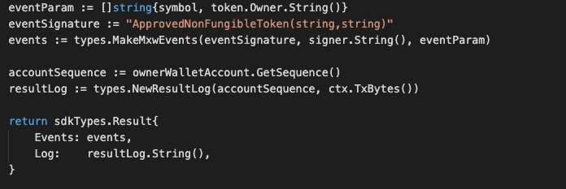  


Usage

This MakeMxwEvents create maxonrow events, by accepting :

* eventSignature : Custom Event Signature that using ApprovedNonFungibleToken(string,string)
* signer : Signer
* eventParam : Event Parameters as below 

| Name | Type | Description                 |
| ---- | ---- | --------------------------- |
| symbol | string | Token symbol, which must be unique| | 
| owner | string | Token owner| | 


2.This tutorial describes how to create maxonrow events for scanner base on reject token after emitted by a network.

  

Usage

This MakeMxwEvents create maxonrow events, by accepting :

* eventSignature : Custom Event Signature that using RejectedNonFungibleToken(string,string)
* signer : Signer
* eventParam : Event Parameters as below 

| Name | Type | Description                 |
| ---- | ---- | --------------------------- |
| symbol | string | Token symbol, which must be unique| | 
| owner | string | Token owner| | 


3.This tutorial describes how to create maxonrow events for scanner base on freeze token after emitted by a network.

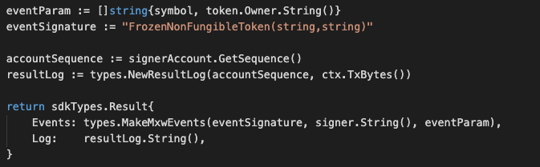  


Usage

This MakeMxwEvents create maxonrow events, by accepting :

* eventSignature : Custom Event Signature that using FrozenNonFungibleToken(string,string)
* signer : Signer
* eventParam : Event Parameters as below 

| Name | Type | Description                 |
| ---- | ---- | --------------------------- |
| symbol | string | Token symbol, which must be unique| | 
| owner | string | Token owner| | 


4.This tutorial describes how to create maxonrow events for scanner base on unfreeze token after emitted by a network.

  


Usage

This MakeMxwEvents create maxonrow events, by accepting :

* eventSignature : Custom Event Signature that using UnfreezeNonFungibleToken(string,string)
* signer : Signer
* eventParam : Event Parameters as below 

| Name | Type | Description                 |
| ---- | ---- | --------------------------- |
| symbol | string | Token symbol, which must be unique| | 
| owner | string | Token owner| | 


5.This tutorial describes how to create maxonrow events for scanner base on approve transfer token-ownership after emitted by a network.

  


Usage

This MakeMxwEvents create maxonrow events, by accepting :

* eventSignature : Custom Event Signature that using ApprovedTransferNonFungibleTokenOwnership(string,string,string)
* from : Signer
* eventParam : Event Parameters as below 

| Name | Type | Description                 |
| ---- | ---- | --------------------------- |
| symbol | string | Token symbol, which must be unique| | 
| owner | string | Token owner| | 
| newOwner | string | New token owner| | 


6.This tutorial describes how to create maxonrow events for scanner base on reject transfer token-ownership after emitted by a network.

  


Usage

This MakeMxwEvents create maxonrow events, by accepting :

* eventSignature : Custom Event Signature that using RejectedTransferNonFungibleTokenOwnership(string,string,string)
* from : Signer
* eventParam : Event Parameters as below 

| Name | Type | Description                 |
| ---- | ---- | --------------------------- |
| symbol | string | Token symbol, which must be unique| | 
| owner | string | Token owner| | 
| newOwner | string | New token owner| | 

### MsgTransferNonFungibleItem
This is the message type used to transfer the item of a non-fungible token.


`Parameters`

The message type contains the following parameters:

| Name | Type | Required | Description                 |
| ---- | ---- | -------- | --------------------------- |
| symbol | string | true   | Token symbol, which must be unique| | 
| from | string | true   | Item owner| | 
| to | string | true   | New Item owner| | 
| itemID | string | true   | Properties of token| | 


Example
```
{
    "type": "nonFungible/transferNonFungibleItem",
    "value": {
        "symbol": "TNFT",
        "from": "mxw1zrguzs0gyqqscjhk6y8zht9xknfz8e4pnvugy6",
        "to": "mxw1md4u2zxz2ne5vsf9t4uun7q2k0nc3ly5g22dne",
        "itemID": "item-123"
    }
}
```

`Handler`

The role of the handler is to define what action(s) needs to be taken when this `MsgTransferNonFungibleItem` message is received.

In the file (./x/token/nonfungible/handler.go) start with the following code:


NewHandler is essentially a sub-router that directs messages coming into this module to the proper handler.
Now, you need to define the actual logic for handling the `MsgTransferNonFungibleItem` message in `handleMsgTransferNonFungibleItem`:


In this function, requirements need to be met before emitted by the network.  

* A valid Token.
* Token transferable flag equals to true and not in freeze condition.
* Token which Transfer-limit Flag set to a certain threshold, number of items that can be transferrable need to follow this constraint.
* Signer must be a valid item owner.
* Action of Re-transfer is not allowed.


`Events`

This tutorial describes how to create maxonrow events for scanner on this after emitted by a network.

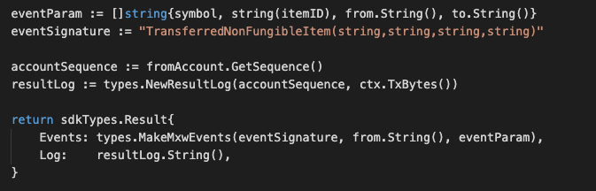  


Usage

This MakeMxwEvents create maxonrow events, by accepting :

* eventSignature : Custom Event Signature that using TransferredNonFungibleItem(string,string,string,string)
* from : Item owner
* eventParam : Event Parameters as below 

| Name | Type | Description                 |
| ---- | ---- | --------------------------- |
| symbol | string | Token symbol, which must be unique| | 
| itemID | string | Item ID| | 
| from | string | Item owner| | 
| to | string | New item owner| | 


### MsgMintNonFungibleItem
This is the message type used to mint an item of a non-fungible token.

`Parameters`

The message type contains the following parameters:

| Name | Type | Required | Description                 |
| ---- | ---- | -------- | --------------------------- |
| itemID | string | true   | Item ID, which must be unique| | 
| symbol | string | true   | Token symbol, which must be unique| | 
| owner | string | true   | Token owner| | 
| to | string | true   | Item owner| | 
| properties | string | true   | Properties of item| | 
| metadata | string | true   | Metadata of item| | 


Example
```
{
    "type": "nonFungible/mintNonFungibleItem",
    "value": {
        "itemID": "ITEM-123",
        "symbol": "TNFT",
        "owner": "mxw1x5cf8y99ntjc8cjm00z603yfqwzxw2mawemf73",
        "to": "mxw1md4u2zxz2ne5vsf9t4uun7q2k0nc3ly5g22dne",
        "properties": "item-properties",
        "metadata": "item-metadata"
    }
}

```

`Handler`

The role of the handler is to define what action(s) needs to be taken when this `MsgMintNonFungibleItem` message is received.

In the file (./x/token/nonfungible/handler.go) start with the following code:


NewHandler is essentially a sub-router that directs messages coming into this module to the proper handler.
Now, you need to define the actual logic for handling the `MsgMintNonFungibleItem` message in `handleMsgMintNonFungibleItem`:

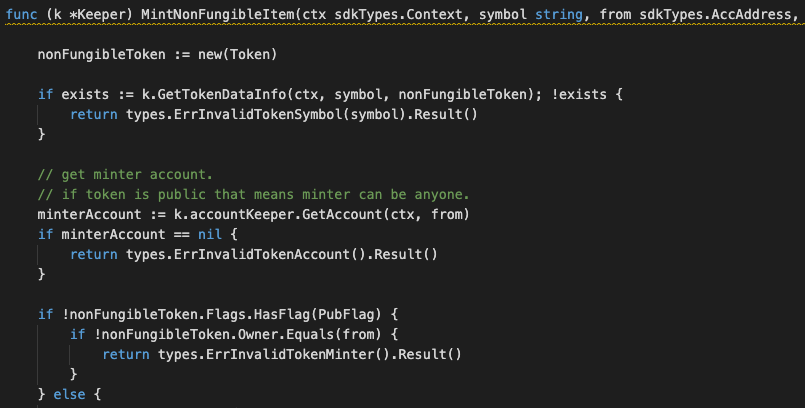


In this function, requirements need to be met before emitted by the network.  

* A valid Token.
* Token must be approved, and not yet be freeze.
* Token which Public Flag equals to true can only be minted to same user.
* Token which Mint-limit Flag set to ZERO, any items can be minted without the limitation. Otherwise, will base on the threshold of this setting.
* A valid Item ID which must be unique.
* Action of Re-mint is not allowed.


`Events`

This tutorial describes how to create maxonrow events for scanner on this after emitted by a network.

  


Usage

This MakeMxwEvents create maxonrow events, by accepting :

* eventSignature : Custom Event Signature that using MintedNonFungibleItem(string,string,string,string)
* from : Token owner
* eventParam : Event Parameters as below 

| Name | Type | Description                 |
| ---- | ---- | --------------------------- |
| symbol | string | Token symbol, which must be unique| | 
| itemID | string | Item ID| | 
| from | string | Token owner| | 
| to | string | Item owner| | 


### MsgBurnNonFungibleItem
This is the message type used to burn an item of a non-fungible token.


`Parameters`

The message type contains the following parameters:

| Name | Type | Required | Description                 |
| ---- | ---- | -------- | --------------------------- |
| symbol | string | true   | Token symbol, which must be unique| | 
| from | string | true   | Item owner| | 
| itemID | string | true   | Properties of token| | 


Example

```
{
    "type": "nonFungible/burnNonFungibleItem",
    "value": {
        "symbol": "TNFT",
        "from": "mxw1zrguzs0gyqqscjhk6y8zht9xknfz8e4pnvugy6",
        "itemID": "ITEM-123"
    }
}

```

`Handler`

The role of the handler is to define what action(s) needs to be taken when this `MsgBurnNonFungibleItem` message is received.

In the file (./x/token/nonfungible/handler.go) start with the following code:


NewHandler is essentially a sub-router that directs messages coming into this module to the proper handler.
Now, you need to define the actual logic for handling the `MsgBurnNonFungibleItem` message in `handleMsgBurnNonFungibleItem`:

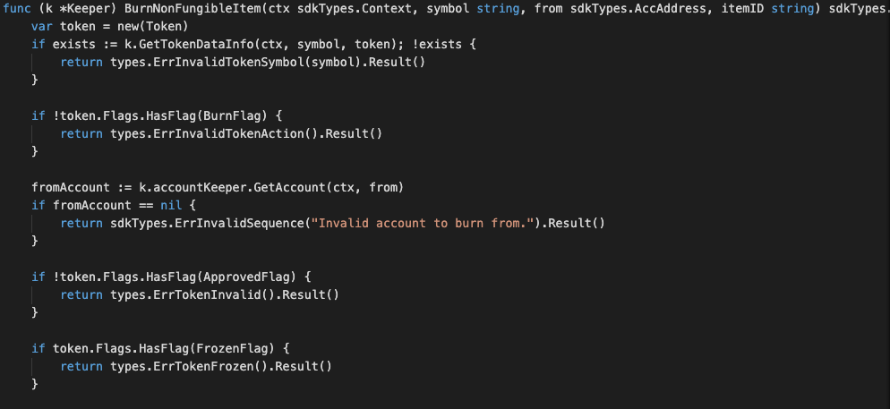


In this function, requirements need to be met before emitted by the network.  

* A valid Token.
* Token must be approved before this, and not be freeze. Also burnable flag must equals to true.
* A valid Item ID.
* Signer who is the Item owner need to be authorised to do this process.
* Action of Re-burn is not allowed.


`Events`

This tutorial describes how to create maxonrow events for scanner on this after emitted by a network.

  


Usage

This MakeMxwEvents create maxonrow events, by accepting :

* eventSignature : Custom Event Signature that using BurnedNonFungibleItem(string,string,string)
* from : Item owner
* eventParam : Event Parameters as below 

| Name | Type | Description                 |
| ---- | ---- | --------------------------- |
| symbol | string | Token symbol, which must be unique| | 
| itemID | string | Item ID| | 
| from | string | Item owner| | 


### MsgTransferNonFungibleTokenOwnership
This is the message type used to transfer-ownership of a non-fungible token.

`Parameters`

The message type contains the following parameters:

| Name | Type | Required | Description                 |
| ---- | ---- | -------- | --------------------------- |
| symbol | string | true   | Token symbol, which must be unique| | 
| from | string | true   | Token owner| | 
| to | string | true   | New token owner| | 


Example

```
{
    "type": "nonFungible/transferNonFungibleTokenOwnership",
    "value": {
        "symbol": "TNFT",
        "from": "mxw1x5cf8y99ntjc8cjm00z603yfqwzxw2mawemf73",
        "to": "mxw1zrguzs0gyqqscjhk6y8zht9xknfz8e4pnvugy6"
    }
}

```

`Handler`

The role of the handler is to define what action(s) needs to be taken when this `MsgTransferNonFungibleTokenOwnership` message is received.

In the file (./x/token/nonfungible/handler.go) start with the following code:


NewHandler is essentially a sub-router that directs messages coming into this module to the proper handler.
Now, you need to define the actual logic for handling the `MsgTransferNonFungibleTokenOwnership` message in `handleMsgTransferNonFungibleTokenOwnership`:


In this function, requirements need to be met before emitted by the network.  

* A valid Token.
* Token must be approved, and not yet be freeze.
* Signer must be valid token owner
* Action of Re-transfer-ownership is not allowed.


`Events`

This tutorial describes how to create maxonrow events for scanner on this after emitted by a network.

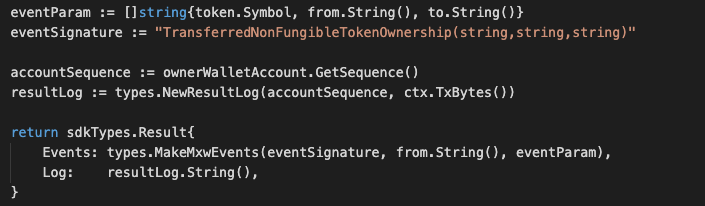  

Usage

This MakeMxwEvents create maxonrow events, by accepting :

* eventSignature : Custom Event Signature that using TransferredNonFungibleTokenOwnership(string,string,string)
* from : Token owner
* eventParam : Event Parameters as below 

| Name | Type | Description                 |
| ---- | ---- | --------------------------- |
| symbol | string | Token symbol, which must be unique| | 
| from | string | Token owner| | 
| to | string | New token owner| | 


### MsgAcceptNonFungibleTokenOwnership
This is the message type used to accept-ownership of a non-fungible token.

`Parameters`

The message type contains the following parameters:

| Name | Type | Required | Description                 |
| ---- | ---- | -------- | --------------------------- |
| symbol | string | true   | Token symbol, which must be unique| | 
| from | string | true   | Token owner| | 


Example

```
{
    "type": "nonFungible/acceptNonFungibleTokenOwnership",
    "value": {
        "symbol": "TNFT",
        "from": "mxw1zrguzs0gyqqscjhk6y8zht9xknfz8e4pnvugy6"
    }
}
```

`Handler`

The role of the handler is to define what action(s) needs to be taken when this `MsgAcceptNonFungibleTokenOwnership` message is received.

In the file (./x/token/nonfungible/handler.go) start with the following code:


NewHandler is essentially a sub-router that directs messages coming into this module to the proper handler.
Now, you need to define the actual logic for handling the `MsgAcceptNonFungibleTokenOwnership` message in `handleMsgAcceptNonFungibleTokenOwnership`:

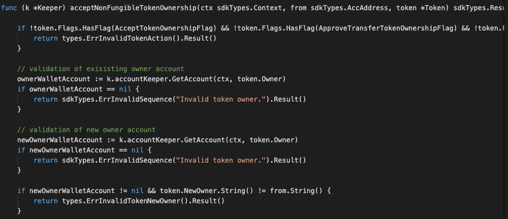


In this function, requirements need to be met before emitted by the network.  

* A valid Token.
* A valid Token owner.
* A valid New token owner.
* Token must be approved and not be freeze.
* Action of Re-accept-ownership is not allowed.


`Events`

This tutorial describes how to create maxonrow events for scanner on this after emitted by a network.

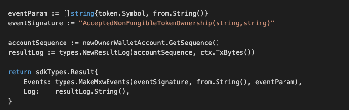  


Usage

This MakeMxwEvents create maxonrow events, by accepting :

* eventSignature : Custom Event Signature that using AcceptedNonFungibleTokenOwnership(string,string)
* from : Token owner
* eventParam : Event Parameters as below 

| Name | Type | Description                 |
| ---- | ---- | --------------------------- |
| symbol | string | Token symbol, which must be unique| | 
| from | string | Token owner| | 


### MsgSetNonFungibleItemStatus
This is the message type used to update the status of an item of a non-fungible token, 
  eg. Freeze or unfreeze

`Parameters`

The message type contains the following parameters:

| Name | Type | Required | Description                 |
| ---- | ---- | -------- | --------------------------- |
| owner | string | true   | Item owner| | 
| payload | ItemPayload | true   | Item Payload information| | 
| signatures | []Signature | true   | Array of Signature| | 


Item Payload Information

| Name | Type | Required | Description                 |
| ---- | ---- | -------- | --------------------------- |
| item | ItemDetails | true   | Item details information| | 
| pub_key | type/value | true   | crypto.PubKey| | 
| signature | []byte | true   | signature| | 


Item Details Information

| Name | Type | Required | Description                 |
| ---- | ---- | -------- | --------------------------- |
| from | string | true   | Item owner| | 
| nonce | string | true   | nonce signature| | 
| status | string | true   | There are two type of status, which include `FREEZE_ITEM`, `UNFREEZE_ITEM`. All this keywords must be matched while come to this message type | | 
| symbol | string | true   | Token-symbol| | 
| itemID | string | true   | Item ID| | 

`status`

| status | Details                 |
| -------- | --------------------------- |
| FREEZE_ITEM  | A valid token with a valid Item ID which already been approved and yet to be frozen must be signed by authorised Signer with valid signature will be proceed, this also along with the approval from authorised address of issuer and provider parties. Item ID which already been frozen is not allowed to do re-submit.| | 
| UNFREEZE_ITEM  | A valid token with a valid Item ID which already been approved and frozen must be signed by authorised Signer with valid signature will be proceed, this also along with the approval from authorised address of issuer and provider parties. Item ID which already been unfreeze is not allowed to do re-submit.| | 

Example
```
{
  "type": "nonFungible/setNonFungibleItemStatus",
  "value": {
    "owner": "mxw1md4u2zxz2ne5vsf9t4uun7q2k0nc3ly5g22dne",
    "payload": {
      "item": {
        "from": "mxw1f8r0k5p7s85kv7jatwvmpartyy2j0s20y0p0yk",
        "nonce": "0",
        "status": "FREEZE_ITEM",
        "symbol": "TNFT",
        "itemID": "Item-123"
      },
      "pub_key": {
        "type": "tendermint/PubKeySecp256k1",
        "value": "A0VBHXKgUEU2fttqh8Lhqp1G6+GzOxTXvCExzDLEdfD7"
      },
      "signature": "hEnOeX536dduNFgWMOdK0cFKq2xwWW9aAHalW9l5kAgxg94P55MIEQJ8vFkEq9eAcYo1sjQ4TfXW5EynIk/kuQ=="
    },
    "signatures": [
      {
        "pub_key": {
          "type": "tendermint/PubKeySecp256k1",
          "value": "Ausyj7Gas2WkCjUpM8UasCcezXrzTMTRbPHqYx44GzLm"
        },
        "signature": "uDh1fll2eN/3lpKgMydW9mEdgfI3Mint30pkFrrQ+phkIY5X8nMbCoS6WNmw5bqCiVunMhkey75U3Qm99csG4g=="
      }
    ]
  }
}

```

`Handler`

The role of the handler is to define what action(s) needs to be taken when this `MsgSetNonFungibleItemStatus` message is received.

In the file (./x/token/nonfungible/handler.go) start with the following code:


NewHandler is essentially a sub-router that directs messages coming into this module to the proper handler.
Now, you define the actual logic for handling the `MsgSetNonFungibleItemStatus` - FreezeNonFungibleItem message in `handleMsgSetNonFungibleItemStatus`:


In this function, requirements need to be met before emitted by the network.  

* A valid Token.
* A valid Item ID which must not be freeze.
* Signer must be authorised.
* Action of Re-freeze-item is not allowed.

Next, you define the actual logic for handling the MsgSetNonFungibleItemStatus-UnfreezeNonFungibleItem message in handleMsgSetNonFungibleItemStatus:


In this function, requirements need to be met before emitted by the network.  

* A valid Token.
* A valid Item ID which must be freeze.
* Signer must be authorised.
* Action of Re-unfreeze-item is not allowed.


`Events`

1.This tutorial describes how to create maxonrow events for scanner base on freeze-item after emitted by a network.

  


Usage

This MakeMxwEvents create maxonrow events, by accepting :

* eventSignature : Custom Event Signature that using FrozenNonFungibleItem(string,string,string) 
* owner : Signer
* eventParam : Event Parameters as below 

| Name | Type | Description                 |
| ---- | ---- | --------------------------- |
| symbol | string | Token symbol, which must be unique| | 
| itemID | string | Item ID| | 
| owner | string | Signer| | 


2.This tutorial describes how to create maxonrow events for scanner base on unfreeze-item after emitted by a network.

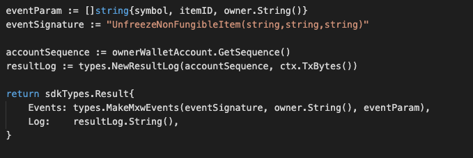  


Usage

This MakeMxwEvents create maxonrow events, by accepting :

* eventSignature : Custom Event Signature that using UnfreezeNonFungibleItem(string,string,string) 
* owner : Signer
* eventParam : Event Parameters as below 

| Name | Type | Description                 |
| ---- | ---- | --------------------------- |
| symbol | string | Token symbol, which must be unique| | 
| itemID | string | Item ID| | 
| owner | string | Signer| | 


### MsgEndorsement
This is the message type used to endorse an item of a non-fungible token.
The user can write into the MEMO field that indicate what kind of remarks/comments wish to be input, while come to item endorsement process. However, the limitation of this MEMO can only be 128 bytes.

`Parameters`

The message type contains the following parameters:

| Name | Type | Required | Description                 |
| ---- | ---- | -------- | --------------------------- |
| symbol | string | true   | Token symbol, which must be unique| | 
| from | string | true   | Endorser| | 
| itemID | string | true   | Item ID, which must be unique| | 


Example
```
{
    "type": "nonFungible/endorsement",
    "value": {
        "symbol": "TNFT",
        "from": "mxw1k9sxz0h3yeh0uzmxet2rmsj7xe5zg54eq7vhla",
        "itemID": "ITEM-123"
    }
}


```

`Handler`

The role of the handler is to define what action(s) needs to be taken when this `MsgEndorsement` message is received.

In the file (./x/token/nonfungible/handler.go) start with the following code:


NewHandler is essentially a sub-router that directs messages coming into this module to the proper handler.
Now, you need to define the actual logic for handling the `MsgEndorsement` message in `handleMsgEndorsement`:


In this function, requirements need to be met before emitted by the network.  

* A valid Item ID.
* Signer must be a valid endorser.
* Action of Re-endorse process is allowed.


`Events`

This tutorial describes how to create maxonrow events for scanner on this after emitted by a network.

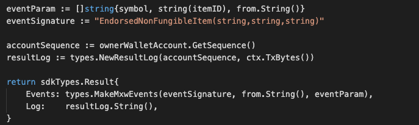  


Usage

This MakeMxwEvents create maxonrow events, by accepting :

* eventSignature : Custom Event Signature that using EndorsedNonFungibleItem(string,string,string)
* from : Endorser
* eventParam : Event Parameters as below 

| Name | Type | Description                 |
| ---- | ---- | --------------------------- |
| symbol | string | Token symbol, which must be unique| | 
| itemID | string | Item ID| | 
| from | string | Endorser| | 


### MsgUpdateItemMetadata
This is the message type used to update item metadata of a non-fungible token.

`Parameters`

The message type contains the following parameters:

| Name | Type | Required | Description                 |
| ---- | ---- | -------- | --------------------------- |
| symbol | string | true   | Token symbol, which must be unique| | 
| from | string | true   | Item owner| | 
| itemID | string | true   | Item ID| | 
| metadata | string | true   | Metadata of item| | 


Example
```
{
    "type": "nonFungible/updateItemMetadata",
    "value": {
        "symbol": "TNFT",
        "from": "mxw1md4u2zxz2ne5vsf9t4uun7q2k0nc3ly5g22dne",
        "itemID": "ITEM-123",
        "metadata": "update Item metadata 9991"
    }
}
```

`Handler`

The role of the handler is to define what action(s) needs to be taken when this `MsgUpdateItemMetadata` message is received.

In the file (./x/token/nonfungible/handler.go) start with the following code:


NewHandler is essentially a sub-router that directs messages coming into this module to the proper handler.
Now, you need to define the actual logic for handling the `MsgUpdateItemMetadata` message in `handleMsgUpdateItemMetadata`:

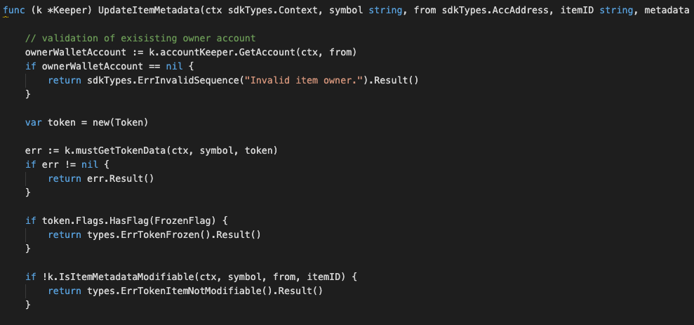


In this function, requirements need to be met before emitted by the network.  

* A valid Token.
* Token not in freeze condition.
* Token which Modifiable Flag is `TRUE`, Item owner allowed to modify item-metadata.
* Token which Modifiable Flag is `FALSE`, only Token owner allowed to modify the item-metadata.
* A valid Item ID which not in freeze condition.
* Signer must be valid item owner.
* Action of Re-update is allowed.


`Events`

This tutorial describes how to create maxonrow events for scanner on this after emitted by a network.

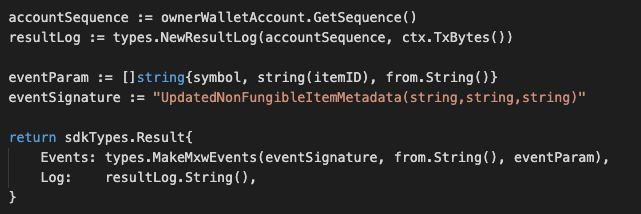  


Usage

This MakeMxwEvents create maxonrow events, by accepting :

* eventSignature : Custom Event Signature that using UpdatedNonFungibleItemMetadata(string,string,string)
* from : Item owner
* eventParam : Event Parameters as below 

| Name | Type | Description                 |
| ---- | ---- | --------------------------- |
| symbol | string | Token symbol, which must be unique| | 
| itemID | string | Item ID| | 
| from | string | Item owner| | 


### MsgUpdateNFTMetadata
This is the message type used to update metadata of a non-fungible token.

`Parameters`

The message type contains the following parameters:

| Name | Type | Required | Description                 |
| ---- | ---- | -------- | --------------------------- |
| symbol | string | true   | Token symbol, which must be unique| | 
| from | string | true   | Token owner| | 
| metadata | string | true   | Metadata of token| | 

Example
```
{
    "type": "nonFungible/updateNFTMetadata",
    "value": {
        "symbol": "TNFT",
        "from": "mxw1x5cf8y99ntjc8cjm00z603yfqwzxw2mawemf73",
        "metadata": "token metadata updated here"
    }
}
```

`Handler`

The role of the handler is to define what action(s) needs to be taken when this `MsgUpdateNFTMetadata` message is received.

In the file (./x/token/nonfungible/handler.go) start with the following code:


NewHandler is essentially a sub-router that directs messages coming into this module to the proper handler.
Now, you need to define the actual logic for handling the `MsgUpdateNFTMetadata` message in `handleMsgUpdateNFTMetadata`:

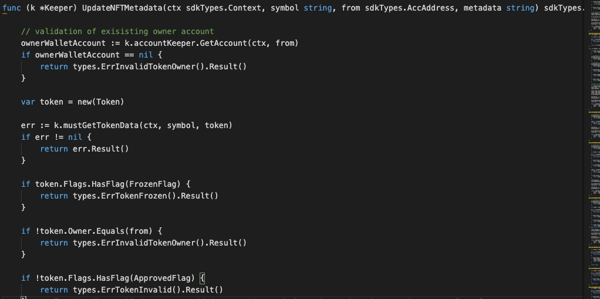


In this function, requirements need to be met before emitted by the network.  

* A valid Token.
* Token must be approved and not in freeze condition.
* Signer must be valid token owner
* Action of Re-update is allowed.


`Events`

This tutorial describes how to create maxonrow events for scanner on this after emitted by a network.

  


Usage

This MakeMxwEvents create maxonrow events, by accepting :

* eventSignature : Custom Event Signature that using UpdatedNonFungibleTokenMetadata(string,string)
* from : Token owner
* eventParam : Event Parameters as below 

| Name | Type | Description                 |
| ---- | ---- | --------------------------- |
| symbol | string | Token symbol, which must be unique| | 
| from | string | Token owner| | 


### Querier

Now you can navigate to the ./x/token/nonfungible/querier.go file. 
This is the place to define which queries against application state users will be able to make. 
 
Here, you will see NewQuerier been defined, and it acts as a sub-router for queries to this module (similar the NewHandler function). Note that because there isn't an interface similar to Msg for queries, we need to manually define switch statement cases (they can't be pulled off of the query .Route() function):


This module will expose few queries:

### ListTokenSymbol
This query the available tokens list.

After the router is defined, define the inputs and responses for this queryListTokenSymbol:

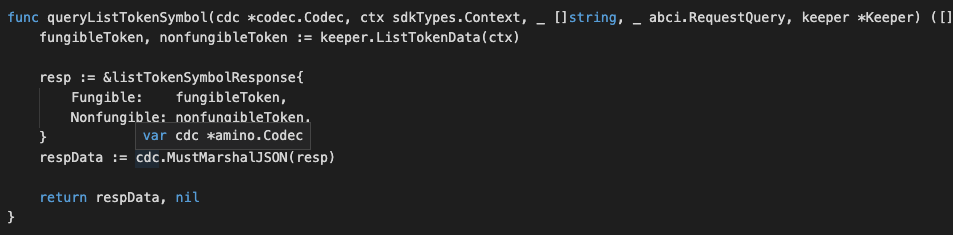


Notes on the above code:

The output type should be something that is both JSON marshalable and stringable (implements the Golang fmt.Stringer interface). The returned bytes should be the JSON encoding of the output result.

For the output of ListTokenSymbol, the normal ListTokenSymbol struct is already JSON marshalable, but we need to add a .String() method on it.


`Parameters`

| Name | Type | Default | Required | Description                 |
| ---- | ---- | ------- | -------- | --------------------------- |
| path | string | false | false    | Path to the data (eg. "/a/b/c") |
| data | []byte | false | true     | Data |
| height | int64 | 0 | false    | Height (0 means latest) |
| prove | bool | false | false    | Include proofs of the transactions inclusion in the block, if true |


`Example`

In this example, we will explain how to query token list with abci_query. 

Run the command with the JSON request body:
```
curl 'http://localhost:26657/'
```

```
{
    "method": "abci_query",
    "params": [
    	"/custom/nonFungible/list_token_symbol",
    	"",
    	"0",
    	false
    	],
    "id": 0,
    "jsonrpc": "2.0"
}

```

The above command returns JSON structured like this: 
```
{
  "jsonrpc": "2.0",
  "id": 0,
  "result": {
    "response": {
      "code": 0,
      "log": "",
      "info": "",
      "index": "0",
      "key": null,
      "value": "eyJmdW5naWJsZSI6bnVsbCwibm9uZnVuZ2libGUiOm51bGx9",
      "proof": null,
      "height": "819",
      "codespace": ""
    }
  }
}
```

### TokenData
This query the token data by a given symbol.

After the router is defined, define the inputs and responses for this queryTokenData:

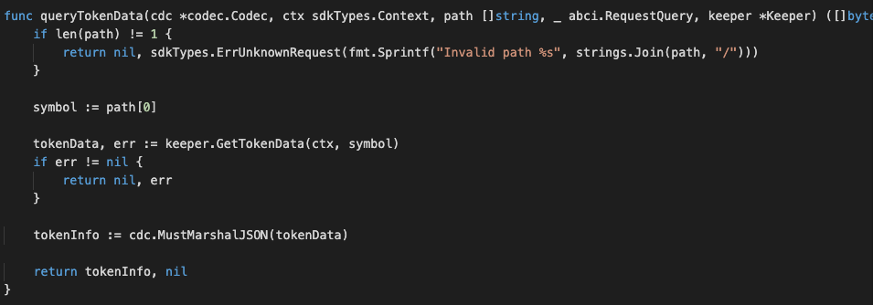


Notes on the above code:

This query request ONE path-parameter which refer to token-symbol. 
The output type should be something that is both JSON marshalable and stringable (implements the Golang fmt.Stringer interface). The returned bytes should be the JSON encoding of the output result.

For the output of TokenData, the normal TokenData struct is already JSON marshalable, but we need to add a .String() method on it.


`Parameters`

| Name | Type | Default | Required | Description                 |
| ---- | ---- | ------- | -------- | --------------------------- |
| path | string | false | false    | Path to the data (eg. "/a/b/c") |
| data | []byte | false | true     | Data |
| height | int64 | 0 | false    | Height (0 means latest) |
| prove | bool | false | false    | Include proofs of the transactions inclusion in the block, if true |


`Example`

In this example, we will explain how to query token data with abci_query. 

Run the command with the JSON request body:
```
curl 'http://localhost:26657/'
```

```
{
    "method": "abci_query",
    "params": [
    	"/custom/nonFungible/token_data/TNFT-E2",
    	"",
    	"0",
    	false
    	],
    "id": 0,
    "jsonrpc": "2.0"
}

```

The above command returns JSON structured like this: 
```
{
    "jsonrpc": "2.0",
    "id": 0,
    "result": {
        "response": {
            "code": 0,
            "log": "",
            "info": "",
            "index": "0",
            "key": null,
            "value": "eyJGbGFncyI6MTE1LCJOYW1lIjoiVGVzdE5vbkZ1bmdpYmxlVG9rZW4iLCJTeW1ib2wiOiJUTkZULUUyIiwiT3duZXIiOiJteHcxeDVjZjh5OTludGpjOGNqbTAwejYwM3lmcXd6eHcybWF3ZW1mNzMiLCJOZXdPd25lciI6IiIsIlByb3BlcnRpZXMiOiIiLCJNZXRhZGF0YSI6InRva2VuIG1ldGFkYXRhIiwiVG90YWxTdXBwbHkiOiIxIiwiVHJhbnNmZXJMaW1pdCI6IjIiLCJNaW50TGltaXQiOiIyIiwiRW5kb3JzZXJMaXN0IjpbIm14dzFmOHIwazVwN3M4NWt2N2phdHd2bXBhcnR5eTJqMHMyMHkwcDB5ayIsIm14dzFrOXN4ejBoM3llaDB1em14ZXQycm1zajd4ZTV6ZzU0ZXE3dmhsYSJdfQ==",
            "proof": null,
            "height": "746",
            "codespace": ""
        }
    }
}
```


### ItemData
This query the item data by given of symbol and item ID.

After the router is defined, define the inputs and responses for this queryItemData:

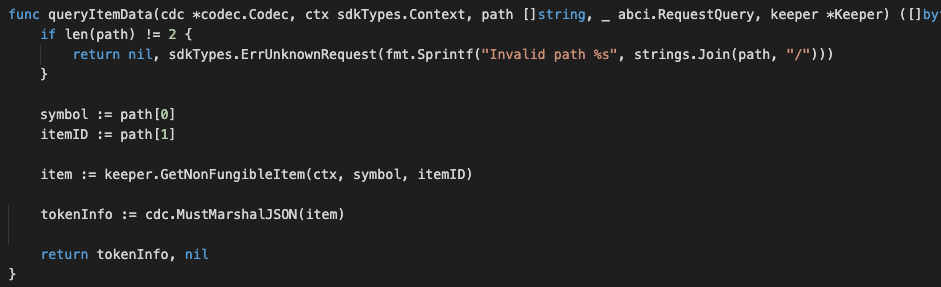


Notes on the above code:

This query request TWO path-parameters which refer to token-symbol and item-id. 
The output type should be something that is both JSON marshalable and stringable (implements the Golang fmt.Stringer interface). The returned bytes should be the JSON encoding of the output result.

For the output of ItemData, the normal ItemData struct is already JSON marshalable, but we need to add a .String() method on it.

`Parameters`

| Name | Type | Default | Required | Description                 |
| ---- | ---- | ------- | -------- | --------------------------- |
| path | string | false | false    | Path to the data (eg. "/a/b/c") |
| data | []byte | false | true     | Data |
| height | int64 | 0 | false    | Height (0 means latest) |
| prove | bool | false | false    | Include proofs of the transactions inclusion in the block, if true |


`Example`

In this example, we will explain how to query item data with abci_query. 

Run the command with the JSON request body:
```
curl 'http://localhost:26657/'
```

```
{
    "method": "abci_query",
    "params": [
    	"/custom/nonFungible/item_data/TNFT-E2/770099",
    	"",
    	"0",
    	false
    	],
    "id": 0,
    "jsonrpc": "2.0"
}

```

The above command returns JSON structured like this: 
```
{
    "jsonrpc": "2.0",
    "id": 0,
    "result": {
        "response": {
            "code": 0,
            "log": "",
            "info": "",
            "index": "0",
            "key": null,
            "value": "eyJJRCI6Ijc3MDA5OSIsIlByb3BlcnRpZXMiOiJwcm9wZXJ0aWVzIiwiTWV0YWRhdGEiOiJtZXRhZGF0YSIsIlRyYW5zZmVyTGltaXQiOiIwIiwiRnJvemVuIjpmYWxzZX0=",
            "proof": null,
            "height": "754",
            "codespace": ""
        }
    }
}
```


