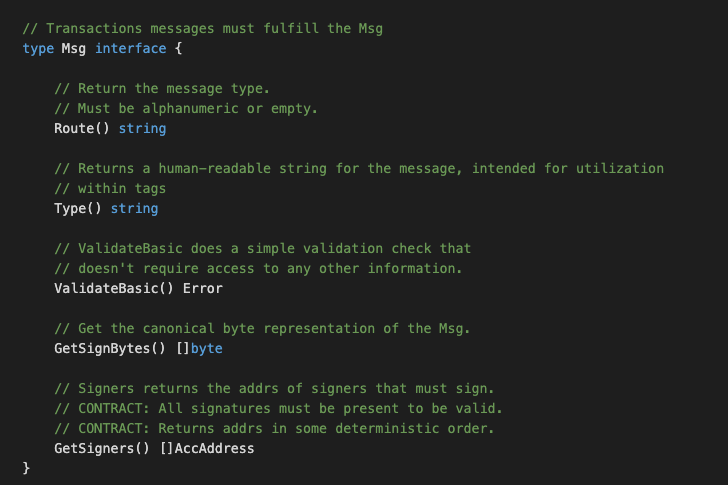
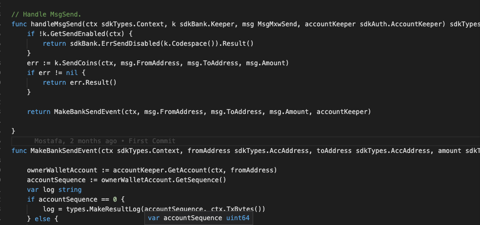
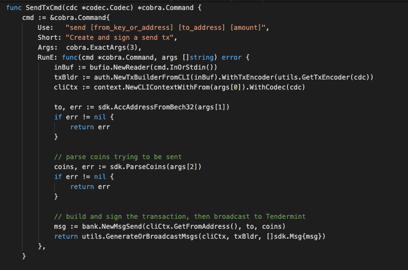

# Bank Module

### Application Goals

This specifies the bank module of the Maxonrow SDK that relies on Cosmos SDK.

The bank module is responsible for handling multi-asset coin transfers between accounts. It exposes several interfaces with varying capabilities for secure interaction with other modules which must alter user balances.

In this section, you will learn how these simple requirements translate to application design.

### Type

We will use this when creating and retrieving the asset/coins transfers sent to the fullnode. 
Start by creating the file msgs.go in ./x/bank/ folder which will hold customs message types for the module.
To start the SDK module, define those relevant structs in the ./x/bank/msgs.go file as below:

* MsgMxwSend
-- This is the message type used to create coin transfers transaction. 

### Msgs

Msgs define your application's state transitions. They are encoded and passed around the network wrapped in Txs. 
Messages are "owned" by a single module, meaning they are routed to only one of your applications modules. 
Each module has its own set of messages that it uses to update its subset of the chain state. 
Maxonrow SDK relies on Cosmos SDK wraps and unwraps Msgs from Txs, which means developer only have to define the relevant Msgs.   
Msgs must satisfy the following interface:

  

### Handlers

Next we need to write a handler function to process the Messages contained in the transactions delivered in each block. Handlers determine what actions should be taken (eg. which stores need to get updated, how, and under what conditions) when a given Msg is received. In MVC terms this would be the 'controller'.

In this module you have ONE type of Msgs that users can send to interact with the application state: 

* MsgMxwSend, which it will have an associated Handler.

### Keeper

The main core of a Maxonrow SDK module is a piece called the Keeper. 
Each module's Keeper is responsible for CRUD operations to the main datastore of the application. 
With more sophisticated applications, modules may have access to each other's Keepers 
for cross-module interactions.  In MVC terms this would be the "model". 

  

### Querier

This is the place to define which queries against application state users will be able to make. 
Now that we have a running distributed state machine, 
it's time to enable querying our blockchain state. This is done through Queriers. 
These define the queries that clients can send via websocket/rpc to which our application will respond. 
The bank module will expose below queries:

* GetTransferFee

### Client with CLI
A Command Line Interface (CLI) will help us interact with our app once it is running on a machine somewhere. Each Module has it's own namespace within the CLI that gives it the ability to create and sign Messages destined to be handled by that module. 

The CLI for the Bank module is refered to file named sendtx.go which is located in ./x/bank/client/cli/. This file is for making transactions that contain messages which will ultimately update our state. This file utilize the Cobra library.

### sendtx.go
The sendtx.go file contains SendTxCmd which is a standard method within the Maxonrow SDK, which will create a send tx and sign it with the given key.
This function takes parameters from the Cobra CLI tool to create a new msg, sign it and submit it to the application to be processed. 

  
