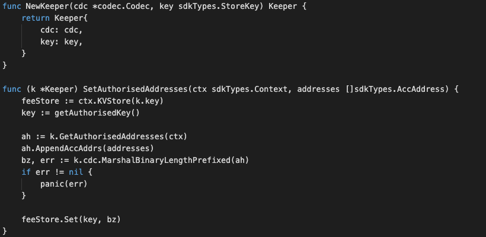
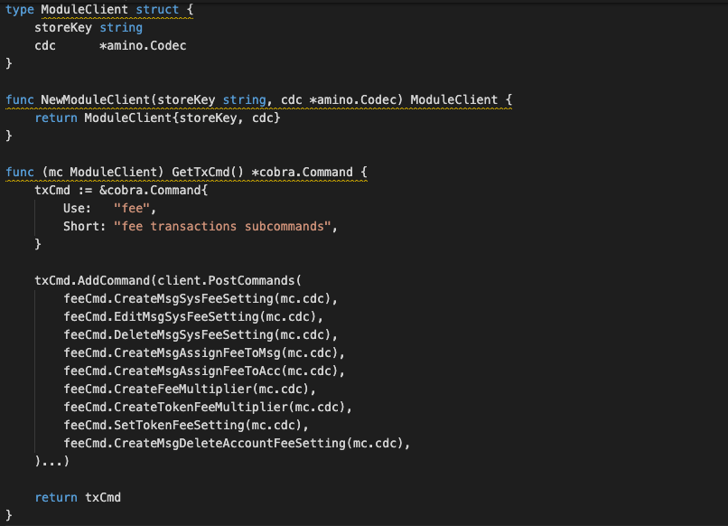
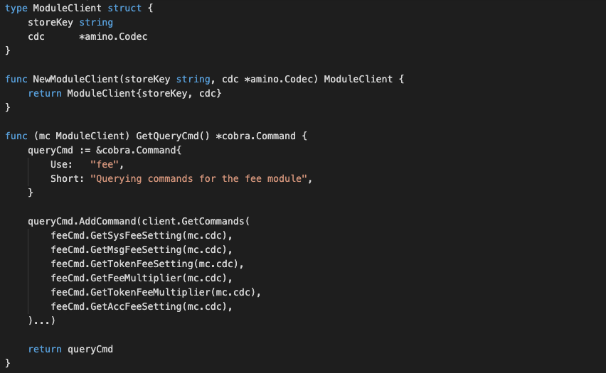

# Fee Setting Module


### Application Goals
The goal of the module is to let users create and maintain account of a fee setting. 

In this section, you will learn how these simple requirements translate to application design.

### Type

We will use this when creating/updating status of the fee setting account for sending to the fullnode. 
Start by creating the file msgs.go in ./x/fee/ folder which will hold customs message types for the module.
To start the SDK module, define those relevant structs in the ./x/fee/msgs.go file as below:

* MsgSysFeeSetting
-- This is the msg type used to create or update the system fee setting. 
    Eg. “default”, “zero”, “transfer” and etc.  
```
Usage :
mxwcli tx fee create-sysfee --name [fee name] --min [minimum amount] --max [maximum amount] --percentage [percentage] --gas 0 --fees 0cin --from [fee authorised address] --chain-id [chain’s id] --node [remote node you wish to connect to] 

Example :

mxwcli tx fee create-sysfee --name default --min 50000000000000000cin --max 10000000000000000000000000cin --percentage 0.005 --gas 0 --fees 0cin --from feeIssuer --chain-id uatnet --node https://uatnet.usdp.io:443 
```
```
Usage :
mxwcli tx fee edit-sysfee [fee name] --min [minimum amount] --max [maximum amount] --percentage [percentage] --gas 0 --fees 0cin --from [fee authorised address] --chain-id [chain’s id] --node [remote node you wish to connect to]  

Example :

mxwcli tx fee edit-sysfee default --min 50000000000000000cin --max 10000000000000000000000000cin --percentage 0.005 --gas 0 --fees 0cin --from feeIssuer --chain-id uatnet --node https://uatnet.usdp.io:443  
```


* MsgDeleteSysFeeSetting
-- This is the msg type used to delete the fee setting. 

```
Usage :
mxwcli tx fee delete-sysfee [fee name] --from [fee authorised address] --fees 0cin --gas0 --chain-id [chain’s id] --node [remote node you wish to connect to]  

Example :

mxwcli tx fee delete-sysfee default --from feeAuth --fees 0cin --gas 0 --chain-id uatnet --node https://uatnet.usdp.io:443  
```


* MsgAssignFeeToMsg
-- This is the msg type used to assign fee setting to message. 

```
Usage :
mxwcli tx fee msg [msg type] --name [fee name] --from [fee authorised address] --chain-id [chain’s id] --fees 0cin --gas 0 --node [remote node you wish to connect to]  

Example :

mxwcli tx fee msg fee-updateFeeSetting --name zero --from feeAuth --chain-id uatnet --fees 0cin --gas 0 --node https://uatnet.usdp.io:443  
```

* MsgAssignFeeToAcc
-- This is the msg type used to assign fee setting to account. 
```
Usage :
mxwcli tx fee account [account address] --name [fee name] --from [fee authorised address] --chain-id [chain’s id] --gas 0 --fees 0cin --node [remote node you wish to connect to] 

Example :

mxwcli tx fee account mxw16f6dsgrxdk6cfpm9kyz9qdp7v0k2azlrkj95vu --name zero --from foundation --chain-id uatnet --gas 0 --fees 0cin --node https://uatnet.usdp.io:443 
```

* MsgDeleteAccFeeSetting
-- This is the msg type used to delete an account of the fee setting. 
```
Usage :
mxwcli tx fee delete-acc-fee [account address] --from [fee authorised address] --fees 0cin --gas 0 --chain-id [chain’s id] --node [remote node you wish to connect to]  
  

Example :

mxwcli tx fee delete-acc-fee mxw16f6dsgrxdk6cfpm9kyz9qdp7v0k2azlrkj95vu --from feeAuth --gas 0 --fees 0cin --chain-id uatnet --node https://uatnet.usdp.io:443  

```

* MsgMultiplier
-- This is the msg type used to create, update the system fee multiplier. 
```
Usage :
mxwcli tx fee fee-multiplier [multiplier you wish to set] --from [fee authorised address] --fees 0cin --gas 0 --chain-id [chain’s id] --node [remote node you wish to connect to]  

Example :

mxwcli tx fee fee-multiplier 1 --from feeAuth --fees 0cin --gas 0 --chain-id uatnet --node https://uatnet.usdp.io:443 
```


* MsgTokenMultiplier
-- This is the msg type used to create, update the token fee multiplier.  
```
Usage :
mxwcli tx fee token-fee-multiplier [multiplier you wish to set] --from [fee authorised address] --fees 0cin --gas 0 --chain-id [chain’s id] --node [remote node you wish to connect to]  

Example :

mxwcli tx fee token-fee-multiplier 1 --from feeAuth --fees 0cin --gas 0 --chain-id uatnet --node https://uatnet.usdp.io:443 
```


* MsgAssignFeeToToken
-- This is the msg type used to assign fee setting to token by token action and token symbol. 
```
Usage :
mxwcli tx fee token [token symbol] [token action] --name [fee setting name] --from [fee authorised address] --gas 0 --fees 0cin --chain-id [chain’s id] --node [remote node you wish to connect to]  

Example :

mxwcli tx fee token MUL transfer --name default --from feeAuth --gas 0 --fees 0cin --chain-id uatnet --node https://uatnet.usdp.io:443  

Available token action: 
* transfer 
* mint 
* burn 
* transferOwnership 
* acceptOwnership 
```


### Msgs

Msgs define your application's state transitions. 
They are encoded and passed around the network wrapped in Txs. 
Messages are "owned" by a single module, meaning they are routed to only one of your applications modules. 
Each module has its own set of messages that it uses to update its subset of the chain state. 
Maxonrow SDK relies on Cosmos SDK wraps and unwraps Msgs from Txs, which means developer only have to define the relevant Msgs.<br/><br/>  
Msgs must satisfy the following interface:

  
  


### Handlers

Next we need to write a handler function to process the Messages contained 
in the transactions delivered in each block. 
Handlers determine what actions should be taken (eg. which stores need to get updated, how, and under what conditions) 
when a given Msg is received. In MVC terms this would be the 'controller'.

In this module you have TWO types of Msgs that users 
can send to interact with the application state: 

* MsgSysFeeSetting
* MsgDeleteSysFeeSetting
* MsgAssignFeeToMsg
* MsgAssignFeeToAcc
* MsgDeleteAccFeeSetting
* MsgMultiplier
* MsgTokenMultiplier
* MsgAssignFeeToToken

** They will each have an associated Handler.


### Keeper

The main core of a Maxonrow SDK module is a piece called the Keeper. 
Each module's Keeper is responsible for CRUD operations to the main datastore of the application. 
With more sophisticated applications, modules may have access to each other's Keepers 
for cross-module interactions.<br/>In MVC terms this would be the "model". 

  


### Querier

This is the place to define which queries against application state users will be able to make. 
Now that we have a running distributed state machine, it's time to enable querying our blockchain state. 
This is done through Queriers. 
These define the queries that clients can send via websocket/rpc to which our application will respond. 
Your maintenance module will expose below queries:

* Proposal
-- This takes a proposal ID and returns the proposal info.

### Client with CLI  
A Command Line Interface (CLI) will help us interact with our app once it is running on a machine somewhere. Each Module has it's own namespace within the CLI that gives it the ability to create and sign Messages destined to be handled by that module. 

The CLI for this module is broken into two files called tx.go and query.go which are located in ./x/fee/client/cli/. One file is for making transactions that contain messages which will ultimately update our state. The other is for making queries which will give us the ability to read information from our state. Both files utilize the Cobra library.

### tx.go
The tx.go (refer module_client.go) file contains GetTxCmd which is a standard method within the Cosmos SDK. It is referenced later in the module.go file which describes exactly which attributes a modules has. This makes it easier to incorporate different modules for different reasons at the level of the actual application.

Inside GetTxCmd we create a new module-specific command and call is fee setting. Within this command we add a sub-command for each Message type we've defined:

* CreateMsgSysFeeSetting
* EditMsgSysFeeSetting

* DeleteMsgSysFeeSetting
* CreateMsgAssignFeeToMsg
* CreateMsgAssignFeeToAcc
* CreateFeeMultiplier
* CreateTokenFeeMultiplier
* SetTokenFeeSetting
* CreateMsgDeleteAccountFeeSetting

Each function takes parameters from the Cobra CLI tool to create a new msg, sign it and submit it to the application to be processed. 


  


### query.go
The query.go (refer module_client.go) file contains similar Cobra commands that reserve a new name space for referencing our maintenance module. Instead of creating and submitting messages however, the query.go file creates queries and returns the results in human readable form, which handles below function:

* GetSysFeeSetting
* GetMsgFeeSetting
* GetTokenFeeSetting
* GetFeeMultiplier
* GetTokenFeeMultiplier
* GetAccFeeSetting

  


