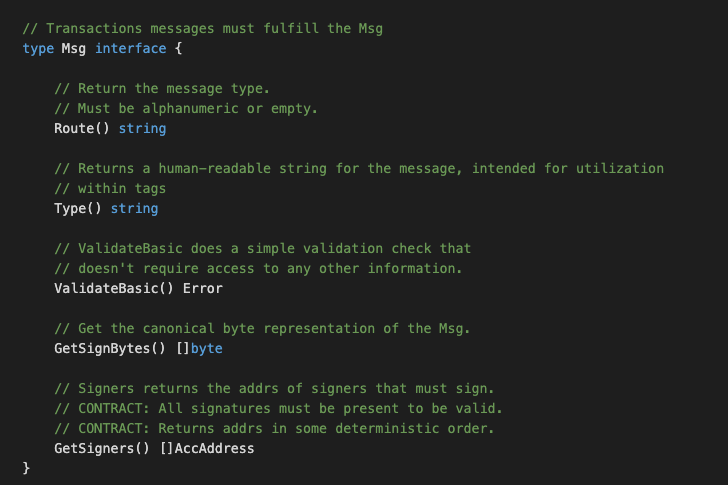
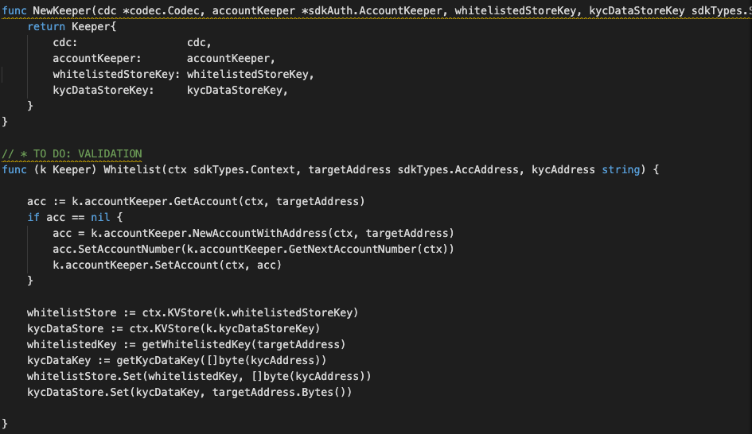
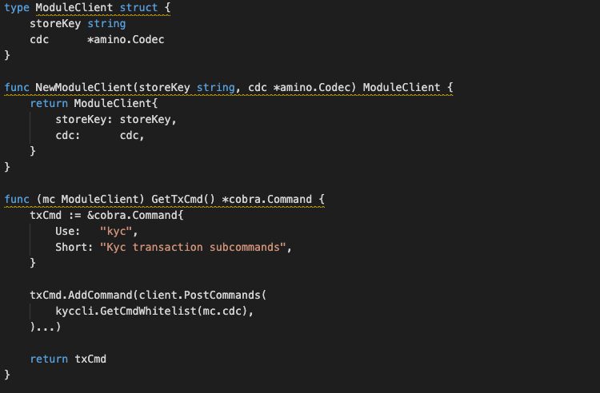
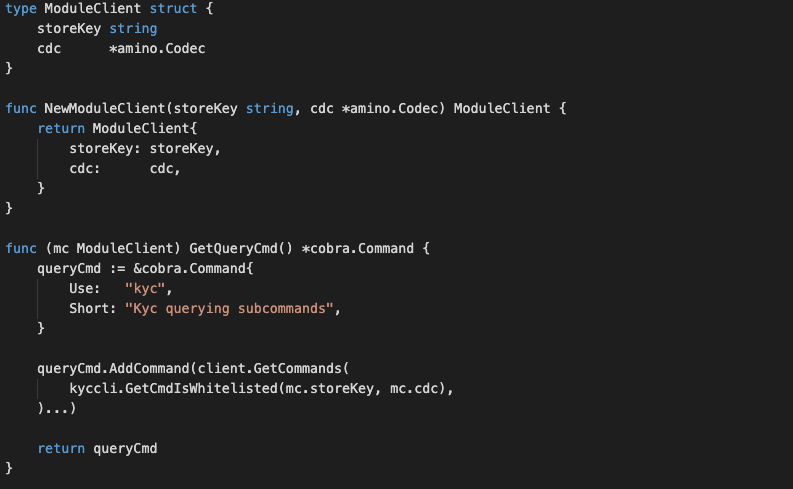

# KYC Module

### Application Goals
The goal of the module is to let users do KYC whitelisting or revoke base on the existing whitelist. 

In this section, you will learn how these simple requirements translate to application design.

### Type

We will use this when do KYC whitelisting or revoke base on the existing whitelist that sent to the fullnode. 
Start by creating the file msgs.go in ./x/kyc/ folder which 
will hold customs message types for the module.
To start the SDK module, define those relevant structs in the ./x/kyc/msgs.go file as below:

* MsgWhitelist
-- This is the message type used to do KYC whitelisting. 

* MsgRevokeWhitelist
-- This is the message type used to revoke base on the existing whitelist.

* MsgKycBind
-- This is the message type used to do KYC whitelisting (by Bussiness users). 

* MsgKycUnbind
-- This is the message type used to revoke base on the existing whitelist (by Bussiness users). 

### Msgs

Msgs define your application's state transitions. 
They are encoded and passed around the network wrapped in Txs. 
Messages are "owned" by a single module, meaning they are routed to only one of your applications modules. 
Each module has its own set of messages that it uses to update its subset of the chain state. 
Maxonrow SDK relies on Cosmos SDK wraps and unwraps Msgs from Txs, which means developer only have to define the relevant Msgs.    
Msgs must satisfy the following interface:

  

### Handlers

Next we need to write a handler function to process the Messages contained 
in the transactions delivered in each block. 
Handlers determine what actions should be taken (eg. which stores need to get updated, how, and under what conditions) 
when a given Msg is received. In MVC terms this would be the 'controller'.

In this module you have FOUR types of Msgs that users 
can send to interact with the application state: 

* MsgWhitelist 
* MsgRevokeWhitelist
* MsgKycBind
* MsgKycUnbind

** They will each have an associated Handler.

### Keeper

The main core of a Maxonrow SDK module is a piece called the Keeper. 
Each module's Keeper is responsible for CRUD operations to the main datastore of the application. 
With more sophisticated applications, modules may have access to each other's Keepers 
for cross-module interactions.  In MVC terms this would be the "model". 

### Querier

This is the place to define which queries against application state users will be able to make. 
Now that we have a running distributed state machine, it's time to enable querying our blockchain state. 
This is done through Queriers. 
These define the queries that clients can send via websocket/rpc to which our application will respond. 
Your maintenance module will expose below queries:

* IsWhitelisted
-- This takes an account address and returns whether been whitelisted.

* IsAuthorised
-- This takes an account address and returns whether been authorised.

* GetKycAddress
-- This takes an account address and returns the KYC address.

* GetFee
-- This takes a fee setting and returns the fee setting info.

### Client with CLI  
A Command Line Interface (CLI) will help us interact with our app once it is running on a machine somewhere. Each Module has it's own namespace within the CLI that gives it the ability to create and sign Messages destined to be handled by that module. 

The CLI for this module is broken into two files called tx.go and query.go which are located in ./x/kyc/client/cli/. One file is for making transactions that contain messages which will ultimately update our state. The other is for making queries which will give us the ability to read information from our state. Both files utilize the Cobra library.

### tx.go
The tx.go (refer module_client.go) file contains GetTxCmd which is a standard method within the Cosmos SDK. It is referenced later in the module.go file which describes exactly which attributes a modules has. This makes it easier to incorporate different modules for different reasons at the level of the actual application.

Inside GetTxCmd we create a new module-specific command and call is kyc. Within this command we add a sub-command for each Message type we've defined:

* GetCmdWhitelist

Each function takes parameters from the Cobra CLI tool to create a new msg, sign it and submit it to the application to be processed. 

### query.go
The query.go  (refer module_client.go) file contains similar Cobra commands that reserve a new name space for referencing our maintenance module. Instead of creating and submitting messages however, the query.go file creates queries and returns the results in human readable form, which handles below function:

* GetCmdIsWhitelisted

