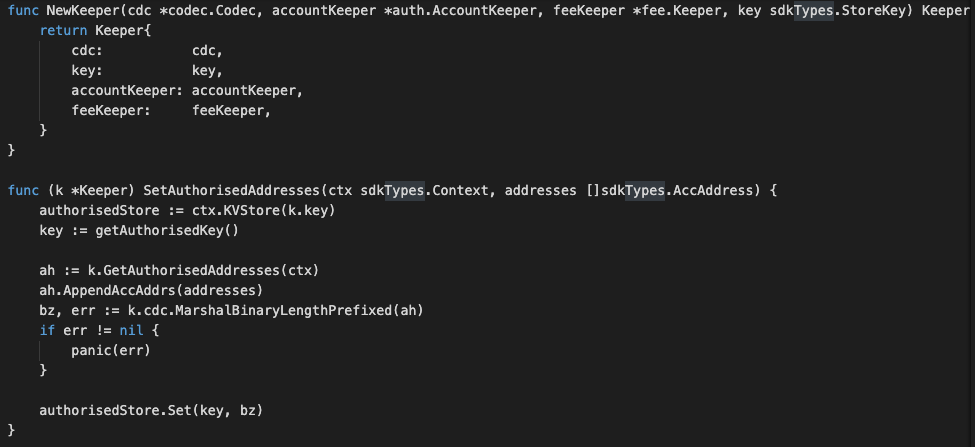

# Non-fungible Token Module

### Application Goals

Non-Fungible Tokens are essentially inventory lists, where was CryptoKitties which 
established the first standard called ERC-721. This allowed for an extreme variety of use cases because the standard was as un-opinionated as possible as to exactly how the standard was used. 
That’s why we’ve been able to see such a wide range of uses that come from different industries, 
eg. been used in invoices and domain names. That’s why at it’s core a Non-Fungible Token only cares about the unique identification number and the token’s place of origin (which makes them essentially inventory lists).

In this section, you will learn how these simple requirements translate to application design.

### Type

We will use this when creating/updating and retrieving the "inventory lists" sent to our fullnode. 
Start by creating the file msgs.go in ./x/token/nonfungible/ folder which 
will hold customs message types for the module.
To start the SDK module, define those relevant structs in 
the ./x/token/nonfungible/msgs.go file as below:

* MsgTypeCreateNonFungibleToken
-- This is the message type used to create a non-fungible token. 

* MsgTypeSetNonFungibleTokenStatus
-- This is the message type used to update the status of a non-fungible token, 
  eg. Approve, Reject, Freeze or unfreeze, Approve-transfer-ownership, Reject-transfer-ownership

* MsgTypeTransferNonFungibleItem
-- This is the message type used to transfer the item of a non-fungible token. 

* MsgTypeMintNonFungibleItem
-- This is the message type used to mint an item of a non-fungible token. 

* MsgTypeBurnNonFungibleItem
-- This is the message type used to burn an item of a non-fungible token. 

* MsgTypeTransferNonFungibleTokenOwnership
-- This is the message type used to transfer-ownership of a non-fungible token. 

* MsgTypeAcceptNonFungibleTokenOwnership
-- This is the message type used to accept-ownership of a non-fungible token. 

* MsgTypeSetNonFungibleItemStatus
-- This is the message type used to update the status of an item of a non-fungible token, 
  eg. Freeze or unfreeze, Transferable,     

* MsgTypeEndorsement
-- This is the message type used to endorse an item of a non-fungible token. 

* MsgTypeUpdateItemMetadata
-- This is the message type used to update metadata of a non-fungible token.

* MsgTypeUpdateNFTMetadata
-- This is the message type used to update item metadata of a non-fungible token.

### Msgs

Msgs define your application's state transitions. 
They are encoded and passed around the network wrapped in Txs. 
Messages are "owned" by a single module, meaning they are routed to only one of your applications modules. 
Each module has its own set of messages that it uses to update its subset of the chain state. 
Maxonrow SDK relies on Cosmos SDK wraps and unwraps Msgs from Txs, which means developer only have to define the relevant Msgs.   
Msgs must satisfy the following interface:

  

### Handlers

Next we need to write a handler function to process the Messages contained 
in the transactions delivered in each block. 
Handlers determine what actions should be taken (eg. which stores need to get updated, how, and under what conditions) 
when a given Msg is received. In MVC terms this would be the 'controller'.

In this module you have NINE types of Msgs that users 
can send to interact with the application state: 

* MsgTypeCreateNonFungibleToken
* MsgTypeSetNonFungibleTokenStatus
* MsgTypeTransferNonFungibleItem
* MsgTypeMintNonFungibleItem
* MsgTypeBurnNonFungibleItem
* MsgTypeTransferNonFungibleTokenOwnership
* MsgTypeAcceptNonFungibleTokenOwnership
* MsgTypeSetNonFungibleItemStatus
* MsgTypeEndorsement
* MsgTypeUpdateItemMetadata
* MsgTypeUpdateNFTMetadata

** They will each have an associated Handler.

### Keeper

The main core of a Maxonrow SDK module is a piece called the Keeper. 
Each module's Keeper is responsible for CRUD operations to the main datastore of the application. 
With more sophisticated applications, modules may have access to each other's Keepers 
for cross-module interactions.  In MVC terms this would be the "model". 

  

### Querier

This is the place to define which queries against application state users will be able to make. 
Now that we have a running distributed state machine, 
it's time to enable querying our blockchain state. This is done through Queriers. 
These define the queries that clients can send via websocket/rpc to which our application will respond. 
Your non-fungible token module will expose few queries:

* ListTokenSymbol
* TokenData
* ItemData

